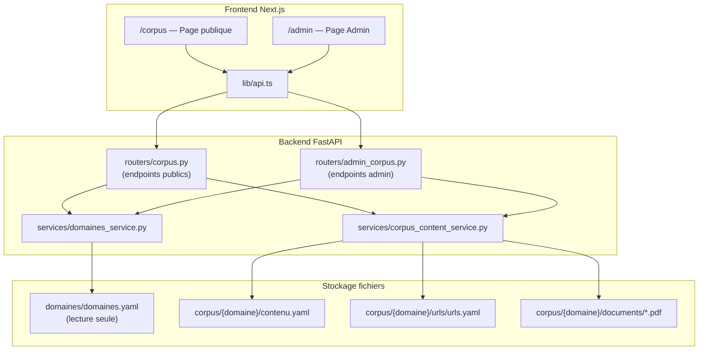

# Document de conception — Gestion du Corpus Admin & Page Corpus Publique

## Vue d'ensemble

Cette conception couvre deux axes fonctionnels complémentaires :

1. **Enrichissement de la page Corpus publique** (`/corpus`) : exposer le contenu réel des fichiers YAML (`contenu.yaml`, `urls/urls.yaml`) montés en volume Docker, au lieu de se limiter aux versions de corpus stockées en base de données.

2. **Refactoring de la page Admin** (`/admin`) : remplacer la navigation par onglets (tabs) par un menu horizontal à quatre sections (Statistiques, Experts, News, Corpus) et ajouter une section complète de gestion du corpus (consultation, upload PDF, ajout d'URLs).

Le backend FastAPI expose de nouveaux endpoints pour lire et écrire dans les fichiers YAML et le répertoire `documents/` du corpus. Le frontend Next.js consomme ces endpoints via le client API centralisé (`lib/api.ts`).

### Décisions de conception clés

- **Lecture/écriture directe des fichiers YAML** : pas de migration vers la base de données pour le contenu du corpus. Les fichiers `contenu.yaml` et `urls/urls.yaml` restent la source de vérité, conformément à l'architecture existante.
- **Service dédié `corpus_content_service.py`** : encapsule toute la logique de lecture/écriture YAML et de gestion des fichiers PDF, séparé du router pour faciliter les tests unitaires et property-based.
- **Réutilisation du pattern d'authentification admin** : la dépendance `get_admin_expert` existante dans `routers/admin.py` est réutilisée pour protéger les endpoints d'écriture.
- **Volume Docker en lecture-écriture** : le montage `../corpus:/data/corpus:ro` dans `docker-compose.dev.yml` passe en `:rw` pour permettre les uploads.

## Architecture

### Diagramme de flux



### Séparation des responsabilités

| Couche | Fichier | Responsabilité |
|--------|---------|----------------|
| Router public | `routers/corpus.py` | Endpoints `GET` sans auth pour contenu et URLs |
| Router admin | `routers/admin_corpus.py` | Endpoints protégés pour upload PDF et ajout URLs |
| Service | `services/corpus_content_service.py` | Lecture/écriture YAML, gestion fichiers PDF |
| Service existant | `services/domaines_service.py` | Lecture de `domaines.yaml` (inchangé) |
| Schémas | `schemas/corpus.py` | Modèles Pydantic pour requêtes/réponses |
| Frontend | `app/corpus/page.tsx` | Page publique enrichie |
| Frontend | `app/admin/page.tsx` | Page admin refactorisée avec menu horizontal |

## Composants et interfaces

### Backend — Nouveaux endpoints

#### Endpoints publics (ajoutés à `routers/corpus.py`)

| Méthode | Route | Description | Auth |
|---------|-------|-------------|------|
| `GET` | `/api/corpus/{domaine}/contenu` | Liste des ressources du `contenu.yaml` | Non |
| `GET` | `/api/corpus/{domaine}/urls` | Liste des URLs du `urls/urls.yaml` | Non |

#### Endpoints admin (nouveau router `routers/admin_corpus.py`)

| Méthode | Route | Description | Auth |
|---------|-------|-------------|------|
| `POST` | `/api/admin/corpus/{domaine}/documents` | Upload d'un fichier PDF | Admin |
| `POST` | `/api/admin/corpus/{domaine}/urls` | Ajout d'une URL (PDF externe ou site web) | Admin |

### Backend — Service `corpus_content_service.py`

```python
class CorpusContentService:
    """Service de lecture/écriture du contenu corpus depuis les fichiers YAML."""

    def __init__(self, corpus_base_path: Path):
        self.corpus_base_path = corpus_base_path

    def load_contenu(self, domaine: str) -> list[ContenuItem]:
        """Lit et parse le fichier contenu.yaml d'un domaine."""

    def load_urls(self, domaine: str) -> list[UrlItem]:
        """Lit et parse le fichier urls/urls.yaml d'un domaine."""

    def save_pdf(self, domaine: str, filename: str, content: bytes) -> ContenuItem:
        """Enregistre un PDF dans documents/ et met à jour contenu.yaml."""

    def add_url(self, domaine: str, entry: UrlItem) -> UrlItem:
        """Ajoute une entrée dans urls/urls.yaml."""

    def _resolve_contenu_path(self, domaine: str) -> Path:
        """Résout le chemin vers contenu.yaml."""

    def _resolve_urls_path(self, domaine: str) -> Path:
        """Résout le chemin vers urls/urls.yaml."""
```

### Backend — Schémas Pydantic (ajouts à `schemas/corpus.py`)

```python
class ContenuItemResponse(BaseModel):
    """Un élément du contenu.yaml."""
    nom: str
    description: str
    type: str
    date_ajout: str

class UrlItemResponse(BaseModel):
    """Une URL du urls.yaml."""
    nom: str
    url: str
    description: str
    type: str
    date_ajout: str

class AddUrlRequest(BaseModel):
    """Requête d'ajout d'une URL."""
    nom: str
    url: str
    description: str
    type: str  # "pdf_externe" | "site_web"
```

### Frontend — Composants

#### Page Corpus publique (`app/corpus/page.tsx`)

Refactoring de la page existante pour ajouter :
- Sections dépliables par domaine actif (accordéon)
- Sous-sections « Documents » et « URLs » avec les données des nouveaux endpoints
- Badge « Inactif » + message « Corpus en cours de préparation » pour les domaines inactifs

#### Page Admin (`app/admin/page.tsx`)

Refactoring complet :
- Remplacement des onglets par un menu horizontal (`nav`) avec 4 items : Statistiques, Experts, News, Corpus
- Le clic sur « News » navigue vers `/admin/news` (page existante)
- Les 3 autres sections sont rendues inline
- Section « Experts » enrichie avec champ de recherche et compteur
- Nouvelle section « Corpus » avec :
  - Liste des domaines (sélection)
  - Affichage du contenu (documents + URLs) du domaine sélectionné
  - Boutons d'action : « Ajouter un document PDF », « Ajouter une URL de PDF », « Ajouter une URL de site web »
  - Formulaires modaux pour upload et ajout d'URLs

### Frontend — Nouvelles fonctions API (`lib/api.ts`)

```typescript
// Endpoints publics
export async function apiGetCorpusContenu(domaine: string): Promise<ContenuItem[]>
export async function apiGetCorpusUrls(domaine: string): Promise<UrlItem[]>

// Endpoints admin
export async function apiAdminUploadDocument(token: string, domaine: string, file: File): Promise<ContenuItem>
export async function apiAdminAddUrl(token: string, domaine: string, data: AddUrlPayload): Promise<UrlItem>
```

## Modèles de données

### Structures YAML (source de vérité)

#### `contenu.yaml`

```yaml
contenu:
  - nom: "documents/example.pdf"
    description: "Description du document"
    type: "document"          # template | document | url
    date_ajout: "2025-07-14"
```

#### `urls/urls.yaml`

```yaml
urls:
  - nom: "Nom de la ressource"
    url: "https://example.com"
    description: "Description de la ressource"
    type: "institutionnel"    # institutionnel | juridique | academique | pdf_externe | site_web
    date_ajout: "2025-07-14"
```

### Schémas Pydantic

```python
class ContenuItemResponse(BaseModel):
    nom: str
    description: str
    type: str
    date_ajout: str

class UrlItemResponse(BaseModel):
    nom: str
    url: str
    description: str
    type: str
    date_ajout: str

class AddUrlRequest(BaseModel):
    nom: str = Field(..., min_length=1)
    url: str = Field(..., pattern=r"^https?://")
    description: str
    type: str = Field(..., pattern=r"^(pdf_externe|site_web)$")
```

### Pas de nouveaux modèles SQLAlchemy

Aucune table de base de données n'est ajoutée. Le contenu du corpus reste géré via les fichiers YAML montés en volume Docker. Les modèles existants (`Domaine`, `CorpusVersion`) ne sont pas modifiés.


## Propriétés de correction

*Une propriété est une caractéristique ou un comportement qui doit rester vrai pour toutes les exécutions valides d'un système — essentiellement, une déclaration formelle de ce que le système doit faire. Les propriétés servent de pont entre les spécifications lisibles par l'humain et les garanties de correction vérifiables par la machine.*

### Propriété 1 : Aller-retour de parsing du contenu.yaml

*Pour tout* ensemble valide d'éléments de contenu (avec des champs `nom`, `description`, `type`, `date_ajout` arbitraires), si on sérialise cet ensemble au format YAML sous la clé `contenu` puis qu'on appelle `load_contenu()`, la liste retournée doit contenir exactement les mêmes éléments avec les mêmes valeurs de champs.

**Valide : Exigences 1.1**

### Propriété 2 : Aller-retour de parsing du urls.yaml

*Pour tout* ensemble valide d'entrées URL (avec des champs `nom`, `url`, `description`, `type`, `date_ajout` arbitraires), si on sérialise cet ensemble au format YAML sous la clé `urls` puis qu'on appelle `load_urls()`, la liste retournée doit contenir exactement les mêmes entrées avec les mêmes valeurs de champs.

**Valide : Exigences 1.2**

### Propriété 3 : Filtrage des experts par recherche

*Pour toute* liste d'experts et *pour toute* chaîne de recherche non vide, le filtrage côté client doit retourner exactement les experts dont le `nom`, le `prenom` ou l'`email` contient la chaîne de recherche (insensible à la casse). Aucun expert correspondant ne doit être exclu, et aucun expert non correspondant ne doit être inclus.

**Valide : Exigences 3.6, 3.7**

### Propriété 4 : Upload PDF persiste le fichier et met à jour contenu.yaml

*Pour tout* nom de fichier PDF valide (caractères alphanumériques, tirets, underscores, extension `.pdf`) et *pour tout* contenu binaire non vide, appeler `save_pdf()` doit résulter en : (a) le fichier existe dans `corpus/{domaine}/documents/`, (b) une entrée correspondante avec le bon `nom`, `type: "document"` et la date du jour est présente dans `contenu.yaml`.

**Valide : Exigences 5.3**

### Propriété 5 : Ajout d'URL persiste l'entrée dans urls.yaml

*Pour toute* entrée URL valide (nom non vide, URL commençant par `http://` ou `https://`, type dans `{pdf_externe, site_web}`), appeler `add_url()` doit résulter en la présence de cette entrée dans le fichier `urls/urls.yaml` du domaine, avec tous les champs préservés et la date d'ajout correcte.

**Valide : Exigences 6.3, 7.3**

## Gestion des erreurs

### Backend

| Situation | Code HTTP | Message | Endpoint(s) |
|-----------|-----------|---------|-------------|
| Domaine inexistant dans `domaines.yaml` | 404 | « Domaine introuvable » | Tous les endpoints `{domaine}` |
| Fichier `contenu.yaml` absent | 200 | Liste vide `[]` | `GET /api/corpus/{domaine}/contenu` |
| Fichier `urls/urls.yaml` absent | 200 | Liste vide `[]` | `GET /api/corpus/{domaine}/urls` |
| Fichier uploadé non-PDF | 400 | « Seuls les fichiers PDF sont acceptés » | `POST /api/admin/corpus/{domaine}/documents` |
| Fichier PDF avec nom existant | 409 | « Un document portant ce nom existe déjà » | `POST /api/admin/corpus/{domaine}/documents` |
| URL invalide (pas http(s)://) | 422 | Erreur de validation Pydantic | `POST /api/admin/corpus/{domaine}/urls` |
| Nom vide | 422 | Erreur de validation Pydantic | `POST /api/admin/corpus/{domaine}/urls` |
| Token absent ou invalide | 401 | « Non authentifié » | Endpoints admin |
| Utilisateur non-admin | 403 | « Accès réservé à l'administrateur » | Endpoints admin |
| Erreur d'écriture fichier (permissions) | 500 | « Erreur lors de l'écriture du fichier » | Endpoints d'écriture admin |
| YAML malformé dans le corpus | 500 | « Erreur de lecture du corpus » | Endpoints de lecture |

### Frontend

- Affichage d'un message d'erreur contextuel en cas d'échec API (toast ou inline)
- Indicateur de chargement pendant les appels réseau
- Validation côté client des formulaires avant soumission (URL, nom obligatoire)
- Gestion du cas « liste vide » avec message explicatif

## Stratégie de tests

### Tests property-based (Hypothesis)

Bibliothèque : **Hypothesis** (déjà utilisée dans le projet, cf. `tests/property/`)

Chaque propriété de correction est implémentée comme un test property-based avec minimum **100 itérations** (configuration par défaut de Hypothesis).

| Propriété | Fichier de test | Tag |
|-----------|----------------|-----|
| Propriété 1 : Aller-retour contenu.yaml | `tests/property/test_prop_corpus_contenu_roundtrip.py` | Feature: admin-corpus-management, Property 1: contenu.yaml round-trip |
| Propriété 2 : Aller-retour urls.yaml | `tests/property/test_prop_corpus_urls_roundtrip.py` | Feature: admin-corpus-management, Property 2: urls.yaml round-trip |
| Propriété 3 : Filtrage experts | `tests/property/test_prop_expert_search_filter.py` | Feature: admin-corpus-management, Property 3: expert search filtering |
| Propriété 4 : Upload PDF round-trip | `tests/property/test_prop_corpus_pdf_upload.py` | Feature: admin-corpus-management, Property 4: PDF upload round-trip |
| Propriété 5 : Ajout URL round-trip | `tests/property/test_prop_corpus_url_addition.py` | Feature: admin-corpus-management, Property 5: URL addition round-trip |

### Tests unitaires (example-based)

| Catégorie | Fichier | Ce qui est testé |
|-----------|---------|-----------------|
| Endpoints publics | `tests/unit/test_corpus_contenu_endpoints.py` | 404 domaine inexistant, liste vide si fichier absent, réponse correcte |
| Endpoints admin | `tests/unit/test_admin_corpus_endpoints.py` | Auth requise, 403 non-admin, 400 non-PDF, 409 doublon, succès upload/URL |
| Service corpus | `tests/unit/test_corpus_content_service.py` | YAML malformé, fichier absent, chemins résolus correctement |
| Frontend corpus | Tests manuels ou Playwright | Sections dépliables, badges, liens cliquables |
| Frontend admin | Tests manuels ou Playwright | Menu horizontal, navigation, formulaires, recherche experts |

### Tests d'intégration

| Test | Description |
|------|-------------|
| Upload PDF end-to-end | Upload via API → vérifier fichier sur disque + contenu.yaml mis à jour |
| Ajout URL end-to-end | POST URL via API → vérifier urls.yaml mis à jour |

### Tests smoke

| Test | Description |
|------|-------------|
| Volume corpus rw | Vérifier que `docker-compose.dev.yml` monte le corpus sans `:ro` |
| Volume domaines ro | Vérifier que `docker-compose.dev.yml` monte domaines avec `:ro` |
