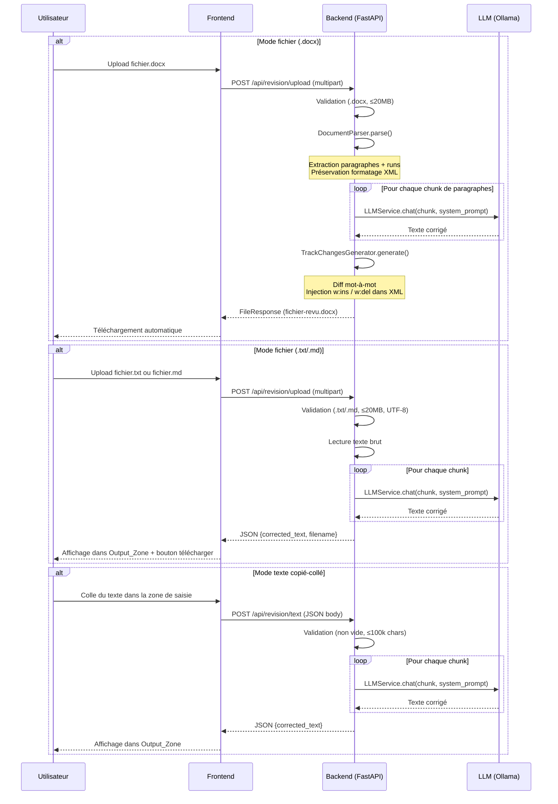

# Design Document — Document Revision

## Overview

La fonctionnalité de révision documentaire est un outil autonome permettant à l'expert judiciaire de soumettre un fichier (`.docx`, `.txt`, `.md`) ou du texte copié-collé pour correction automatique par le LLM local (Mistral 7B via Ollama). Le système extrait le texte du document tout en préservant le formatage, envoie le contenu au LLM par chunks pour correction orthographique/grammaticale et développement des abréviations, puis :
- Pour les fichiers `.docx` : génère un fichier de sortie avec des marques de révision Word (track changes) natives.
- Pour les fichiers `.txt`/`.md` ou le texte copié-collé : affiche le texte corrigé dans une zone de sortie et propose le téléchargement.

### Décisions architecturales clés

1. **Manipulation XML directe via lxml** : python-docx ne supporte pas nativement l'écriture de track changes. La génération des marques de révision sera réalisée par manipulation directe du XML OOXML (`w:ins` / `w:del`) via lxml, en s'appuyant sur python-docx pour le parsing initial.

2. **Traitement par paragraphe avec chunking adaptatif** : Le texte est envoyé au LLM paragraphe par paragraphe (ou en groupes de paragraphes) pour respecter la fenêtre de contexte. Chaque chunk est traité indépendamment, ce qui permet de mapper précisément les corrections aux éléments XML d'origine.

3. **Diff au niveau des runs** : La comparaison entre texte original et texte corrigé utilise un algorithme de diff (difflib) au niveau des mots pour produire des opérations insert/delete granulaires, converties en éléments OOXML `w:ins` et `w:del`.

4. **Aucune persistance en base** : Conformément à l'exigence d'indépendance, les fichiers sont traités en mémoire et via des fichiers temporaires, sans écriture en base de données.

5. **Deux modes de sortie** : Le backend expose deux endpoints — un pour les fichiers (retourne un fichier) et un pour le texte brut (retourne du JSON avec le texte corrigé). Le frontend adapte l'affichage selon le mode d'entrée.

## Architecture

```mermaid
flowchart TD
    subgraph Frontend ["Frontend (Next.js)"]
        RP[Revision Page<br/>/revision]
        UC[UploadCard Component]
        TI[TextInputCard Component]
        PC[ProgressCard Component]
        DC[DownloadCard Component]
        OZ[OutputZone Component]
    end

    subgraph Backend ["Backend (FastAPI)"]
        RR[revision router<br/>POST /api/revision/upload<br/>POST /api/revision/text]
        RS[RevisionService]
        DP[DocumentParser]
        TC[TrackChangesGenerator]
    end

    subgraph LLM ["LLM (Ollama)"]
        LS[LLMService.chat]
    end

    RP --> UC
    RP --> TI
    UC -->|multipart/form-data| RR
    TI -->|JSON body| RR
    RR --> RS
    RS --> DP
    DP -->|paragraphs + runs| RS
    RS -->|chunks| LS
    LS -->|corrected text| RS
    RS --> TC
    TC -->|.docx with revisions| RR
    RS -->|corrected text| RR
    RR -->|FileResponse (.docx)| RP
    RR -->|JSON response (.txt/.md/text)| RP
    RP --> PC
    RP --> DC
    RP --> OZ
```

### Flux de données



## Components and Interfaces

### Backend Components

#### 1. Revision Router (`routers/revision.py`)

```python
from fastapi import APIRouter, UploadFile, File, HTTPException
from fastapi.responses import FileResponse
from pydantic import BaseModel

router = APIRouter()

class TextRevisionRequest(BaseModel):
    """Requête de révision de texte copié-collé."""
    text: str

class TextRevisionResponse(BaseModel):
    """Réponse de révision pour texte et fichiers .txt/.md."""
    corrected_text: str
    filename: str | None = None  # None pour texte copié-collé

@router.post("/upload")
async def upload_and_revise(file: UploadFile = File(...)):
    """
    Reçoit un fichier .docx, .txt ou .md, le révise via le LLM.
    
    - .docx → retourne FileResponse avec track changes (fichier-revu.docx)
    - .txt/.md → retourne JSON avec texte corrigé + filename pour download
    
    Returns:
        FileResponse (.docx) ou TextRevisionResponse (.txt/.md)
    
    Raises:
        HTTPException 400: Format non supporté ou fichier corrompu
        HTTPException 413: Fichier > 20 MB
        HTTPException 503: LLM indisponible
    """
    ...

@router.post("/text", response_model=TextRevisionResponse)
async def revise_text(request: TextRevisionRequest):
    """
    Reçoit du texte brut copié-collé et le révise via le LLM.
    
    Returns:
        TextRevisionResponse avec le texte corrigé
    
    Raises:
        HTTPException 400: Texte vide ou > 100 000 caractères
        HTTPException 503: LLM indisponible
    """
    ...
```

#### 2. Revision Service (`services/revision_service.py`)

```python
class RevisionService:
    """Orchestre le processus complet de révision documentaire."""

    def __init__(self, llm_service: LLMService) -> None:
        self.llm = llm_service
        self.parser = DocumentParser()
        self.generator = TrackChangesGenerator()

    async def revise_document(self, file_bytes: bytes, file_ext: str) -> bytes | str:
        """
        Pipeline complet : parse → chunk → LLM → track changes → output.
        
        Args:
            file_bytes: Contenu brut du fichier uploadé.
            file_ext: Extension du fichier (.docx, .txt, .md).
            
        Returns:
            - bytes du fichier .docx révisé avec track changes (si .docx)
            - str du texte corrigé (si .txt/.md)
            
        Raises:
            DocumentParseError: Fichier corrompu ou illisible.
            LLMError: LLM indisponible ou timeout.
        """
        ...

    async def revise_text(self, text: str) -> str:
        """
        Révise du texte brut copié-collé.
        
        Args:
            text: Texte brut à réviser.
            
        Returns:
            Texte corrigé.
            
        Raises:
            LLMError: LLM indisponible ou timeout.
        """
        ...

    def _build_chunks(
        self, paragraphs: list[ParagraphInfo]
    ) -> list[list[ParagraphInfo]]:
        """
        Regroupe les paragraphes en chunks respectant la fenêtre de contexte.
        
        Stratégie : accumule les paragraphes jusqu'à atteindre ~60% du
        ctx_max disponible (laissant de la place pour le prompt système
        et la réponse).
        """
        ...
```

#### 3. Document Parser (`services/document_parser.py`)

```python
@dataclass
class RunInfo:
    """Représente un run (segment de texte avec formatage uniforme)."""
    text: str
    xml_element: Element  # Référence à l'élément w:r dans le XML
    properties: Element | None  # w:rPr (bold, italic, font, etc.)

@dataclass
class ParagraphInfo:
    """Représente un paragraphe avec ses runs et propriétés."""
    runs: list[RunInfo]
    xml_element: Element  # Référence à l'élément w:p
    properties: Element | None  # w:pPr (style, heading level, etc.)
    full_text: str  # Concaténation de tous les runs

class DocumentParser:
    """Parse un .docx en préservant la structure XML pour modification ultérieure."""

    def parse(self, file_bytes: bytes) -> ParsedDocument:
        """
        Ouvre le .docx, extrait les paragraphes avec leurs runs et
        conserve les références aux éléments XML pour modification in-place.
        
        Préserve :
        - Structure paragraphes/runs
        - Propriétés de formatage (w:rPr)
        - Tables (itération sur les cellules)
        - Headers/footers (non modifiés)
        - Images (non modifiées)
        """
        ...
```

#### 4. Track Changes Generator (`services/track_changes_generator.py`)

```python
class TrackChangesGenerator:
    """Génère les marques de révision OOXML dans le document."""

    AUTHOR: str = "Judi-Expert"
    
    def generate(
        self,
        parsed_doc: ParsedDocument,
        corrections: list[ParagraphCorrection],
    ) -> bytes:
        """
        Applique les corrections comme track changes dans le XML du document.
        
        Pour chaque paragraphe corrigé :
        1. Calcule le diff mot-à-mot (difflib.SequenceMatcher)
        2. Remplace les runs originaux par des éléments w:del (suppression)
           et w:ins (insertion) avec les attributs de révision
        3. Préserve le formatage des runs originaux sur les insertions
        
        Returns:
            Bytes du fichier .docx modifié.
        """
        ...

    def _create_revision_element(
        self,
        tag: str,  # "w:ins" ou "w:del"
        text: str,
        run_properties: Element | None,
        revision_id: int,
    ) -> Element:
        """Crée un élément XML de révision OOXML."""
        ...
```

### Frontend Components

#### 5. Revision Page (`app/revision/page.tsx`)

```typescript
type InputMode = "file" | "text";
type RevisionStatus = "idle" | "uploading" | "processing" | "done" | "error";

export default function RevisionPage() {
  const [inputMode, setInputMode] = useState<InputMode>("file");
  const [status, setStatus] = useState<RevisionStatus>("idle");
  const [error, setError] = useState<string | null>(null);
  const [downloadUrl, setDownloadUrl] = useState<string | null>(null);
  const [outputText, setOutputText] = useState<string | null>(null);
  const [outputFilename, setOutputFilename] = useState<string | null>(null);

  const handleFileUpload = async (file: File) => { ... };
  const handleTextSubmit = async (text: string) => { ... };
  const handleRetry = () => { ... };
  const handleCopy = () => { ... };

  return (
    <main>
      {/* Zone d'entrée : onglets Fichier / Texte */}
      <InputTabs activeMode={inputMode} onChange={setInputMode} />
      
      {inputMode === "file" && status === "idle" && (
        <UploadCard onUpload={handleFileUpload} accept=".docx,.txt,.md" />
      )}
      {inputMode === "text" && status === "idle" && (
        <TextInputCard onSubmit={handleTextSubmit} />
      )}
      
      {status === "processing" && <ProgressCard />}
      {status === "done" && downloadUrl && <DownloadCard url={downloadUrl} onReset={handleRetry} />}
      {status === "error" && <ErrorCard message={error} onRetry={handleRetry} />}
      
      {/* Zone de sortie : affichage du texte corrigé (.txt/.md/texte) */}
      {status === "done" && outputText && (
        <OutputZone
          text={outputText}
          filename={outputFilename}
          onCopy={handleCopy}
        />
      )}
    </main>
  );
}
```

#### 6. OutputZone Component (`components/OutputZone.tsx`)

```typescript
interface OutputZoneProps {
  text: string;
  filename: string | null;  // null = texte copié-collé (pas de download)
  onCopy: () => void;
}

export function OutputZone({ text, filename, onCopy }: OutputZoneProps) {
  return (
    <section aria-label="Résultat de la révision">
      <textarea readOnly value={text} rows={20} />
      <div>
        <button onClick={onCopy}>Copier</button>
        {filename && (
          <a href={...} download={filename}>Télécharger {filename}</a>
        )}
      </div>
    </section>
  );
}
```

#### 7. Revision API Client (ajout dans `lib/api.ts`)

```typescript
export const revisionApi = {
  async uploadFile(file: File): Promise<Blob | { corrected_text: string; filename: string | null }> {
    const formData = new FormData();
    formData.append("file", file);
    const ext = file.name.split(".").pop()?.toLowerCase();
    
    if (ext === "docx") {
      // .docx → retourne un blob (fichier avec track changes)
      const res = await apiClient.post("/api/revision/upload", formData, {
        headers: { "Content-Type": "multipart/form-data" },
        responseType: "blob",
        timeout: 1_800_000,
      });
      return res.data;
    } else {
      // .txt/.md → retourne du JSON avec le texte corrigé
      const res = await apiClient.post("/api/revision/upload", formData, {
        headers: { "Content-Type": "multipart/form-data" },
        timeout: 1_800_000,
      });
      return res.data;
    }
  },

  async submitText(text: string): Promise<{ corrected_text: string }> {
    const res = await apiClient.post("/api/revision/text", { text }, {
      timeout: 1_800_000,
    });
    return res.data;
  },
};
```

### Interface entre composants

| Source | Destination | Interface | Format |
|--------|-------------|-----------|--------|
| Frontend (fichier) | Router | HTTP POST `/upload` multipart | `.docx`, `.txt`, `.md` file |
| Frontend (texte) | Router | HTTP POST `/text` JSON | `{ text: string }` |
| Router | RevisionService | `revise_document(bytes, ext)` | bytes + ext → bytes\|str |
| Router | RevisionService | `revise_text(str)` | str → str |
| RevisionService | DocumentParser | `parse(bytes)` | → `ParsedDocument` |
| RevisionService | LLMService | `chat(messages, system_prompt)` | text chunks |
| RevisionService | TrackChangesGenerator | `generate(doc, corrections)` | → bytes |
| Router | Frontend | HTTP FileResponse | `.docx` blob (track changes) |
| Router | Frontend | HTTP JSON | `{ corrected_text, filename }` |

## Data Models

### Backend Data Structures

```python
@dataclass
class ParsedDocument:
    """Document parsé avec références XML préservées."""
    paragraphs: list[ParagraphInfo]
    document_xml: Element  # Racine w:document
    package: ZipFile  # Archive .docx ouverte (pour réécriture)
    # Les headers, footers, images restent intacts dans le package

@dataclass
class ParagraphInfo:
    """Un paragraphe avec ses runs et métadonnées."""
    index: int
    runs: list[RunInfo]
    xml_element: Element
    properties: Element | None
    full_text: str
    is_in_table: bool = False
    table_cell_ref: Element | None = None

@dataclass
class RunInfo:
    """Un run (segment de texte avec formatage uniforme)."""
    text: str
    xml_element: Element
    properties: Element | None  # Copie profonde de w:rPr

@dataclass
class ParagraphCorrection:
    """Résultat de la correction LLM pour un paragraphe."""
    paragraph_index: int
    original_text: str
    corrected_text: str
    has_changes: bool

@dataclass
class DiffOperation:
    """Une opération de diff atomique."""
    op: Literal["equal", "insert", "delete", "replace"]
    original_text: str
    new_text: str
```

### Structure XML OOXML des Track Changes

```xml
<!-- Suppression (texte original barré en rouge) -->
<w:del w:id="1" w:author="Judi-Expert" w:date="2024-01-15T10:30:00Z">
  <w:r w:rsidDel="00A1B2C3">
    <w:rPr><!-- formatage original préservé --></w:rPr>
    <w:delText xml:space="preserve">texte supprimé</w:delText>
  </w:r>
</w:del>

<!-- Insertion (texte corrigé souligné en bleu) -->
<w:ins w:id="2" w:author="Judi-Expert" w:date="2024-01-15T10:30:00Z">
  <w:r>
    <w:rPr><!-- formatage original copié --></w:rPr>
    <w:t xml:space="preserve">texte inséré</w:t>
  </w:r>
</w:ins>
```

### Prompt système pour la révision

```python
PROMPT_REVISION: str = (
    "Tu es un correcteur professionnel spécialisé dans les documents juridiques français.\n\n"
    "Ta tâche est de corriger le texte suivant en respectant ces règles :\n"
    "1. Corrige toutes les fautes d'orthographe et de grammaire.\n"
    "2. Développe les abréviations en phrases complètes "
    "(ex: 'cf.' → 'conformément à', 'art.' → 'article').\n"
    "3. Améliore la lisibilité pour un lecteur psychologue non-expert, "
    "sans modifier le sens.\n"
    "4. Préserve INTÉGRALEMENT la terminologie juridique, médicale et "
    "psychologique spécialisée.\n"
    "5. Ne modifie PAS les noms propres, dates, numéros de dossier, "
    "références juridiques.\n"
    "6. Ne modifie PAS la structure du texte (pas d'ajout/suppression "
    "de paragraphes).\n\n"
    "IMPORTANT : Retourne UNIQUEMENT le texte corrigé, sans commentaire, "
    "sans explication, sans balise. Le nombre de paragraphes en sortie "
    "DOIT être identique au nombre de paragraphes en entrée.\n"
    "Sépare chaque paragraphe par une ligne vide."
)
```

## Correctness Properties

*A property is a characteristic or behavior that should hold true across all valid executions of a system — essentially, a formal statement about what the system should do. Properties serve as the bridge between human-readable specifications and machine-verifiable correctness guarantees.*

### Property 1: Préservation du nombre de paragraphes

*For any* valid .docx document containing N paragraphs with text content, after parsing and reconstruction (without LLM correction), the output document SHALL contain exactly N paragraphs with the same structure.

**Validates: Requirements 3.1, 5.4**

### Property 2: Préservation du formatage des runs

*For any* paragraph containing runs with formatting properties (bold, italic, underline, font size, font color), the track changes generator SHALL preserve these formatting properties on both the deleted text (`w:del`) and the inserted text (`w:ins`).

**Validates: Requirements 3.2, 5.4**

### Property 3: Validité structurelle des éléments de révision

*For any* pair (original_text, corrected_text) where original_text ≠ corrected_text, the generated XML SHALL contain valid OOXML revision elements where every `w:del` element has attributes `w:id`, `w:author`, and `w:date`, and every `w:ins` element has the same required attributes, and all `w:id` values are unique within the document.

**Validates: Requirements 5.2, 5.5**

### Property 4: Round-trip du contenu textuel

*For any* document, if we extract the "accepted" text from the track changes output (i.e., keep insertions, remove deletions), the result SHALL equal the corrected text provided by the LLM. Conversely, if we extract the "rejected" text (keep deletions, remove insertions), it SHALL equal the original text.

**Validates: Requirements 5.2, 5.5**

### Property 5: Respect de la limite de taille des chunks

*For any* document, the chunking algorithm SHALL produce chunks where each chunk's estimated token count does not exceed 60% of the active context window size (ctx_max), ensuring sufficient room for the system prompt and the LLM response.

**Validates: Requirements 7.4**

### Property 6: Rejet des fichiers invalides

*For any* byte sequence that is not a valid .docx file (not a ZIP archive, or ZIP without `word/document.xml`), the DocumentParser SHALL raise a `DocumentParseError`.

**Validates: Requirements 2.2, 7.2**

### Property 7: Idempotence du parsing sans correction

*For any* valid .docx document, parsing then serializing back to .docx without applying any corrections SHALL produce a document whose textual content is identical to the original.

**Validates: Requirements 3.1, 3.4**

## Error Handling

### Stratégie par couche

| Couche | Erreur | Comportement | Code HTTP |
|--------|--------|-------------|-----------|
| Router | Fichier non .docx/.txt/.md | Rejet immédiat | 400 |
| Router | Fichier > 20 MB | Rejet immédiat | 413 |
| Router | Texte vide | Rejet immédiat | 400 |
| Router | Texte > 100 000 caractères | Rejet immédiat | 400 |
| DocumentParser | Fichier corrompu / ZIP invalide | `DocumentParseError` → 400 | 400 |
| DocumentParser | Pas de `word/document.xml` | `DocumentParseError` → 400 | 400 |
| DocumentParser | Fichier .txt/.md non UTF-8 | `DocumentParseError` → 400 | 400 |
| RevisionService | LLM timeout | `LLMTimeoutError` → 503 | 503 |
| RevisionService | LLM connexion refusée | `LLMConnectionError` → 503 | 503 |
| RevisionService | Chunk sans réponse valide | Retry 1x, puis skip le chunk | — |
| TrackChangesGenerator | Diff incohérent | Log warning, paragraphe non modifié | — |
| Cleanup | Toute erreur | Suppression fichiers temporaires (finally) | — |

### Exceptions personnalisées

```python
class RevisionError(Exception):
    """Erreur de base pour le service de révision."""

class DocumentParseError(RevisionError):
    """Le fichier ne peut pas être lu comme un .docx valide."""

class ChunkProcessingError(RevisionError):
    """Erreur lors du traitement d'un chunk par le LLM."""
```

### Gestion des fichiers temporaires

```python
import tempfile
from contextlib import asynccontextmanager

@asynccontextmanager
async def temporary_revision_files():
    """Context manager garantissant le nettoyage des fichiers temporaires."""
    tmp_dir = tempfile.mkdtemp(prefix="judi_revision_")
    try:
        yield tmp_dir
    finally:
        shutil.rmtree(tmp_dir, ignore_errors=True)
```

### Stratégie de retry pour les chunks LLM

- **Timeout par chunk** : `LLM_TIMEOUT` (30 min par défaut, configurable)
- **Retry** : 1 tentative supplémentaire en cas de timeout sur un chunk
- **Fallback** : Si un chunk échoue après retry, le paragraphe est conservé tel quel (pas de correction) et un warning est loggé
- **Pas de corruption** : En cas d'erreur partielle, le document de sortie contient les corrections réussies + les paragraphes non modifiés

## Testing Strategy

### Property-Based Tests (Hypothesis)

La bibliothèque **Hypothesis** sera utilisée pour les tests de propriétés, avec un minimum de **100 itérations** par test.

**Configuration** :
```python
from hypothesis import settings

@settings(max_examples=100)
```

**Tests de propriétés à implémenter** :

| Property | Fichier test | Tag |
|----------|-------------|-----|
| Property 1 | `tests/property/test_prop_revision_parser.py` | Feature: document-revision, Property 1: paragraph count preservation |
| Property 2 | `tests/property/test_prop_revision_track_changes.py` | Feature: document-revision, Property 2: run formatting preservation |
| Property 3 | `tests/property/test_prop_revision_track_changes.py` | Feature: document-revision, Property 3: revision element validity |
| Property 4 | `tests/property/test_prop_revision_track_changes.py` | Feature: document-revision, Property 4: textual content round-trip |
| Property 5 | `tests/property/test_prop_revision_chunking.py` | Feature: document-revision, Property 5: chunk size limit |
| Property 6 | `tests/property/test_prop_revision_parser.py` | Feature: document-revision, Property 6: invalid file rejection |
| Property 7 | `tests/property/test_prop_revision_parser.py` | Feature: document-revision, Property 7: parsing idempotence |

### Unit Tests (pytest)

| Test | Fichier | Ce qui est vérifié |
|------|---------|-------------------|
| Upload validation | `tests/unit/test_revision_router.py` | Rejet .pdf, rejet > 20MB, accept .docx/.txt/.md |
| Text endpoint validation | `tests/unit/test_revision_router.py` | Rejet texte vide, rejet > 100k chars, accept texte valide |
| Prompt construction | `tests/unit/test_revision_service.py` | Format du prompt, séparation paragraphes |
| Diff algorithm | `tests/unit/test_track_changes_generator.py` | Cas simples : remplacement mot, insertion, suppression |
| XML generation | `tests/unit/test_track_changes_generator.py` | Structure w:ins/w:del correcte |
| Chunking | `tests/unit/test_revision_service.py` | Respect limites, pas de paragraphe coupé |
| Error handling | `tests/unit/test_revision_service.py` | LLM timeout → fallback, fichier corrompu → erreur claire |
| Text revision | `tests/unit/test_revision_service.py` | Texte brut → texte corrigé (mock LLM) |
| UTF-8 validation | `tests/unit/test_revision_service.py` | Fichier .txt non UTF-8 → erreur claire |

### Integration Tests

| Test | Ce qui est vérifié |
|------|-------------------|
| End-to-end avec mock LLM | Upload → parse → mock correction → track changes → download |
| Ouverture dans Word | Le fichier produit s'ouvre sans erreur (validation manuelle) |

### Générateurs Hypothesis

```python
from hypothesis import strategies as st
from docx import Document
import io

@st.composite
def docx_documents(draw):
    """Génère des documents .docx valides avec contenu aléatoire."""
    doc = Document()
    n_paragraphs = draw(st.integers(min_value=1, max_value=20))
    for _ in range(n_paragraphs):
        text = draw(st.text(
            alphabet=st.characters(whitelist_categories=("L", "N", "P", "Z")),
            min_size=1, max_size=200
        ))
        para = doc.add_paragraph()
        # Ajouter des runs avec formatage varié
        n_runs = draw(st.integers(min_value=1, max_value=5))
        words = text.split() or [text]
        for i in range(n_runs):
            run_text = words[i % len(words)] if words else "x"
            run = para.add_run(run_text + " ")
            run.bold = draw(st.booleans())
            run.italic = draw(st.booleans())
    
    buffer = io.BytesIO()
    doc.save(buffer)
    return buffer.getvalue()
```
