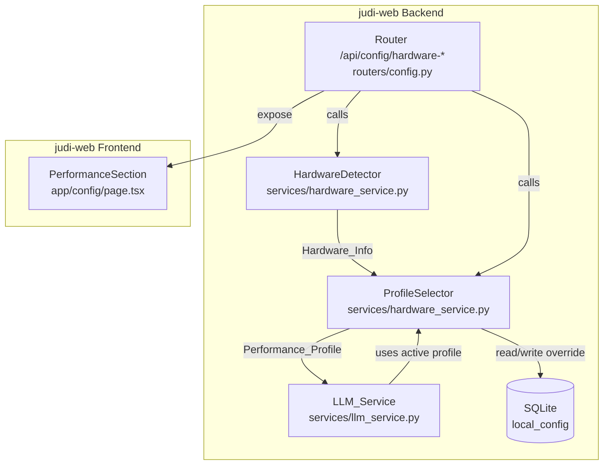
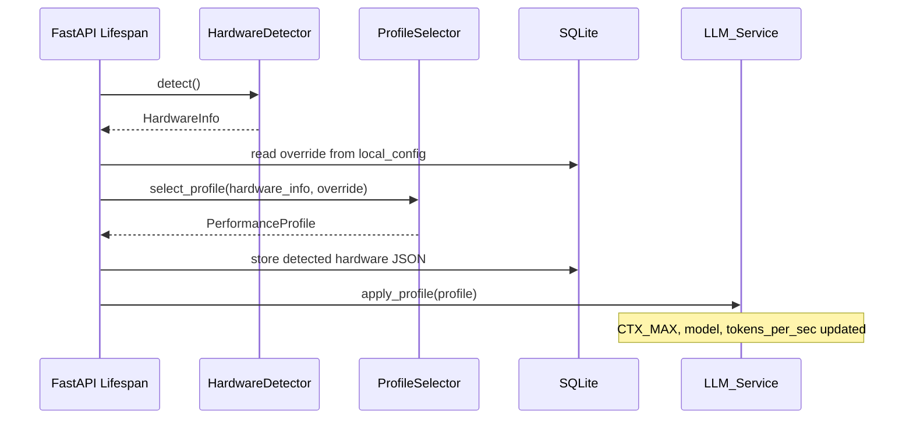

# Design Document — Hardware Performance Tuning

## Overview

Cette fonctionnalité détecte automatiquement les capacités matérielles du poste de l'expert au démarrage du backend et sélectionne un profil de performance LLM adapté. Les paramètres (CTX_MAX, modèle, chunks RAG, tokens/s) sont appliqués dynamiquement à toutes les requêtes LLM sans nécessiter de redémarrage.

L'architecture repose sur :
- Un **Hardware Detector** qui lit les infos CPU/RAM/GPU depuis `/proc` et `psutil` à l'intérieur du conteneur Docker (avec accès aux ressources de l'hôte via les limites Docker)
- Un **Profile Selector** qui associe les caractéristiques détectées à un profil prédéfini
- Une **intégration LLM_Service** qui remplace les constantes globales par des valeurs dynamiques issues du profil actif
- Une **API REST** exposant hardware info, profil actif, et override manuel
- Une **page Performance** dans le frontend affichant le tout

### Décisions de conception clés

1. **Profils en dur (dict Python)** plutôt qu'en base : les profils sont stables et peu nombreux (4). Un dictionnaire dans le code est plus simple à maintenir et tester qu'une table DB.
2. **Détection via `/proc` + `psutil`** : le conteneur Docker partage le kernel de l'hôte, donc `/proc/cpuinfo` et `/proc/meminfo` reflètent le matériel réel. `psutil` fournit une API propre par-dessus.
3. **Override persisté en DB** (colonne `performance_profile_override` dans `LocalConfig`) : permet de survivre aux redémarrages.
4. **Pas de page séparée** : la section Performance s'intègre dans la page `/config` existante, cohérent avec l'UX actuelle.

## Architecture



### Flux au démarrage



## Components and Interfaces

### 1. HardwareDetector (`services/hardware_service.py`)

Responsable de la collecte des informations matérielles.

```python
@dataclass
class HardwareInfo:
    cpu_model: str          # e.g. "Intel Core i7-10750H"
    cpu_freq_ghz: float     # e.g. 2.6
    cpu_cores: int          # physical cores, e.g. 6
    ram_total_gb: float     # e.g. 31.7
    gpu_name: str | None    # e.g. "NVIDIA GeForce RTX 3060" or None
    gpu_vram_gb: float | None  # e.g. 6.0 or None

class HardwareDetector:
    def detect(self) -> HardwareInfo:
        """Collect hardware info. Uses safe defaults on failure."""
        ...
```

**Stratégie de détection dans Docker :**
- CPU : `psutil.cpu_count(logical=False)` pour les cœurs physiques, `/proc/cpuinfo` pour le modèle et la fréquence
- RAM : `psutil.virtual_memory().total` (reflète la RAM de l'hôte sauf si Docker a un memory limit)
- GPU : lecture de `/proc/driver/nvidia/gpus/*/information` ou appel `nvidia-smi` si disponible ; sinon `None`

### 2. ProfileSelector (`services/hardware_service.py`)

Associe le matériel détecté à un profil et gère l'override.

```python
@dataclass
class PerformanceProfile:
    name: str               # "high", "medium", "low", "minimal"
    display_name: str       # "Haute performance", etc.
    ram_range: str          # "≥ 32 Go", "16–32 Go", etc.
    ctx_max: int            # 8192, 6144, 4096, 2048
    model: str              # "qwen2.5:7b-instruct-q3_K_M" or "qwen2.5:3b-instruct-q3_K_M"
    rag_chunks: int         # 6, 4, 3, 2
    tokens_per_sec: float   # computed from CPU

PROFILES: dict[str, PerformanceProfile]  # keyed by name

class ProfileSelector:
    def select(self, hw: HardwareInfo) -> PerformanceProfile:
        """Select profile based on RAM thresholds."""
        ...

    def compute_tokens_per_sec(self, hw: HardwareInfo) -> float:
        """base 8.0 × (cores × freq_ghz) / 16"""
        ...

    def get_active_profile(self, hw: HardwareInfo, override: str | None) -> PerformanceProfile:
        """Returns override profile if set, else auto-detected."""
        ...
```

### 3. LLM_Service Integration

Le `LLM_Service` existant sera modifié pour lire les paramètres depuis un singleton `ActiveProfile` plutôt que depuis les variables d'environnement.

```python
# Nouveau dans llm_service.py
class ActiveProfile:
    """Thread-safe singleton holding the active performance profile."""
    _profile: PerformanceProfile | None = None
    _hardware_info: HardwareInfo | None = None

    @classmethod
    def set(cls, profile: PerformanceProfile, hw: HardwareInfo) -> None: ...

    @classmethod
    def get_ctx_max(cls) -> int: ...

    @classmethod
    def get_model(cls) -> str: ...

    @classmethod
    def get_tokens_per_sec(cls) -> float: ...
```

Les constantes globales `CTX_MAX`, `LLM_MODEL`, `LLM_TOKENS_PER_SEC` deviennent des fallbacks : si `ActiveProfile` est initialisé, ses valeurs priment.

### 4. API Endpoints (dans `routers/config.py`)

| Method | Path | Description |
|--------|------|-------------|
| GET | `/api/config/hardware-info` | Retourne le HardwareInfo détecté |
| GET | `/api/config/performance-profile` | Retourne le profil actif + tous les profils disponibles |
| PUT | `/api/config/performance-profile/override` | Applique un override manuel ou revient en auto |

**Schemas Pydantic :**

```python
class HardwareInfoResponse(BaseModel):
    cpu_model: str
    cpu_freq_ghz: float
    cpu_cores: int
    ram_total_gb: float
    gpu_name: str | None
    gpu_vram_gb: float | None

class ProfileResponse(BaseModel):
    name: str
    display_name: str
    ram_range: str
    ctx_max: int
    model: str
    rag_chunks: int
    tokens_per_sec: float
    step_durations: dict[str, str]  # {"step1": "~3 min", ...}

class PerformanceProfileResponse(BaseModel):
    active_profile: ProfileResponse
    is_override: bool
    auto_detected_profile: str
    all_profiles: list[ProfileResponse]
    hardware_info: HardwareInfoResponse

class OverrideRequest(BaseModel):
    profile_name: str | None  # None = revert to auto

class ModelDownloadStatus(BaseModel):
    needed: bool
    in_progress: bool
    progress_percent: float | None
    error: str | None
```

### 5. Frontend PerformanceSection

Nouvelle section dans `/config/page.tsx` affichant :
- Carte "Matériel détecté" (CPU, RAM, GPU)
- Carte "Profil actif" avec sélecteur dropdown pour override
- Table de référence des profils avec la ligne active surlignée
- Estimations de durée par step

## Data Models

### Modification de `LocalConfig`

Ajout de deux colonnes :

```python
class LocalConfig(Base):
    # ... colonnes existantes ...

    # Hardware Performance Tuning
    detected_hardware_json: Mapped[Optional[str]] = mapped_column(String(1024))
    # JSON sérialisé du HardwareInfo détecté au dernier démarrage

    performance_profile_override: Mapped[Optional[str]] = mapped_column(String(50))
    # Nom du profil forcé ("high", "medium", "low", "minimal") ou NULL = auto
```

### Migration Alembic `009_add_hardware_performance_columns.py`

```python
def upgrade():
    op.add_column("local_config", sa.Column("detected_hardware_json", sa.String(1024), nullable=True))
    op.add_column("local_config", sa.Column("performance_profile_override", sa.String(50), nullable=True))

def downgrade():
    op.drop_column("local_config", "performance_profile_override")
    op.drop_column("local_config", "detected_hardware_json")
```

### Profils (dictionnaire Python, pas de table DB)

```python
PROFILES = {
    "high": PerformanceProfile(
        name="high",
        display_name="Haute performance",
        ram_range="≥ 32 Go",
        ctx_max=8192,
        model="qwen2.5:7b-instruct-q3_K_M",
        rag_chunks=6,
        tokens_per_sec=0.0,  # computed at runtime
    ),
    "medium": PerformanceProfile(
        name="medium",
        display_name="Standard",
        ram_range="16–32 Go",
        ctx_max=6144,
        model="qwen2.5:7b-instruct-q3_K_M",
        rag_chunks=4,
        tokens_per_sec=0.0,
    ),
    "low": PerformanceProfile(
        name="low",
        display_name="Économique",
        ram_range="8–16 Go",
        ctx_max=4096,
        model="qwen2.5:3b-instruct-q3_K_M",
        rag_chunks=3,
        tokens_per_sec=0.0,
    ),
    "minimal": PerformanceProfile(
        name="minimal",
        display_name="Minimal",
        ram_range="< 8 Go",
        ctx_max=2048,
        model="qwen2.5:3b-instruct-q3_K_M",
        rag_chunks=2,
        tokens_per_sec=0.0,
    ),
}
```


## Correctness Properties

*A property is a characteristic or behavior that should hold true across all valid executions of a system — essentially, a formal statement about what the system should do. Properties serve as the bridge between human-readable specifications and machine-verifiable correctness guarantees.*

### Property 1: Profile selection is consistent with RAM thresholds

*For any* positive RAM value (in GB), the ProfileSelector SHALL return:
- "high" when RAM ≥ 32
- "medium" when 16 ≤ RAM < 32
- "low" when 8 ≤ RAM < 16
- "minimal" when RAM < 8

And the returned profile SHALL have the correct `ctx_max`, `model`, and `rag_chunks` values matching the profile definition.

**Validates: Requirements 2.1, 2.2, 2.3, 2.4, 2.5**

### Property 2: Tokens per second computation follows the formula

*For any* valid CPU configuration (cores > 0, frequency > 0), the computed `tokens_per_sec` SHALL equal `8.0 × (cores × frequency_ghz) / 16`.

**Validates: Requirements 2.6**

### Property 3: RAM warning for over-provisioned profiles

*For any* combination of detected RAM and selected profile, if the profile's minimum RAM requirement exceeds the detected RAM, the system SHALL flag the selection as potentially unstable (warning = true). If the detected RAM meets or exceeds the requirement, no warning SHALL be raised.

**Validates: Requirements 5.5**

### Property 4: Step duration estimate follows the formula

*For any* positive values of `estimated_input_tokens`, `output_ratio` (> 0), and `tokens_per_sec` (> 0), the computed step duration in seconds SHALL equal `(estimated_input_tokens × output_ratio) / tokens_per_sec`.

**Validates: Requirements 6.2**

## Error Handling

### Hardware Detection Failures

| Failure | Default Value | Action |
|---------|--------------|--------|
| CPU model unreadable | `"Unknown CPU"` | Log warning, continue |
| CPU frequency unreadable | `2.0` GHz | Log warning, continue |
| CPU cores unreadable | `4` | Log warning, continue |
| RAM unreadable | `8.0` GB (selects "low") | Log warning, continue |
| GPU detection fails | `None` (no GPU) | Log info, continue |

### Profile Override Errors

| Error | Response | HTTP Status |
|-------|----------|-------------|
| Invalid profile name in override | `{"detail": "Profil inconnu: {name}"}` | 400 |
| DB write failure | `{"detail": "Erreur de persistance"}` | 500 |

### Model Download Errors

| Error | Behavior |
|-------|----------|
| Ollama unreachable | Keep current model, log error, report in API |
| Download interrupted | Keep current model, retry on next startup |
| Disk space insufficient | Keep current model, log error, report warning in API |

### LLM_Service Fallback Chain

1. Use `ActiveProfile` values if initialized
2. Fall back to environment variables (`CTX_MAX`, `LLM_MODEL`, `LLM_TOKENS_PER_SEC`)
3. Fall back to hardcoded defaults (8192, "qwen2.5:7b-instruct-q3_K_M", 8.0)

## Testing Strategy

### Property-Based Tests (Hypothesis)

La fonctionnalité contient de la logique pure (sélection de profil, calculs de formules) bien adaptée au property-based testing.

**Library**: Hypothesis (déjà utilisé dans le projet, `tests/property/`)

**Configuration**: minimum 100 itérations par propriété.

**Fichier**: `tests/property/test_prop_hardware_performance.py`

| Property | Test | Generators |
|----------|------|-----------|
| 1 — Profile selection | `test_profile_selection_matches_ram_thresholds` | `st.floats(min_value=0.5, max_value=256.0)` for RAM |
| 2 — Tokens/sec formula | `test_tokens_per_sec_formula` | `st.integers(1, 64)` for cores, `st.floats(0.5, 6.0)` for freq |
| 3 — RAM warning | `test_ram_warning_consistency` | `st.floats(1.0, 128.0)` for RAM, `st.sampled_from(PROFILES)` for profile |
| 4 — Duration formula | `test_step_duration_formula` | `st.integers(100, 50000)` for tokens, `st.floats(0.1, 3.0)` for ratio, `st.floats(1.0, 50.0)` for tps |

**Tag format**: `# Feature: hardware-performance-tuning, Property {N}: {title}`

### Unit Tests (Example-Based)

**Fichier**: `tests/unit/test_hardware_service.py`

| Test | What it verifies |
|------|-----------------|
| `test_detect_hardware_returns_valid_info` | HardwareDetector returns all fields populated |
| `test_detect_hardware_fallback_on_failure` | Safe defaults when psutil raises |
| `test_active_profile_singleton_set_get` | ActiveProfile stores and returns values |
| `test_active_profile_hot_reload` | Changing profile updates subsequent reads |
| `test_override_persists_to_db` | PUT override writes to local_config |
| `test_override_auto_clears_db` | PUT with null clears override column |
| `test_api_hardware_info_response_shape` | GET /hardware-info returns correct schema |
| `test_api_performance_profile_response` | GET /performance-profile returns all profiles |
| `test_model_download_triggered_on_mismatch` | Ollama pull called when model differs |
| `test_model_download_failure_fallback` | Keeps previous model on pull failure |

### Integration Tests

**Fichier**: `tests/integration/test_hardware_integration.py`

| Test | What it verifies |
|------|-----------------|
| `test_startup_detects_and_persists_hardware` | Full lifespan flow: detect → persist → profile active |
| `test_llm_service_uses_active_profile_ctx_max` | LLM compute_num_ctx respects profile CTX_MAX |
| `test_override_applies_to_llm_calls` | After override, LLM uses new model/ctx_max |

### Smoke Tests

| Test | What it verifies |
|------|-----------------|
| `test_hardware_detection_in_container` | HardwareDetector runs without error in Docker |
| `test_performance_api_accessible` | GET endpoints return 200 |
