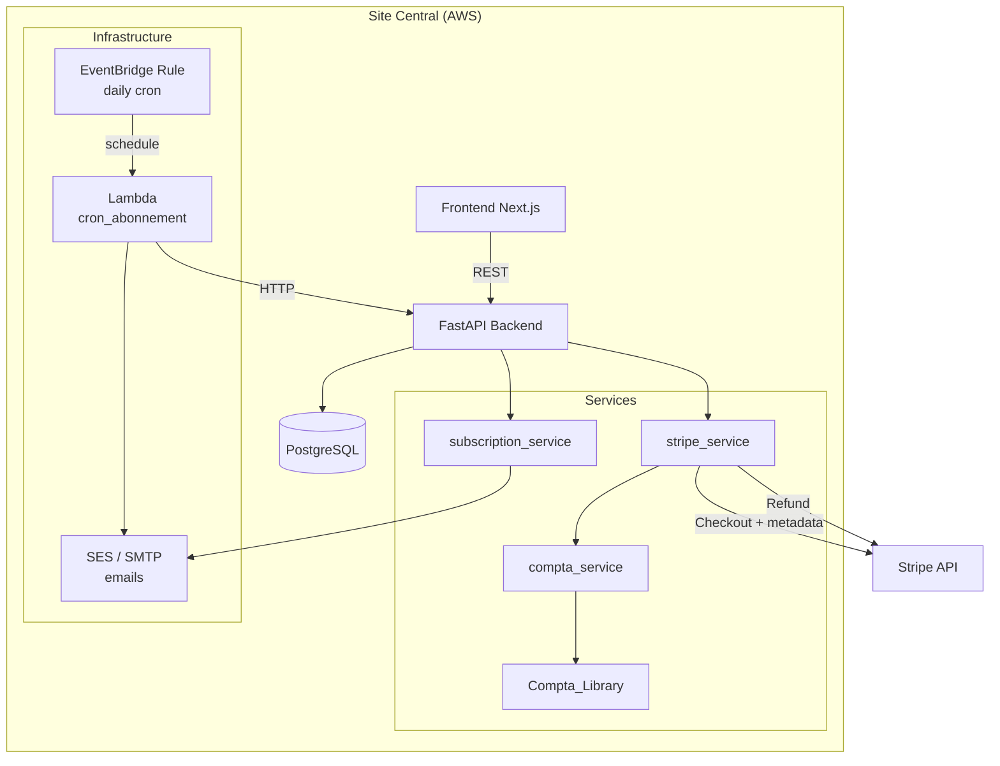
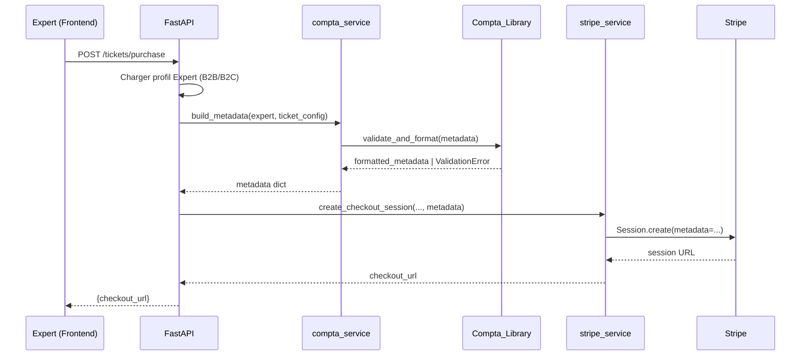
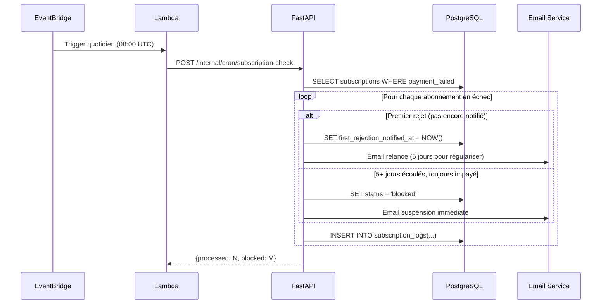

# Design Document — Integration Compta

## Overview

Cette fonctionnalité enrichit le système de paiement Stripe du Site Central avec des métadonnées comptables exploitables par une application comptable externe (compta-appli). Elle couvre :

1. **Métadonnées comptables** : injection de données B2B/B2C dans les sessions Stripe Checkout
2. **Profil expert étendu** : stockage des informations de facturation (SIRET, RCS, adresse société, email facturation)
3. **Bibliothèque partagée** : intégration de `Compta_Library` pour le formatage/validation des métadonnées
4. **Remboursement admin** : bouton "Re-créditer" sur la page tickets de l'administration
5. **Cron abonnement** : tâche quotidienne EventBridge pour la gestion des incidents de paiement
6. **Résiliation** : workflow de résiliation d'abonnement par l'expert

### Décisions techniques clés

| Décision | Choix | Justification |
|----------|-------|---------------|
| Stockage profil B2B/B2C | Colonnes sur la table `experts` | Relation 1:1, pas besoin d'une table séparée |
| Compta_Library | Dépendance pip via git+https | Bibliothèque Python externe hébergée sur GitHub |
| Cron | EventBridge → Lambda → API interne | Architecture serverless, coût minimal, découplage |
| Résiliation | Champ `termination_scheduled_at` | Simple, requêtable, pas de table supplémentaire |
| Remboursement | Endpoint admin dédié | Séparation des responsabilités, audit trail |

## Architecture



### Flux de paiement avec métadonnées



### Flux cron abonnement



## Components and Interfaces

### Backend — Nouveaux fichiers / modifications

| Fichier | Action | Description |
|---------|--------|-------------|
| `models/expert.py` | Modifier | Ajouter colonnes B2B/B2C |
| `models/subscription.py` | Créer | Modèle abonnement expert |
| `models/subscription_log.py` | Créer | Journal des actions cron |
| `schemas/profile.py` | Modifier | Ajouter champs B2B/B2C au profil |
| `schemas/subscription.py` | Créer | Schémas abonnement/résiliation |
| `services/compta_service.py` | Créer | Wrapper autour de Compta_Library |
| `services/stripe_service.py` | Modifier | Ajouter metadata + refund |
| `services/subscription_service.py` | Créer | Logique abonnement/cron |
| `routers/admin.py` | Modifier | Endpoint refund |
| `routers/subscription.py` | Créer | Endpoints résiliation |
| `routers/internal.py` | Créer | Endpoint cron (auth par token) |

### API Endpoints

#### Remboursement (Admin)

```
POST /api/admin/tickets/{ticket_id}/refund
Authorization: Bearer <admin_token>
Response 200: { "message": "Remboursement effectué", "refunded_at": "..." }
Response 400: { "detail": "Ticket non remboursable (statut: utilisé)" }
Response 502: { "detail": "Erreur Stripe: <description>" }
```

#### Résiliation (Expert)

```
POST /api/subscription/terminate
Authorization: Bearer <expert_token>
Response 200: { "termination_date": "2025-01-31", "message": "Résiliation programmée" }

GET /api/subscription/status
Authorization: Bearer <expert_token>
Response 200: { "status": "active|blocked|terminating", "termination_date": null|"..." }
```

#### Cron interne

```
POST /api/internal/cron/subscription-check
X-Cron-Token: <secret>
Response 200: { "processed": 5, "emails_sent": 3, "blocked": 1 }
```

### Frontend — Modifications

| Fichier | Action | Description |
|---------|--------|-------------|
| `app/admin/page.tsx` | Modifier | Ajouter bouton "Re-créditer" par ticket |
| `app/monespace/profil/page.tsx` | Modifier | Formulaire B2B/B2C |
| `app/monespace/abonnement/page.tsx` | Créer | Page gestion abonnement + résiliation |
| `components/RefundButton.tsx` | Créer | Composant bouton remboursement |
| `components/ProfileBillingForm.tsx` | Créer | Formulaire profil facturation |

### Infrastructure (Terraform)

| Ressource | Description |
|-----------|-------------|
| `aws_cloudwatch_event_rule.cron_abonnement` | Règle EventBridge `cron(0 8 * * ? *)` |
| `aws_cloudwatch_event_target.cron_lambda` | Target Lambda |
| `aws_lambda_function.cron_abonnement` | Lambda Python invoquant l'API interne |
| `aws_iam_role.cron_lambda_role` | Rôle IAM pour la Lambda |
| `aws_secretsmanager_secret.cron_token` | Token d'authentification du cron |

## Data Models

### Expert (colonnes ajoutées)

```python
class Expert(Base):
    # ... colonnes existantes ...
    
    # Profil facturation
    profile_type: Mapped[str] = mapped_column(
        String(3), default="B2C"  # "B2B" ou "B2C"
    )
    # Champs B2B (nullable, requis si profile_type == "B2B")
    company_address: Mapped[Optional[str]] = mapped_column(Text, nullable=True)
    billing_email: Mapped[Optional[str]] = mapped_column(String(255), nullable=True)
    siret: Mapped[Optional[str]] = mapped_column(String(14), nullable=True)
    rcs: Mapped[Optional[str]] = mapped_column(String(50), nullable=True)
```

### Subscription (nouveau modèle)

```python
class Subscription(Base):
    __tablename__ = "subscriptions"

    id: Mapped[int] = mapped_column(primary_key=True)
    expert_id: Mapped[int] = mapped_column(ForeignKey("experts.id"), unique=True)
    stripe_subscription_id: Mapped[str] = mapped_column(String(255))
    status: Mapped[str] = mapped_column(String(20), default="active")
    # Statuts: active, blocked, terminating, terminated
    
    current_period_end: Mapped[datetime] = mapped_column()
    termination_scheduled_at: Mapped[Optional[datetime]] = mapped_column(nullable=True)
    termination_effective_at: Mapped[Optional[datetime]] = mapped_column(nullable=True)
    
    # Gestion incidents de paiement
    payment_failed_at: Mapped[Optional[datetime]] = mapped_column(nullable=True)
    first_rejection_notified_at: Mapped[Optional[datetime]] = mapped_column(nullable=True)
    blocked_at: Mapped[Optional[datetime]] = mapped_column(nullable=True)
    
    created_at: Mapped[datetime] = mapped_column(server_default=func.now())
    updated_at: Mapped[Optional[datetime]] = mapped_column(nullable=True)

    expert: Mapped["Expert"] = relationship(back_populates="subscription")
```

### SubscriptionLog (nouveau modèle)

```python
class SubscriptionLog(Base):
    __tablename__ = "subscription_logs"

    id: Mapped[int] = mapped_column(primary_key=True)
    expert_id: Mapped[int] = mapped_column(ForeignKey("experts.id"))
    action: Mapped[str] = mapped_column(String(50))
    # Actions: "email_relance", "email_suspension", "blocked", "terminated"
    details: Mapped[Optional[str]] = mapped_column(Text, nullable=True)
    created_at: Mapped[datetime] = mapped_column(server_default=func.now())
```

### Ticket (colonnes ajoutées)

```python
class Ticket(Base):
    # ... colonnes existantes ...
    
    # Remboursement
    refunded_at: Mapped[Optional[datetime]] = mapped_column(nullable=True)
    stripe_refund_id: Mapped[Optional[str]] = mapped_column(String(255), nullable=True)
```

### Migration Alembic

Fichier : `alembic/versions/XXX_add_compta_integration.py`

```python
def upgrade():
    # Expert — profil facturation
    op.add_column("experts", sa.Column("profile_type", sa.String(3), server_default="B2C"))
    op.add_column("experts", sa.Column("company_address", sa.Text(), nullable=True))
    op.add_column("experts", sa.Column("billing_email", sa.String(255), nullable=True))
    op.add_column("experts", sa.Column("siret", sa.String(14), nullable=True))
    op.add_column("experts", sa.Column("rcs", sa.String(50), nullable=True))
    
    # Ticket — remboursement
    op.add_column("tickets", sa.Column("refunded_at", sa.DateTime(), nullable=True))
    op.add_column("tickets", sa.Column("stripe_refund_id", sa.String(255), nullable=True))
    
    # Subscription
    op.create_table("subscriptions", ...)
    
    # SubscriptionLog
    op.create_table("subscription_logs", ...)

def downgrade():
    op.drop_table("subscription_logs")
    op.drop_table("subscriptions")
    op.drop_column("tickets", "stripe_refund_id")
    op.drop_column("tickets", "refunded_at")
    op.drop_column("experts", "rcs")
    op.drop_column("experts", "siret")
    op.drop_column("experts", "billing_email")
    op.drop_column("experts", "company_address")
    op.drop_column("experts", "profile_type")
```

## Correctness Properties

*A property is a characteristic or behavior that should hold true across all valid executions of a system — essentially, a formal statement about what the system should do. Properties serve as the bridge between human-readable specifications and machine-verifiable correctness guarantees.*

### Property 1: Metadata correctness by profile type

*For any* Expert with a valid profile (B2B or B2C), the metadata builder SHALL produce a dictionary containing all required fields for that profile type: common fields (`appli`, `service`, `type`, `domaine`) plus B2B-specific fields (`company_address`, `billing_email`, `expert_firstname`, `expert_lastname`, `siret`, `rcs`, `price_ht`) for B2B profiles, or B2C-specific fields (`expert_firstname`, `expert_lastname`, `expert_address`, `price_ttc`) for B2C profiles.

**Validates: Requirements 1.1, 1.2, 1.3**

### Property 2: Metadata format validation round-trip

*For any* valid Expert profile and ticket configuration, the metadata produced by `compta_service.build_metadata()` SHALL pass validation by the Compta_Library without errors.

**Validates: Requirements 1.4, 3.2**

### Property 3: SIRET and RCS validation

*For any* string, the SIRET validator SHALL accept it if and only if it consists of exactly 14 digit characters. *For any* string, the RCS validator SHALL accept it if and only if it matches the French RCS format pattern.

**Validates: Requirements 2.4, 2.5**

### Property 4: Refund button visibility

*For any* Ticket, the refund button SHALL be visible if and only if the ticket has status "actif" AND has a non-empty `stripe_payment_id` that does not start with "pending-".

**Validates: Requirements 4.1, 4.5**

### Property 5: Refund state transition

*For any* Ticket with status "actif" and a valid `stripe_payment_id`, after a successful Stripe refund, the ticket status SHALL be "rembourse" AND `refunded_at` SHALL be set to a non-null timestamp.

**Validates: Requirements 4.3**

### Property 6: Cron payment failure state machine

*For any* subscription with `payment_failed_at` set:
- If `first_rejection_notified_at` is NULL, the cron SHALL produce an "email_relance" action and set `first_rejection_notified_at`.
- If `first_rejection_notified_at` is set AND (now - first_rejection_notified_at) >= 5 days AND payment is still unresolved, the cron SHALL produce a "blocked" action, set status to "blocked", and produce an "email_suspension" action.
- Each action SHALL produce a log entry with timestamp and expert_id.

**Validates: Requirements 5.2, 5.3, 5.5**

### Property 7: Subscription access control

*For any* Expert with a subscription:
- If subscription status is "blocked", access to subscription-based services SHALL be denied.
- If subscription status is "terminating" AND current date is before `termination_effective_at`, access SHALL be granted.
- If subscription status is "active", access SHALL be granted.

**Validates: Requirements 5.4, 6.4**

### Property 8: Termination date calculation

*For any* date within a billing month, when an Expert requests termination, the `termination_effective_at` SHALL be set to the last day of the current billing month (based on `current_period_end`).

**Validates: Requirements 6.1**

## Error Handling

### Stripe Errors

| Scénario | Comportement |
|----------|-------------|
| Compta_Library validation échoue | Rejet de la création de session, HTTP 422 avec message descriptif |
| Stripe Checkout creation échoue | HTTP 500, ticket "en_attente" supprimé, log erreur |
| Stripe Refund échoue | HTTP 502 avec description Stripe, ticket inchangé |
| Stripe Subscription cancel échoue | Log erreur, retry au prochain cron, alerte admin |

### Cron Errors

| Scénario | Comportement |
|----------|-------------|
| Lambda timeout | CloudWatch alarm, retry automatique EventBridge |
| Email envoi échoue | Log erreur, action marquée "failed" dans subscription_logs, retry au prochain cron |
| DB indisponible | Lambda échoue, CloudWatch alarm |
| Token cron invalide | HTTP 401, log tentative non autorisée |

### Validation Errors

| Scénario | Comportement |
|----------|-------------|
| SIRET invalide (pas 14 chiffres) | HTTP 422, message "Le SIRET doit contenir exactement 14 chiffres" |
| RCS invalide | HTTP 422, message "Format RCS invalide" |
| Profil B2B incomplet | HTTP 422, liste des champs manquants |
| Ticket non remboursable | HTTP 400, message avec statut actuel du ticket |

## Testing Strategy

### Property-Based Tests (Hypothesis)

Bibliothèque : **Hypothesis** (déjà utilisée dans le projet)
Configuration : minimum **100 itérations** par propriété

Chaque test de propriété sera tagué avec un commentaire référençant la propriété du design :

```python
# Feature: integration-compta, Property 1: Metadata correctness by profile type
@given(expert=st_expert_profile(), config=st_ticket_config())
def test_prop_metadata_correctness(expert, config):
    ...
```

Fichier : `tests/property/test_prop_compta_integration.py`

| Property | Test | Générateurs |
|----------|------|-------------|
| P1 | `test_prop_metadata_correctness` | Expert B2B/B2C aléatoire, TicketConfig aléatoire |
| P2 | `test_prop_metadata_format_validation` | Expert aléatoire → build_metadata → validate |
| P3 | `test_prop_siret_rcs_validation` | Strings aléatoires (longueur 0-20, mix digits/alpha) |
| P4 | `test_prop_refund_button_visibility` | Ticket avec statut/payment_id aléatoires |
| P5 | `test_prop_refund_state_transition` | Ticket actif aléatoire → refund → vérifier état |
| P6 | `test_prop_cron_state_machine` | Subscription avec dates aléatoires → cron → vérifier actions |
| P7 | `test_prop_subscription_access_control` | Subscription avec statut/dates aléatoires → vérifier accès |
| P8 | `test_prop_termination_date_calculation` | Dates aléatoires → calculer fin de mois billing |

### Unit Tests

Fichier : `tests/unit/test_compta_integration.py`

- Validation SIRET : cas limites (13 chiffres, 15 chiffres, lettres, espaces)
- Validation RCS : formats valides/invalides connus
- Metadata builder : cas B2B complet, cas B2C complet
- Refund : erreur Stripe mockée, ticket déjà remboursé
- Cron : subscription sans échec, subscription déjà bloquée

### Integration Tests

Fichier : `tests/integration/test_compta_stripe.py`

- Création session Checkout avec metadata (Stripe test mode)
- Refund via Stripe API (test mode)
- Compta_Library import et validation

### Smoke Tests

Fichier : `tests/smoke/test_compta_smoke.py`

- Compta_Library importable
- Configuration `appli` / `service` correcte
- EventBridge rule existe (si déployé)
