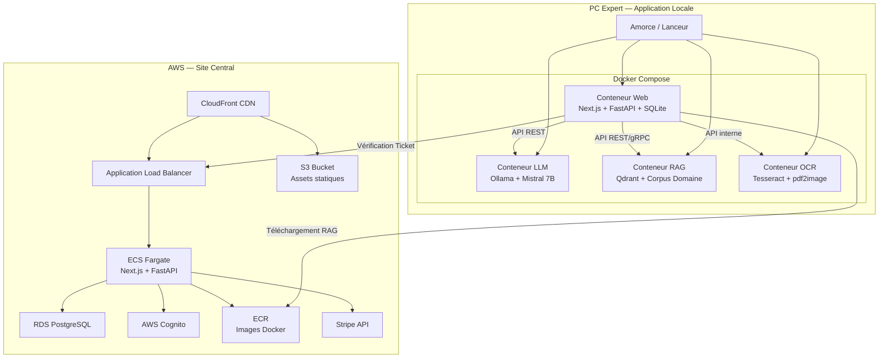
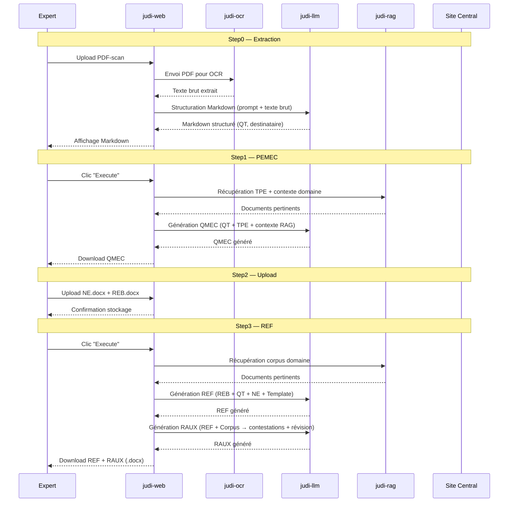
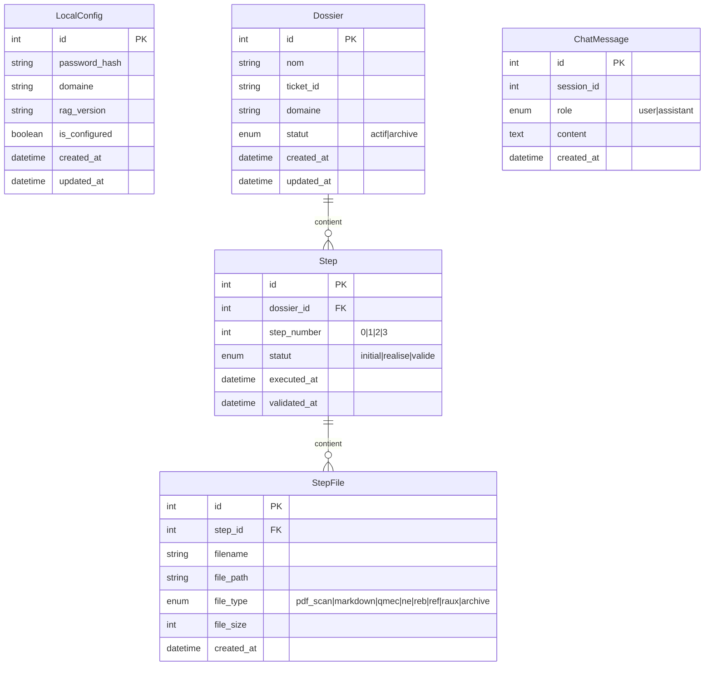
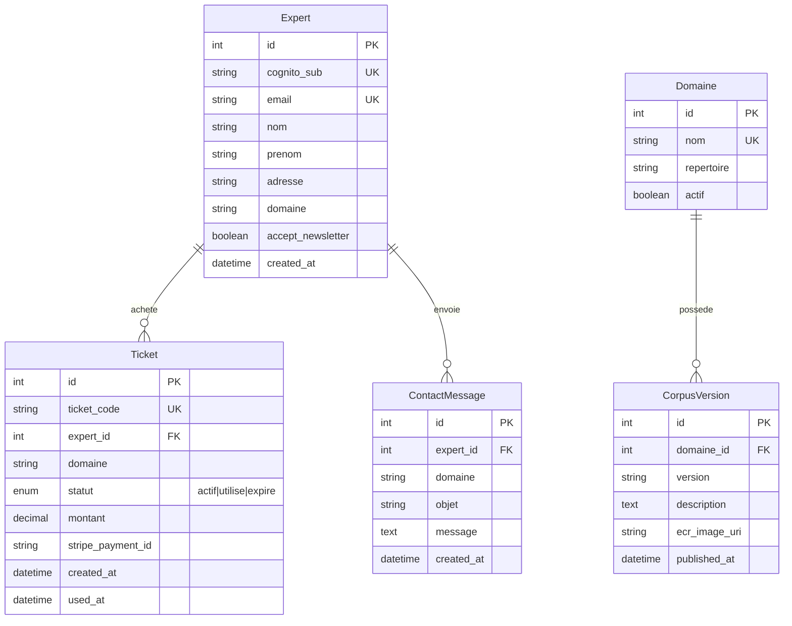

# Document de Conception — Judi-Expert

## Vue d'ensemble

Judi-Expert est un système à deux composants principaux :

1. **Application Locale** — PWA installée sur le PC de l'expert, conteneurisée via Docker (4 conteneurs), intégrant un LLM local (Mistral 7B via Ollama), une base RAG (Qdrant), un moteur OCR (Tesseract) et une BD relationnelle (SQLite via SQLAlchemy). Elle gère le workflow d'expertise en 4 étapes séquentielles.

2. **Site Central** — PWA déployée sur AWS (Terraform), gérant l'authentification (AWS Cognito), les paiements (Stripe), la distribution des modules RAG (ECR) et l'administration.

Les deux composants partagent la même stack technique : Python (FastAPI) pour le backend, React/Next.js pour le frontend PWA. Toutes les données d'expertise restent exclusivement sur le PC de l'expert ; seuls les tickets transitent entre l'Application Locale et le Site Central.

### Décisions techniques clés

| Décision | Choix | Justification |
|---|---|---|
| ORM | SQLAlchemy + Alembic | Standard Python, migrations versionnées |
| Base vectorielle | Qdrant | Open-source, API REST/gRPC, conteneur Docker officiel |
| OCR | Tesseract OCR (pytesseract) | Open-source (Apache 2.0), support français natif |
| LLM | Mistral 7B Instruct v0.3 | Apache 2.0, optimisé français, 7.25B paramètres |
| Runtime LLM | Ollama | Gratuit, API REST compatible OpenAI, gestion GPU/CPU |
| Template .docx | docxtpl (Jinja2) | Remplacement de {{placeholders}} avec préservation du style |
| Paiement | Stripe Checkout + Webhooks | Standard SaaS, SDK Python officiel |
| Auth | AWS Cognito + Amplify JS | Intégration native AWS, User Pools |
| Infra | Terraform | IaC déclaratif, état versionné |
| Conteneurs | Docker Compose (local), ECS/ECR (AWS) | Orchestration simple locale, scalable en production |

---

## Architecture

### Architecture globale



### Architecture des 4 conteneurs Docker locaux

| Conteneur | Image | Rôle | Port |
|---|---|---|---|
| `judi-web` | Next.js + FastAPI + SQLite | Frontend PWA, API backend, BD locale | 3000 (web), 8000 (api) |
| `judi-llm` | Ollama (Mistral 7B) | Inférence LLM locale | 11434 |
| `judi-rag` | Qdrant | Base vectorielle + corpus domaine | 6333 (REST), 6334 (gRPC) |
| `judi-ocr` | Python + Tesseract + pdf2image | Extraction OCR des PDF-scan | 8001 |

### Flux de données principal



---

## Composants et Interfaces

### 1. Module OCR (`judi-ocr`)

Service Python autonome exposant une API REST pour la conversion PDF-scan → texte brut.

**Stack** : Python, pytesseract, pdf2image, Poppler, Pillow, FastAPI

**Interface API** :
```
POST /api/ocr/extract
  Body: multipart/form-data { file: PDF }
  Response: { "text": string, "pages": int, "confidence": float }
```

**Processus** :
1. Conversion des pages PDF en images via `pdf2image` (utilise Poppler)
2. Détection du type de PDF (texte extractible vs scan image)
3. Pour les PDF-scan : extraction OCR via `pytesseract` avec langue `fra` (français)
4. Pour les PDF texte : extraction directe via `PyMuPDF`
5. Retour du texte brut concaténé avec métadonnées

### 2. Module LLM (`judi-llm`)

Conteneur Ollama hébergeant Mistral 7B Instruct v0.3. Expose l'API REST compatible OpenAI.

**Interface API** (Ollama natif) :
```
POST /api/chat
  Body: { "model": "mistral:7b-instruct-v0.3", "messages": [...], "stream": bool }
  Response: { "message": { "role": "assistant", "content": string } }

POST /api/generate
  Body: { "model": "mistral:7b-instruct-v0.3", "prompt": string }
  Response: { "response": string }
```

**Prompts système** :
- `PROMPT_STRUCTURATION_MD` : Structuration du texte OCR brut en Markdown (identification QT, destinataire, sections)
- `PROMPT_GENERATION_QMEC` : Génération du plan d'entretien à partir de QT + TPE + contexte RAG
- `PROMPT_GENERATION_REF` : Génération du rapport final à partir de REB + QT + NE + Template
- `PROMPT_GENERATION_RAUX_P1` : Analyse des contestations possibles du REF
- `PROMPT_GENERATION_RAUX_P2` : Révision du REF tenant compte des contestations
- `PROMPT_CHATBOT` : Prompt système du ChatBot avec contexte RAG

### 3. Module RAG (`judi-rag`)

Conteneur Qdrant avec collections vectorielles par domaine. Le backend `judi-web` gère l'indexation et la recherche.

**Collections Qdrant** :
- `corpus_{domaine}` : Documents du corpus domaine (PDF, URLs)
- `config_{domaine}` : TPE et Template Rapport de l'expert
- `system_docs` : Documentation système (user-guide, CGU, mentions légales)

**Interface de recherche** (côté backend `judi-web`) :
```python
class RAGService:
    async def search(query: str, collection: str, limit: int = 5) -> list[Document]
    async def index_document(file_path: str, collection: str, metadata: dict) -> str
    async def index_url(url: str, collection: str, metadata: dict) -> str
    async def delete_collection(collection: str) -> bool
    async def list_documents(collection: str) -> list[DocumentInfo]
```

**Modèle d'embedding** : `sentence-transformers/all-MiniLM-L6-v2` via FastEmbed (intégré au client Qdrant) ou modèle français `camembert-base` selon les performances.

### 4. Backend API (`judi-web` — FastAPI)

API REST principale de l'Application Locale.

**Routes principales** :

| Groupe | Route | Méthode | Description |
|---|---|---|---|
| Auth locale | `/api/auth/setup` | POST | Configuration mot de passe initial |
| Auth locale | `/api/auth/login` | POST | Connexion locale |
| Config | `/api/config/domain` | GET/PUT | Domaine d'expertise |
| Config | `/api/config/rag-versions` | GET | Versions RAG disponibles |
| Config | `/api/config/rag-install` | POST | Installation module RAG |
| Config | `/api/config/tpe` | POST/PUT | Upload/remplacement TPE |
| Config | `/api/config/template` | POST/PUT | Upload/remplacement Template Rapport |
| Config | `/api/config/documents` | GET | Liste documents RAG |
| Dossiers | `/api/dossiers` | GET/POST | Liste/création dossiers |
| Dossiers | `/api/dossiers/{id}` | GET | Détail dossier + étapes |
| Dossiers | `/api/dossiers/{id}/steps/{step}` | GET | État d'une étape |
| Step0 | `/api/dossiers/{id}/step0/extract` | POST | Lancement extraction OCR |
| Step0 | `/api/dossiers/{id}/step0/markdown` | GET/PUT | Lecture/modification Markdown |
| Step1 | `/api/dossiers/{id}/step1/execute` | POST | Génération QMEC |
| Step1 | `/api/dossiers/{id}/step1/download` | GET | Téléchargement QMEC |
| Step1 | `/api/dossiers/{id}/step1/validate` | POST | Validation Step1 |
| Step2 | `/api/dossiers/{id}/step2/upload` | POST | Upload NE + REB (.docx) |
| Step2 | `/api/dossiers/{id}/step2/validate` | POST | Validation Step2 |
| Step3 | `/api/dossiers/{id}/step3/execute` | POST | Génération REF + RAUX |
| Step3 | `/api/dossiers/{id}/step3/download/{type}` | GET | Téléchargement REF ou RAUX |
| Step3 | `/api/dossiers/{id}/step3/validate` | POST | Validation + archivage ZIP |
| Tickets | `/api/tickets/verify` | POST | Vérification ticket via Site Central |
| ChatBot | `/api/chatbot/message` | POST | Envoi message au ChatBot |
| ChatBot | `/api/chatbot/history` | GET | Historique conversation |

### 5. Backend API Site Central (FastAPI)

**Routes principales** :

| Groupe | Route | Méthode | Description |
|---|---|---|---|
| Auth | `/api/auth/register` | POST | Inscription (Cognito) |
| Auth | `/api/auth/login` | POST | Connexion (Cognito) |
| Auth | `/api/auth/logout` | POST | Déconnexion |
| Profil | `/api/profile` | GET/PUT | Profil expert |
| Profil | `/api/profile/password` | PUT | Changement mot de passe |
| Profil | `/api/profile/delete` | DELETE | Suppression compte |
| Tickets | `/api/tickets/purchase` | POST | Création session Stripe |
| Tickets | `/api/tickets/list` | GET | Liste tickets achetés |
| Tickets | `/api/tickets/verify` | POST | Vérification ticket (appelé par App Locale) |
| Webhooks | `/api/webhooks/stripe` | POST | Webhook Stripe |
| Corpus | `/api/corpus` | GET | Liste corpus par domaine |
| Corpus | `/api/corpus/{domaine}/versions` | GET | Versions module RAG |
| Downloads | `/api/downloads/app` | GET | Package Application Locale |
| Contact | `/api/contact` | POST | Formulaire de contact |
| Admin | `/api/admin/experts` | GET | Liste experts (admin) |
| Admin | `/api/admin/stats/tickets` | GET | Statistiques tickets (admin) |

### 6. Frontend Application Locale (Next.js PWA)

**Pages** :

| Route | Composant | Description |
|---|---|---|
| `/` | `DossiersList` | Page d'accueil — liste des dossiers |
| `/setup` | `InitialSetup` | Configuration initiale (mot de passe + domaine) |
| `/login` | `LocalLogin` | Connexion locale |
| `/config` | `Configuration` | Gestion RAG, TPE, Template |
| `/dossier/[id]` | `DossierDetail` | Détail dossier avec étapes |
| `/dossier/[id]/step/[n]` | `StepView` | Vue d'une étape spécifique |
| `/chatbot` | `ChatBot` | Interface ChatBot |

**Header** : Logo "Judi-expert Local", Dossiers, Configuration, Site Central (lien externe), FAQ (lien externe)
**Footer** : "© ItechSource 2026", CHU (lien externe), Mentions légales, CGU (lien externe), Contact (lien externe)

### 7. Frontend Site Central (Next.js PWA)

**Pages** :

| Route | Composant | Description |
|---|---|---|
| `/` | `LandingPage` | Page d'accueil marketing |
| `/inscription` | `RegisterForm` | Formulaire inscription (Cognito) |
| `/connexion` | `LoginForm` | Formulaire connexion + Captcha |
| `/corpus` | `CorpusList` | Liste corpus par domaine |
| `/contact` | `ContactForm` | Formulaire de contact |
| `/downloads` | `Downloads` | Téléchargement Application Locale |
| `/monespace` | `MonEspace` | Espace personnel (onglets) |
| `/monespace/profil` | `Profil` | Paramètres profil |
| `/monespace/tickets` | `TicketsList` | Liste tickets achetés |
| `/mentions-legales` | `MentionsLegales` | Mentions légales |
| `/cgu` | `CGU` | Conditions générales |
| `/faq` | `FAQ` | Questions fréquentes |
| `/politique-confidentialite` | `PolitiqueConfidentialite` | Politique de confidentialité |
| `/admin` | `AdminDashboard` | Administration (experts + stats) |

**Header** : Logo "Judi-expert", Corpus, FAQ, Connexion/Inscription (ou "Mon Espace" si connecté)
**Footer** : "© ITechSource 2026", Mentions légales, CGU, FAQ, Contact

---

## Modèles de Données

### Base de données Application Locale (SQLite via SQLAlchemy)



**Modèles SQLAlchemy** :

```python
class LocalConfig(Base):
    __tablename__ = "local_config"
    id: Mapped[int] = mapped_column(primary_key=True)
    password_hash: Mapped[str] = mapped_column(String(255))
    domaine: Mapped[str] = mapped_column(String(100))
    rag_version: Mapped[Optional[str]] = mapped_column(String(50))
    is_configured: Mapped[bool] = mapped_column(default=False)
    created_at: Mapped[datetime] = mapped_column(default=func.now())
    updated_at: Mapped[datetime] = mapped_column(default=func.now(), onupdate=func.now())

class Dossier(Base):
    __tablename__ = "dossiers"
    id: Mapped[int] = mapped_column(primary_key=True)
    nom: Mapped[str] = mapped_column(String(255))
    ticket_id: Mapped[str] = mapped_column(String(255), unique=True)
    domaine: Mapped[str] = mapped_column(String(100))
    statut: Mapped[str] = mapped_column(String(20), default="actif")
    created_at: Mapped[datetime] = mapped_column(default=func.now())
    updated_at: Mapped[datetime] = mapped_column(default=func.now(), onupdate=func.now())
    steps: Mapped[list["Step"]] = relationship(back_populates="dossier")

class Step(Base):
    __tablename__ = "steps"
    id: Mapped[int] = mapped_column(primary_key=True)
    dossier_id: Mapped[int] = mapped_column(ForeignKey("dossiers.id"))
    step_number: Mapped[int] = mapped_column()  # 0, 1, 2, 3
    statut: Mapped[str] = mapped_column(String(20), default="initial")
    executed_at: Mapped[Optional[datetime]] = mapped_column()
    validated_at: Mapped[Optional[datetime]] = mapped_column()
    dossier: Mapped["Dossier"] = relationship(back_populates="steps")
    files: Mapped[list["StepFile"]] = relationship(back_populates="step")

class StepFile(Base):
    __tablename__ = "step_files"
    id: Mapped[int] = mapped_column(primary_key=True)
    step_id: Mapped[int] = mapped_column(ForeignKey("steps.id"))
    filename: Mapped[str] = mapped_column(String(255))
    file_path: Mapped[str] = mapped_column(String(500))
    file_type: Mapped[str] = mapped_column(String(50))
    file_size: Mapped[int] = mapped_column()
    created_at: Mapped[datetime] = mapped_column(default=func.now())
    step: Mapped["Step"] = relationship(back_populates="files")

class ChatMessage(Base):
    __tablename__ = "chat_messages"
    id: Mapped[int] = mapped_column(primary_key=True)
    session_id: Mapped[int] = mapped_column()
    role: Mapped[str] = mapped_column(String(20))
    content: Mapped[str] = mapped_column(Text)
    created_at: Mapped[datetime] = mapped_column(default=func.now())
```

### Base de données Site Central (PostgreSQL via SQLAlchemy)



**Modèles SQLAlchemy Site Central** :

```python
class Expert(Base):
    __tablename__ = "experts"
    id: Mapped[int] = mapped_column(primary_key=True)
    cognito_sub: Mapped[str] = mapped_column(String(255), unique=True)
    email: Mapped[str] = mapped_column(String(255), unique=True)
    nom: Mapped[str] = mapped_column(String(100))
    prenom: Mapped[str] = mapped_column(String(100))
    adresse: Mapped[str] = mapped_column(Text)
    domaine: Mapped[str] = mapped_column(String(100))
    accept_newsletter: Mapped[bool] = mapped_column(default=False)
    created_at: Mapped[datetime] = mapped_column(default=func.now())
    tickets: Mapped[list["Ticket"]] = relationship(back_populates="expert")

class Ticket(Base):
    __tablename__ = "tickets"
    id: Mapped[int] = mapped_column(primary_key=True)
    ticket_code: Mapped[str] = mapped_column(String(255), unique=True)
    expert_id: Mapped[int] = mapped_column(ForeignKey("experts.id"))
    domaine: Mapped[str] = mapped_column(String(100))
    statut: Mapped[str] = mapped_column(String(20), default="actif")
    montant: Mapped[Decimal] = mapped_column(Numeric(10, 2))
    stripe_payment_id: Mapped[str] = mapped_column(String(255))
    created_at: Mapped[datetime] = mapped_column(default=func.now())
    used_at: Mapped[Optional[datetime]] = mapped_column()
    expert: Mapped["Expert"] = relationship(back_populates="tickets")

class Domaine(Base):
    __tablename__ = "domaines"
    id: Mapped[int] = mapped_column(primary_key=True)
    nom: Mapped[str] = mapped_column(String(100), unique=True)
    repertoire: Mapped[str] = mapped_column(String(255))
    actif: Mapped[bool] = mapped_column(default=False)

class CorpusVersion(Base):
    __tablename__ = "corpus_versions"
    id: Mapped[int] = mapped_column(primary_key=True)
    domaine_id: Mapped[int] = mapped_column(ForeignKey("domaines.id"))
    version: Mapped[str] = mapped_column(String(50))
    description: Mapped[str] = mapped_column(Text)
    ecr_image_uri: Mapped[str] = mapped_column(String(500))
    published_at: Mapped[datetime] = mapped_column(default=func.now())
    domaine: Mapped["Domaine"] = relationship()

class ContactMessage(Base):
    __tablename__ = "contact_messages"
    id: Mapped[int] = mapped_column(primary_key=True)
    expert_id: Mapped[Optional[int]] = mapped_column(ForeignKey("experts.id"))
    domaine: Mapped[str] = mapped_column(String(100))
    objet: Mapped[str] = mapped_column(String(100))
    message: Mapped[str] = mapped_column(Text)
    created_at: Mapped[datetime] = mapped_column(default=func.now())
```

### Configuration des domaines (`domaines.yaml`)

```yaml
domaines:
  - nom: psychologie
    repertoire: corpus/psychologie
    actif: true
    corpus:
      documents: corpus/psychologie/documents/
      urls: corpus/psychologie/urls/urls.yaml
    contenu: corpus/psychologie/contenu.yaml

  - nom: psychiatrie
    repertoire: corpus/psychiatrie
    actif: false
    corpus:
      documents: corpus/psychiatrie/documents/
      urls: corpus/psychiatrie/urls/urls.yaml

  - nom: medecine_legale
    repertoire: corpus/medecine_legale
    actif: false
    corpus:
      documents: corpus/medecine_legale/documents/
      urls: corpus/medecine_legale/urls/urls.yaml

  - nom: batiment
    repertoire: corpus/batiment
    actif: false
    corpus:
      documents: corpus/batiment/documents/
      urls: corpus/batiment/urls/urls.yaml

  - nom: comptabilite
    repertoire: corpus/comptabilite
    actif: false
    corpus:
      documents: corpus/comptabilite/documents/
      urls: corpus/comptabilite/urls/urls.yaml
```


---

## Propriétés de Correction

*Une propriété est une caractéristique ou un comportement qui doit rester vrai pour toutes les exécutions valides d'un système — essentiellement, une déclaration formelle de ce que le système doit faire. Les propriétés servent de pont entre les spécifications lisibles par l'humain et les garanties de correction vérifiables par la machine.*

### Propriété 1 : Validation des prérequis système

*Pour toute* configuration système (CPU, RAM, espace disque, chiffrement), la fonction de validation doit accepter la configuration si et seulement si toutes les conditions minimales sont satisfaites. De plus, pour toute configuration rejetée, le message d'erreur doit lister exactement les conditions non remplies — ni plus, ni moins.

**Valide : Exigences 1.1, 1.2**

### Propriété 2 : Validation de création de dossier

*Pour tout* nom de dossier et tout ticket, la création d'un dossier doit réussir si et seulement si le nom est non-vide et le ticket est valide (existant, non utilisé, domaine correspondant). Un dossier créé doit contenir exactement 4 étapes (Step0 à Step3) toutes au statut "initial".

**Valide : Exigences 5.1, 5.5**

### Propriété 3 : Cycle de vie des tickets (idempotence d'utilisation)

*Pour tout* ticket valide, la première vérification doit réussir et marquer le ticket comme "utilisé". Toute vérification ultérieure du même ticket doit échouer avec un message indiquant "déjà utilisé". Pour tout ticket inexistant ou invalide, la vérification doit échouer avec un message indiquant "invalide".

**Valide : Exigences 5.3, 5.4, 15.2, 15.4**

### Propriété 4 : Tri chronologique inverse des dossiers

*Pour toute* liste de dossiers avec des dates de création distinctes, la liste retournée par l'API doit être triée par date de création décroissante (le plus récent en premier).

**Valide : Exigences 5.6**

### Propriété 5 : Validation du format de fichier .docx

*Pour tout* fichier soumis au Step2, le système doit accepter le fichier si et seulement si son extension est `.docx`. Pour tout fichier avec une extension différente, le système doit retourner un message d'erreur indiquant que seul le format .docx est accepté.

**Valide : Exigences 8.2, 8.3**

### Propriété 6 : Machine à états du workflow d'expertise

*Pour tout* dossier et *pour toute* séquence de transitions d'étapes, le système doit respecter les invariants suivants :
- L'ordre séquentiel Step0 → Step1 → Step2 → Step3 est strictement imposé
- Une étape au statut "initial" ou "réalisé" interdit l'accès aux étapes suivantes
- Seule la validation d'une étape (passage à "validé") autorise l'accès à l'étape suivante
- Une étape au statut "validé" est immuable (toute tentative de modification échoue)
- La validation du Step3 verrouille définitivement le dossier entier

**Valide : Exigences 7.4, 8.4, 9.5, 10.1, 10.2, 10.3, 10.4**

### Propriété 7 : Complétude et immutabilité de l'archive

*Pour tout* dossier finalisé (Step3 validé), l'archive ZIP générée doit contenir exactement tous les fichiers du dossier : réquisition originale, Markdown extrait, QMEC, NE, REB, REF, RAUX et tous les fichiers intermédiaires. De plus, pour tout dossier archivé, toute tentative de modification ou suppression des fichiers contenus doit échouer.

**Valide : Exigences 9.6, 34.1, 34.2**

### Propriété 8 : Validation du formulaire d'inscription

*Pour toute* combinaison de champs du formulaire d'inscription et de cases à cocher, l'inscription doit réussir si et seulement si tous les champs obligatoires (Nom, Prénom, adresse, Domaine) sont remplis ET toutes les cases obligatoires (Mentions légales, CGU, engagement protection données) sont cochées. La case newsletter optionnelle ne doit pas affecter la validité de l'inscription.

**Valide : Exigences 13.3, 13.4, 13.5**

### Propriété 9 : Uniformité du message d'erreur de connexion

*Pour toute* combinaison d'identifiants invalides (email incorrect, mot de passe incorrect, ou les deux), le message d'erreur retourné doit être identique, ne révélant pas si c'est l'email ou le mot de passe qui est incorrect.

**Valide : Exigences 14.3**

### Propriété 10 : Génération de ticket unique après paiement

*Pour tout* paiement Stripe confirmé, le système doit générer exactement un ticket avec un code unique, le domaine correspondant à celui de l'expert, et le statut "actif". Deux paiements distincts ne doivent jamais produire le même code de ticket.

**Valide : Exigences 15.2**

### Propriété 11 : Filtrage des statistiques de tickets par domaine

*Pour tout* ensemble de tickets et *pour tout* filtre de domaine sélectionné, les résultats retournés doivent contenir uniquement les tickets correspondant au domaine filtré. Si le filtre est "Tous", tous les tickets doivent être retournés.

**Valide : Exigences 19.4**

### Propriété 12 : Parsing round-trip du fichier domaines.yaml

*Pour toute* configuration de domaines valide, la sérialisation en YAML puis le parsing du fichier résultant doit produire une structure de données équivalente à l'originale, préservant le nom, le répertoire, l'indicateur actif et les chemins du corpus de chaque domaine.

**Valide : Exigences 22.1, 22.2**

### Propriété 13 : Round-trip d'indexation RAG

*Pour tout* document valide (.docx ou PDF), l'indexation dans la base Qdrant suivie d'une recherche par le contenu du document doit retourner le document indexé parmi les résultats.

**Valide : Exigences 3.5**

---

## Gestion des Erreurs

### Erreurs Application Locale

| Contexte | Erreur | Comportement |
|---|---|---|
| Installation | Prérequis non satisfaits | Message détaillé par condition, interruption installation |
| Configuration | Image RAG absente | Blocage fonctionnalités expertise, message de configuration obligatoire |
| Configuration | Échec téléchargement RAG | Message d'erreur réseau, possibilité de réessayer |
| Dossier | Ticket invalide/utilisé | Message d'erreur spécifique (invalide vs déjà utilisé) |
| Step0 | PDF illisible ou corrompu | Message d'erreur OCR, suggestion de vérifier le fichier |
| Step0 | OCR faible confiance | Avertissement avec score de confiance, suggestion de vérification manuelle |
| Step2 | Format fichier non .docx | Message d'erreur "seul le format .docx est accepté" |
| Step1/Step3 | Erreur LLM (timeout, OOM) | Message d'erreur avec suggestion de redémarrer le conteneur LLM |
| Step3 | Échec génération ZIP | Message d'erreur, possibilité de réessayer l'archivage |
| Workflow | Tentative accès étape non autorisée | Message "étape précédente non validée" |
| Workflow | Tentative modification étape validée | Message "étape verrouillée, modification impossible" |
| ChatBot | LLM indisponible | Message "assistant temporairement indisponible" |
| Réseau | Site Central injoignable | Message d'erreur réseau pour vérification ticket |

### Erreurs Site Central

| Contexte | Erreur | Comportement |
|---|---|---|
| Inscription | Champs obligatoires manquants | Validation côté client + serveur, messages par champ |
| Inscription | Email déjà utilisé | Message générique "erreur d'inscription" (sécurité) |
| Connexion | Identifiants invalides | Message uniforme sans révéler email/mot de passe |
| Connexion | Captcha non résolu | Blocage soumission formulaire |
| Paiement | Échec Stripe | Message d'erreur Stripe, pas de génération de ticket |
| Paiement | Webhook Stripe échoué | Retry automatique Stripe, log d'erreur côté serveur |
| Ticket | Vérification ticket invalide | Réponse JSON avec code erreur et raison |
| Admin | Accès non autorisé | Redirection vers page de connexion |

### Stratégie de logging

- **Application Locale** : Logs structurés (JSON) dans `data/logs/`, rotation quotidienne, niveaux INFO/WARN/ERROR
- **Site Central** : CloudWatch Logs via ECS, alertes sur erreurs critiques
- **Conteneurs Docker** : Logs stdout/stderr capturés par Docker, accessibles via `docker logs`

---

## Stratégie de Tests

### Approche duale

Le projet utilise une approche de test duale combinant tests unitaires (exemples spécifiques) et tests par propriétés (vérification universelle).

### Tests unitaires (pytest)

- **Validation des entrées** : cas limites pour chaque formulaire et endpoint API
- **Intégration OCR** : tests avec des PDF exemples (scan et texte)
- **Intégration LLM** : tests avec des prompts et réponses mockées
- **Intégration Stripe** : tests avec l'API Stripe en mode test
- **Intégration Cognito** : tests avec des tokens mockés
- **UI** : tests React Testing Library pour les composants critiques

### Tests par propriétés (Hypothesis)

La bibliothèque **Hypothesis** (Python) est utilisée pour les tests par propriétés. Chaque test par propriété :
- Exécute un minimum de **100 itérations** par propriété
- Référence la propriété du document de conception via un tag
- Format du tag : **Feature: judi-expert, Property {numéro}: {titre}**

**Propriétés testées** :
1. Validation prérequis système (Propriété 1)
2. Validation création dossier (Propriété 2)
3. Cycle de vie tickets (Propriété 3)
4. Tri chronologique dossiers (Propriété 4)
5. Validation format .docx (Propriété 5)
6. Machine à états workflow (Propriété 6)
7. Complétude archive ZIP (Propriété 7)
8. Validation formulaire inscription (Propriété 8)
9. Uniformité message erreur connexion (Propriété 9)
10. Génération ticket unique (Propriété 10)
11. Filtrage statistiques tickets (Propriété 11)
12. Parsing round-trip domaines.yaml (Propriété 12)
13. Round-trip indexation RAG (Propriété 13)

### Tests d'intégration

- **Docker Compose** : vérification du démarrage et de la communication inter-conteneurs
- **Flux complet Step0→Step3** : test end-to-end avec des données exemples du domaine psychologie
- **Flux paiement Stripe** : test avec clés Stripe en mode test
- **Flux authentification Cognito** : test avec un User Pool de test

### Tests de fumée (smoke tests)

- Vérification de la structure du dépôt (Exigences 28)
- Vérification de la présence des documents générés (Exigences 29)
- Vérification des licences open-source (Exigences 27)
- Vérification du compte admin par défaut (Exigence 19.1)
- Vérification de la configuration des 5 domaines (Exigences 22.3, 22.4)

### Organisation des tests

```
tests/
├── unit/
│   ├── test_ocr_service.py
│   ├── test_llm_service.py
│   ├── test_rag_service.py
│   ├── test_ticket_service.py
│   ├── test_dossier_service.py
│   ├── test_workflow_engine.py
│   ├── test_archive_service.py
│   ├── test_auth_service.py
│   └── test_docx_generator.py
├── property/
│   ├── test_prop_prerequisites.py
│   ├── test_prop_dossier_creation.py
│   ├── test_prop_ticket_lifecycle.py
│   ├── test_prop_dossier_sorting.py
│   ├── test_prop_file_validation.py
│   ├── test_prop_workflow_fsm.py
│   ├── test_prop_archive.py
│   ├── test_prop_registration.py
│   ├── test_prop_login_error.py
│   ├── test_prop_ticket_generation.py
│   ├── test_prop_ticket_stats.py
│   ├── test_prop_domaines_yaml.py
│   └── test_prop_rag_roundtrip.py
├── integration/
│   ├── test_docker_compose.py
│   ├── test_e2e_workflow.py
│   ├── test_stripe_integration.py
│   └── test_cognito_integration.py
└── smoke/
    ├── test_repo_structure.py
    ├── test_docs_generated.py
    ├── test_licenses.py
    └── test_initial_config.py
```
