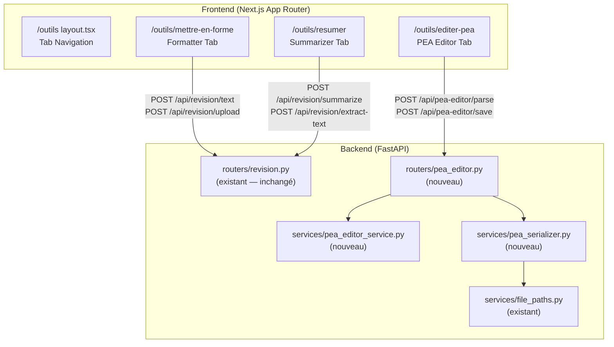
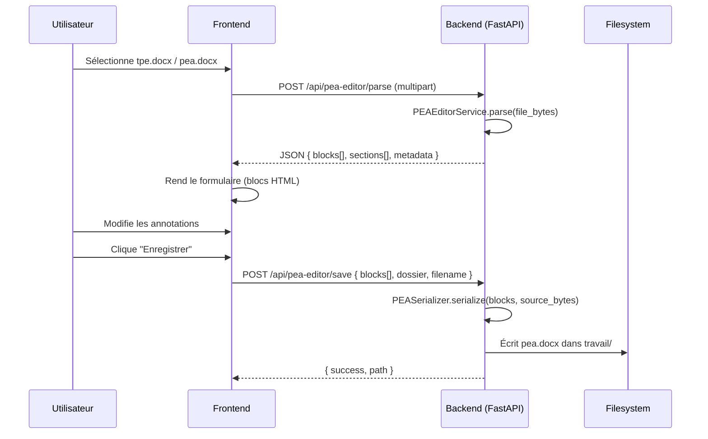

# Design Document — PEA Editor Tools

## Overview

Cette fonctionnalité réorganise la page "Révision" existante en une page "Outils" (`/outils`) avec un système de navigation par onglets exposant trois sous-pages :

1. **Mettre en forme** — correction orthographique/grammaticale via LLM (reprise de la logique existante)
2. **Résumer** — génération de résumés via LLM (reprise de la logique existante)
3. **Editer PEA** — éditeur de formulaire pour les annotations PEA dans les documents .docx

L'éditeur PEA est la partie nouvelle : il parse un document TPE/PEA, affiche sa structure sous forme de formulaire HTML (sections, placeholders en lecture seule, annotations modifiables), et permet de sauvegarder le résultat en .docx dans le répertoire de travail.

### Décisions de conception clés

- **Réutilisation maximale** : les onglets Formatter et Summarizer réutilisent les endpoints backend existants (`/api/revision/*`) sans modification.
- **Nouveau service PEA** : un `PEAEditorService` distinct du `TREParser` existant, car le parsing PEA a des besoins différents (extraction de contenu modifiable, sérialisation round-trip) tandis que le TREParser est orienté extraction de structure.
- **Architecture formulaire** : le document parsé est représenté comme une liste ordonnée de "blocs" (heading, text, placeholder, annotation) envoyée au frontend en JSON. Le frontend rend chaque bloc selon son type.
- **Sauvegarde locale** : le fichier .docx est généré côté backend et écrit directement dans `c:\judi-expert\<dossier>\travail`.

## Architecture



### Flux de données — Éditeur PEA



## Components and Interfaces

### Frontend Components

#### 1. Layout Outils (`/outils/layout.tsx`)

Composant layout Next.js App Router qui encapsule les trois sous-pages avec une barre d'onglets.

```typescript
// app/outils/layout.tsx
interface OutilsLayoutProps {
  children: React.ReactNode;
}

// Tabs: "Mettre en forme" | "Résumer" | "Editer PEA"
// Active tab determined by current pathname
// Redirects /outils → /outils/mettre-en-forme
```

#### 2. Tab Navigation Component

```typescript
interface TabItem {
  label: string;       // "Mettre en forme", "Résumer", "Editer PEA"
  href: string;        // "/outils/mettre-en-forme", etc.
  slug: string;        // "mettre-en-forme", "resumer", "editer-pea"
}

interface OutilsTabsProps {
  activeSlug: string;
}

function OutilsTabs({ activeSlug }: OutilsTabsProps): JSX.Element;
```

#### 3. Formatter Page (`/outils/mettre-en-forme/page.tsx`)

Reprend la logique existante de `revision/page.tsx` en ne conservant que la partie révision (pas le résumé). Modes fichier et texte avec `ProcessingTimer`.

#### 4. Summarizer Page (`/outils/resumer/page.tsx`)

Reprend la logique de résumé existante. Modes fichier et texte avec `ProcessingTimer`.

#### 5. PEA Editor Page (`/outils/editer-pea/page.tsx`)

```typescript
// État principal
interface PEAEditorState {
  status: "idle" | "loading" | "editing" | "saving" | "error";
  blocks: PEABlock[];
  sections: SectionInfo[];
  sourceFilename: string | null;
  sourceFileBytes: File | null;  // conservé pour la sérialisation
  error: string | null;
  isDirty: boolean;
}

// Composants enfants
function PEAFileSelector({ onSelect }: { onSelect: (file: File) => void }): JSX.Element;
function PEAFormRenderer({ blocks, sections, onChange }: PEAFormProps): JSX.Element;
function PEAAnnotationPalette({ sections, onInsert }: PaletteProps): JSX.Element;
function PEAToolbar({ onSave, onCancel, isDirty }: ToolbarProps): JSX.Element;
```

#### 6. PEA Form Renderer

Rend chaque bloc selon son type :

```typescript
function PEABlockRenderer({ block, onChange }: { block: PEABlock; onChange: (id: string, value: string) => void }) {
  switch (block.type) {
    case "heading":    return <HeadingBlock block={block} />;
    case "text":       return <TextBlock block={block} />;        // lecture seule
    case "placeholder": return <PlaceholderBlock block={block} />; // rouge gras, lecture seule
    case "annotation": return <AnnotationBlock block={block} onChange={onChange} />;
  }
}
```

#### 7. Annotation Palette

```typescript
interface AnnotationPaletteProps {
  sections: SectionInfo[];           // sections du document pour la colonne 2
  activeTextareaRef: React.RefObject<HTMLTextAreaElement> | null;
  onInsert: (tag: string) => void;
}

// Colonne 1: type d'annotation (cite, référence, résumé)
// Colonne 2: cible (@dires section_x.x.x, @analyse section_x.x.x)
// Bouton "Insérer" → insère @<type> @<cible>@ à la position du curseur
```

### Backend Components

#### 8. PEA Editor Router (`routers/pea_editor.py`)

```python
router = APIRouter(prefix="/api/pea-editor", tags=["pea-editor"])

@router.post("/parse")
async def parse_pea_document(file: UploadFile) -> PEAParseResponse:
    """Parse un .docx PEA/TPE et retourne la structure en blocs."""

@router.post("/save")
async def save_pea_document(request: PEASaveRequest) -> PEASaveResponse:
    """Sérialise les blocs modifiés en .docx et enregistre dans travail/."""
```

#### 9. PEA Editor Service (`services/pea_editor_service.py`)

```python
class PEAEditorService:
    """Parse un document PEA/TPE en blocs éditables."""

    ANNOTATION_TYPES: frozenset = frozenset({
        "remplir", "dires", "analyse", "conclusion",
        "verbatim", "resume", "reference", "cite", "question"
    })

    def parse(self, file_bytes: bytes) -> PEADocument:
        """Parse le .docx et retourne un PEADocument structuré."""

    def _extract_blocks(self, doc: DocxDocument) -> list[PEABlock]:
        """Extrait les blocs ordonnés du document."""

    def _parse_annotation(self, text: str, position: int) -> Annotation | None:
        """Parse une annotation depuis le texte d'un paragraphe."""

    def _detect_heading(self, paragraph) -> HeadingInfo | None:
        """Détecte si un paragraphe est un titre de section."""
```

#### 10. PEA Serializer Service (`services/pea_serializer.py`)

```python
class PEASerializer:
    """Génère un .docx à partir des blocs modifiés."""

    def serialize(
        self,
        source_bytes: bytes,
        blocks: list[PEABlock],
    ) -> bytes:
        """Produit le .docx final en préservant les styles source."""

    def _rebuild_paragraph(self, paragraph, block: PEABlock) -> None:
        """Reconstruit le contenu d'un paragraphe à partir du bloc modifié."""

    def _write_to_work_dir(
        self,
        content: bytes,
        dossier_name: str,
        filename: str,
    ) -> str:
        """Écrit le fichier dans c:\\judi-expert\\<dossier>\\travail."""
```

### API Client Extension (Frontend)

```typescript
// lib/api.ts — ajout
export const peaEditorApi = {
  async parse(file: File): Promise<PEAParseResponse> {
    const formData = new FormData();
    formData.append("file", file);
    const res = await apiClient.post<PEAParseResponse>(
      "/api/pea-editor/parse",
      formData,
      { headers: { "Content-Type": "multipart/form-data" }, timeout: 60_000 },
    );
    return res.data;
  },

  async save(request: PEASaveRequest): Promise<PEASaveResponse> {
    const res = await apiClient.post<PEASaveResponse>(
      "/api/pea-editor/save",
      request,
      { timeout: 60_000 },
    );
    return res.data;
  },
};
```

## Data Models

### Frontend Types

```typescript
// types/pea.ts

/** Types de blocs dans le document PEA */
type PEABlockType = "heading" | "text" | "placeholder" | "annotation";

/** Types d'annotations modifiables */
type EditableAnnotationType = "remplir" | "dires" | "analyse" | "conclusion";

/** Types d'annotations en lecture seule */
type ReadOnlyAnnotationType = "verbatim" | "resume" | "reference" | "cite" | "question";

/** Bloc générique du document PEA */
interface PEABlock {
  id: string;                          // UUID unique pour React key + tracking
  type: PEABlockType;
  paragraphIndex: number;              // position dans le .docx source
}

/** Bloc titre de section */
interface HeadingBlock extends PEABlock {
  type: "heading";
  level: number;                       // 1-6 (H1-H6)
  number: string;                      // "2.1.3"
  text: string;                        // texte du titre
}

/** Bloc texte normal (lecture seule) */
interface TextBlock extends PEABlock {
  type: "text";
  content: string;                     // texte brut
}

/** Bloc placeholder <<...>> (lecture seule, rouge gras) */
interface PlaceholderBlock extends PEABlock {
  type: "placeholder";
  name: string;                        // nom du placeholder sans << >>
  fullText: string;                    // texte complet du paragraphe contenant le placeholder
}

/** Bloc annotation (modifiable ou lecture seule selon le type) */
interface AnnotationBlock extends PEABlock {
  type: "annotation";
  annotationType: EditableAnnotationType | ReadOnlyAnnotationType;
  suffix: string;                      // "section_2.1.3" ou "date_entretien JJ/MM/AAAA"
  content: string;                     // contenu textuel modifiable
  isEditable: boolean;                 // true pour remplir, dires, analyse, conclusion
  fieldName?: string;                  // pour @remplir: nom du champ
  fieldFormat?: string;                // pour @remplir: format attendu
  sectionRef?: string;                 // pour @dires/@analyse: "2.1.3"
  insertedAnnotations?: InsertedAnnotation[];  // annotations insérées via palette
}

/** Annotation insérée via la palette dans un textarea */
interface InsertedAnnotation {
  id: string;                          // UUID
  type: "cite" | "reference" | "resume";
  target: string;                      // "@dires section_2.1.3"
  position: number;                    // position dans le texte du textarea
  displayText: string;                 // texte affiché (ex: "@cite @dires_2.1.3@")
}

/** Info section pour la palette */
interface SectionInfo {
  number: string;                      // "2.1.3"
  title: string;                       // texte du titre
  level: number;                       // niveau de profondeur
  annotationType: "dires" | "analyse"; // type d'annotation associé
}

/** Réponse du parsing */
interface PEAParseResponse {
  blocks: PEABlock[];
  sections: SectionInfo[];
  metadata: {
    filename: string;
    totalAnnotations: number;
    editableAnnotations: number;
    totalParagraphs: number;
  };
  errors: string[];                    // erreurs de parsing non fatales
}

/** Requête de sauvegarde */
interface PEASaveRequest {
  blocks: PEABlock[];                  // blocs avec contenu modifié
  sourceFile: string;                  // base64 du fichier source (pour préserver styles)
  dossierName: string;                 // nom du dossier actif
  outputFilename: string;              // nom du fichier de sortie (ex: "pea.docx")
}

/** Réponse de sauvegarde */
interface PEASaveResponse {
  success: boolean;
  outputPath: string;                  // chemin complet du fichier écrit
  message: string;
}
```

### Backend Models (Pydantic + Dataclasses)

```python
# services/pea_editor_models.py

from __future__ import annotations
from dataclasses import dataclass, field
from typing import Literal
from pydantic import BaseModel, Field
import uuid


# --- Dataclasses internes (parsing) ---

@dataclass
class PEABlock:
    """Bloc générique du document PEA."""
    id: str = field(default_factory=lambda: str(uuid.uuid4()))
    type: Literal["heading", "text", "placeholder", "annotation"] = "text"
    paragraph_index: int = 0


@dataclass
class HeadingBlock(PEABlock):
    """Titre de section."""
    type: Literal["heading"] = "heading"
    level: int = 1
    number: str = ""
    text: str = ""


@dataclass
class TextBlock(PEABlock):
    """Texte normal (lecture seule)."""
    type: Literal["text"] = "text"
    content: str = ""


@dataclass
class PlaceholderBlock(PEABlock):
    """Placeholder <<...>>."""
    type: Literal["placeholder"] = "placeholder"
    name: str = ""
    full_text: str = ""


@dataclass
class AnnotationBlock(PEABlock):
    """Annotation @type ... @."""
    type: Literal["annotation"] = "annotation"
    annotation_type: str = ""
    suffix: str = ""
    content: str = ""
    is_editable: bool = False
    field_name: str | None = None
    field_format: str | None = None
    section_ref: str | None = None


@dataclass
class SectionInfo:
    """Information sur une section du document."""
    number: str = ""
    title: str = ""
    level: int = 1
    annotation_type: str = "dires"


@dataclass
class PEADocument:
    """Résultat complet du parsing PEA."""
    blocks: list[PEABlock] = field(default_factory=list)
    sections: list[SectionInfo] = field(default_factory=list)
    errors: list[str] = field(default_factory=list)
    filename: str = ""
    total_paragraphs: int = 0


# --- Modèles Pydantic (API) ---

class PEABlockSchema(BaseModel):
    """Schéma JSON d'un bloc PEA."""
    id: str
    type: Literal["heading", "text", "placeholder", "annotation"]
    paragraph_index: int = Field(alias="paragraphIndex")
    # Heading fields
    level: int | None = None
    number: str | None = None
    text: str | None = None
    # Text fields
    content: str | None = None
    # Placeholder fields
    name: str | None = None
    full_text: str | None = Field(None, alias="fullText")
    # Annotation fields
    annotation_type: str | None = Field(None, alias="annotationType")
    suffix: str | None = None
    is_editable: bool | None = Field(None, alias="isEditable")
    field_name: str | None = Field(None, alias="fieldName")
    field_format: str | None = Field(None, alias="fieldFormat")
    section_ref: str | None = Field(None, alias="sectionRef")

    class Config:
        populate_by_name = True


class SectionInfoSchema(BaseModel):
    """Schéma JSON d'une section."""
    number: str
    title: str
    level: int
    annotation_type: str = Field(alias="annotationType")

    class Config:
        populate_by_name = True


class PEAParseResponseSchema(BaseModel):
    """Réponse du endpoint /parse."""
    blocks: list[PEABlockSchema]
    sections: list[SectionInfoSchema]
    metadata: dict
    errors: list[str]


class PEASaveRequestSchema(BaseModel):
    """Requête du endpoint /save."""
    blocks: list[PEABlockSchema]
    source_file: str = Field(alias="sourceFile")  # base64
    dossier_name: str = Field(alias="dossierName")
    output_filename: str = Field(alias="outputFilename")

    class Config:
        populate_by_name = True


class PEASaveResponseSchema(BaseModel):
    """Réponse du endpoint /save."""
    success: bool
    output_path: str = Field(alias="outputPath")
    message: str

    class Config:
        populate_by_name = True
```

### Algorithme de parsing PEA

```python
def parse(self, file_bytes: bytes) -> PEADocument:
    """
    Algorithme principal de parsing :
    
    1. Ouvrir le .docx avec python-docx
    2. Pour chaque paragraphe :
       a. Détecter si c'est un heading (style Heading1-6 ou numérotation x.x.x)
       b. Détecter les placeholders <<...>>
       c. Détecter les annotations @type ... @
       d. Sinon, traiter comme texte normal
    3. Gérer les annotations multi-paragraphes (ouverture sans fermeture sur la même ligne)
    4. Construire la liste des sections pour la palette
    5. Signaler les erreurs (annotations non fermées, types inconnus)
    """
```

### Algorithme de sérialisation PEA

```python
def serialize(self, source_bytes: bytes, blocks: list[PEABlock]) -> bytes:
    """
    Algorithme de sérialisation :
    
    1. Ouvrir le .docx source avec python-docx (préserve tous les styles)
    2. Créer un mapping paragraph_index → block modifié
    3. Pour chaque paragraphe du document source :
       a. Si le bloc correspondant est une annotation modifiable :
          - Reconstruire le texte au format @type params : contenu @
          - Remplacer le contenu des runs tout en préservant le formatage
       b. Sinon : ne pas modifier (préserve placeholders, texte, headings)
    4. Sauvegarder le document modifié en bytes
    """
```

## Correctness Properties

*A property is a characteristic or behavior that should hold true across all valid executions of a system — essentially, a formal statement about what the system should do. Properties serve as the bridge between human-readable specifications and machine-verifiable correctness guarantees.*

### Property 1: Parsing-Serialization Round-Trip

*For any* valid PEA document containing annotations (@remplir, @dires, @analyse, @conclusion, @verbatim, @resume, @reference, @cite, @question), parsing the document then serializing the result then re-parsing should produce an identical structure: same number of annotations, same types, same textual contents, and same section references.

**Validates: Requirements 11.5**

### Property 2: Annotation Parsing Extraction

*For any* valid annotation string in either mono-line format (`@type content@`) or multi-paragraph format (`@type content\n...\n@`), the parser shall correctly extract the annotation type, suffix/parameters, and textual content. Specifically:
- For `@remplir field_name format :` → field_name (snake_case, 1-64 chars) and format are extracted
- For `@dires section_x.x.x` / `@analyse section_x.x.x` → section reference (1-4 levels) is extracted
- For `@conclusion` → content between opening and closing `@` is extracted as multi-line text

**Validates: Requirements 11.1, 11.2, 11.3, 11.4**

### Property 3: Editability Classification

*For any* PEA block, the `isEditable` flag shall be `true` if and only if the block is an annotation of type @remplir, @dires, @analyse, or @conclusion. All other block types (heading, text, placeholder) and annotation types (verbatim, resume, reference, cite, question) shall have `isEditable = false`.

**Validates: Requirements 8.2, 8.3**

### Property 4: Block Rendering Correctness

*For any* array of PEA blocks, the form renderer shall produce HTML where:
- Heading blocks render as `<hN>` elements (N = block.level) containing the section number and title
- Text blocks render as read-only plain text elements
- Placeholder blocks render as red bold read-only inline elements
- Editable annotation blocks render with a red bold type marker followed by a `<textarea>` or `<input>` containing the annotation content

**Validates: Requirements 6.3, 7.1, 7.2, 7.3, 7.4, 7.5, 7.6**

### Property 5: Serialization Produces Valid .docx

*For any* valid set of PEA blocks (including modified annotation content), the serializer shall produce output that is a valid ZIP archive containing `word/document.xml` with well-formed XML — i.e., a file openable by python-docx without error.

**Validates: Requirements 12.4**

### Property 6: Placeholder Preservation Through Serialization

*For any* PEA document containing placeholders (`<<variable_name>>`), after parsing, modifying annotation contents, and serializing, all placeholders in the output document shall be identical (same names, same positions relative to surrounding text) to those in the source document.

**Validates: Requirements 12.2, 10.2**

### Property 7: Unclosed Annotation Error Detection

*For any* PEA document where a multi-paragraph annotation's closing `@` marker is missing (truncated at end of document), the parser shall report an error that includes the paragraph index of the opening marker and the annotation type.

**Validates: Requirements 11.6**

### Property 8: Unknown Annotation Type Tolerance

*For any* annotation with a type not in the predefined set (remplir, dires, analyse, conclusion, verbatim, resume, reference, cite, question), the parser shall parse it without raising an exception, include it in the block list with `annotation_type` set to the raw type string, and mark it as non-editable.

**Validates: Requirements 11.7**

### Property 9: Palette Insertion Format and Position

*For any* textarea content, cursor position within that content, annotation type selection (cite, référence, résumé), and target selection (@dires section_x.x.x or @analyse section_x.x.x), the insertion operation shall produce a string where the tag `@<type> @<target>@` is inserted exactly at the cursor position, with the rest of the content unchanged before and after the insertion point.

**Validates: Requirements 9.3, 9.6**

## Error Handling

### Frontend Error Handling

| Scenario | Behavior |
|----------|----------|
| File format invalid (.docx only for PEA editor) | Display inline error, keep file selector visible |
| File too large (> 20 MB for formatter/summarizer) | Display size limit error message |
| Network error during parse/save | Display error banner, preserve form state |
| Parse returns errors (unclosed annotations) | Display warnings but still show parseable content |
| Save fails (filesystem error) | Display error message, preserve all form data |
| No annotations found in document | Display informational message |
| LLM timeout (formatter/summarizer) | Display timeout message with retry button |

### Backend Error Handling

| Scenario | HTTP Status | Response |
|----------|-------------|----------|
| Invalid file format | 400 | `{"detail": "Format non supporté. Seuls les fichiers .docx sont acceptés."}` |
| Corrupted .docx (not a valid ZIP) | 400 | `{"detail": "Le fichier .docx est invalide ou corrompu."}` |
| No annotations found | 200 | Normal response with `metadata.editableAnnotations = 0` |
| Unclosed annotation | 200 | Normal response with errors array populated |
| Work directory creation fails | 500 | `{"detail": "Impossible de créer le répertoire de travail."}` |
| File write fails (permissions) | 500 | `{"detail": "Impossible d'écrire le fichier dans le répertoire de travail."}` |
| File already exists (overwrite) | 409 | `{"detail": "Un fichier du même nom existe déjà.", "existing_path": "..."}` |
| Serialization error | 500 | `{"detail": "Erreur lors de la génération du fichier .docx."}` |

### Graceful Degradation

- If the parser encounters unknown annotation types, it includes them as non-editable blocks rather than failing.
- If style information cannot be fully preserved (rare edge cases with complex Word formatting), the serializer logs a warning but produces a valid .docx.
- The frontend preserves all user input in component state even when save fails, allowing retry without data loss.

## Testing Strategy

### Property-Based Tests (Hypothesis)

**Library**: Hypothesis (Python) — already used in the project (`tests/property/`)

**Configuration**: Minimum 100 iterations per property test.

Each property test references its design document property with a tag comment:

```python
# Feature: pea-editor-tools, Property 1: Parsing-Serialization Round-Trip
@given(pea_document=valid_pea_documents())
@settings(max_examples=100)
def test_parse_serialize_roundtrip(pea_document):
    ...
```

**Properties to implement:**

1. **Round-trip** (Property 1) — Generate random valid PEA documents with various annotation combinations, verify parse→serialize→parse identity.
2. **Annotation extraction** (Property 2) — Generate random valid annotations of all types, verify correct field extraction.
3. **Editability classification** (Property 3) — Generate blocks of all types, verify isEditable flag.
4. **Serialization validity** (Property 5) — Generate random block modifications, verify output is valid .docx.
5. **Placeholder preservation** (Property 6) — Generate documents with placeholders, modify annotations, verify placeholders unchanged.
6. **Unclosed annotation detection** (Property 7) — Generate documents with missing closing markers, verify error reporting.
7. **Unknown type tolerance** (Property 8) — Generate annotations with random unknown types, verify no crash.
8. **Palette insertion** (Property 9) — Generate random text/cursor/selections, verify insertion format.

**Custom Hypothesis strategies needed:**

```python
@st.composite
def valid_pea_documents(draw):
    """Generate random valid PEA .docx documents with annotations."""
    # Generate headings, text paragraphs, placeholders, and annotations
    ...

@st.composite  
def valid_annotations(draw):
    """Generate random valid annotation strings."""
    annotation_type = draw(st.sampled_from(["remplir", "dires", "analyse", "conclusion", ...]))
    ...

@st.composite
def pea_blocks(draw):
    """Generate random PEA block arrays."""
    ...
```

### Unit Tests (pytest)

- **Parser unit tests**: Specific examples for each annotation type, edge cases (empty content, special characters, nested annotations)
- **Serializer unit tests**: Verify style preservation with known .docx fixtures
- **Frontend component tests**: React Testing Library for tab navigation, form rendering, palette interaction
- **API endpoint tests**: FastAPI TestClient for /parse and /save endpoints

### Integration Tests

- **End-to-end PEA workflow**: Upload a real TPE .docx → parse → modify annotations → save → verify output .docx
- **File system tests**: Verify work directory creation and file writing
- **Formatter/Summarizer**: Verify existing revision endpoints still work through new routing

### Test File Structure

```
tests/
├── property/
│   ├── test_prop_pea_parser.py          # Properties 1, 2, 7, 8
│   ├── test_prop_pea_serializer.py      # Properties 5, 6
│   ├── test_prop_pea_editability.py     # Property 3
│   └── test_prop_pea_palette.py         # Property 9
├── unit/
│   ├── test_pea_editor_service.py       # Parser unit tests
│   ├── test_pea_serializer.py           # Serializer unit tests
│   └── test_pea_editor_router.py        # API endpoint tests
└── integration/
    └── test_pea_editor_workflow.py       # End-to-end workflow
```

