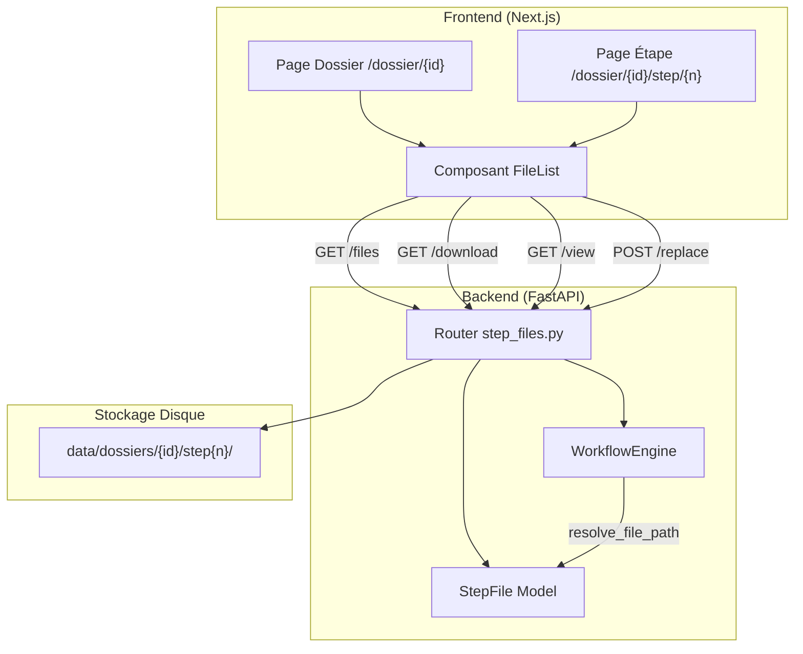
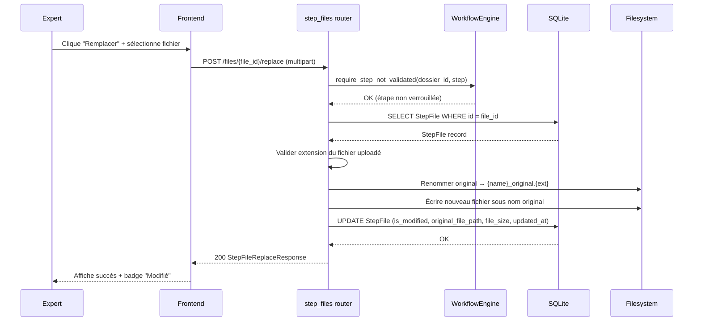

# Design — Gestion des Fichiers par Étape

## Overview

Cette fonctionnalité ajoute une couche de gestion de fichiers unifiée au workflow d'expertise existant. Actuellement, chaque étape (Step 0–3) gère ses fichiers de manière ad hoc via des endpoints spécifiques (extraction PDF, download QMEC, upload NE/REB, download REF/RAUX). Le design proposé introduit :

1. Un ensemble d'endpoints API génériques pour lister, télécharger, prévisualiser et remplacer les fichiers de n'importe quelle étape
2. Un composant frontend réutilisable `FileList` affichant les fichiers avec actions (ouvrir, télécharger, remplacer)
3. Un mécanisme de remplacement de fichier avec conservation de l'original et traçabilité (champ `is_modified`, `original_file_path`)
4. La résolution automatique du fichier actif (modifié ou original) par le workflow engine pour les étapes suivantes

Le design s'intègre dans l'architecture existante sans modifier les endpoints step-spécifiques actuels — les nouveaux endpoints génériques coexistent avec les routes existantes.

## Architecture



### Décisions d'architecture

1. **Nouveau router dédié** (`step_files.py`) plutôt qu'extension du router `steps.py` existant — séparation des responsabilités, le router `steps.py` gère l'exécution/validation des étapes, le nouveau router gère les opérations sur les fichiers.

2. **Endpoints génériques par `file_id`** plutôt que par nom de fichier — permet de gérer plusieurs fichiers du même type et évite les conflits de nommage.

3. **Conservation de l'original sur disque** avec suffixe `_original` — permet le rollback et la traçabilité sans complexifier le modèle de données avec un système de versions multiples.

4. **Résolution du fichier actif via `file_path` en base** — le champ `file_path` du StepFile pointe toujours vers le fichier actif (modifié ou original). Les étapes suivantes n'ont pas besoin de logique spéciale, elles lisent simplement `file_path`.

## Components and Interfaces

### Backend

#### 1. Router `step_files.py`

Nouveau router monté sur `/api/dossiers/{dossier_id}/steps/{step_number}/files`.

| Endpoint | Méthode | Description |
|----------|---------|-------------|
| `/{file_id}/download` | GET | Téléchargement du fichier (Content-Disposition: attachment) |
| `/{file_id}/view` | GET | Affichage inline du fichier (Content-Disposition: inline) |
| `/{file_id}/replace` | POST | Remplacement du fichier par une version modifiée |


#### 2. Schemas Pydantic

```python
class StepFileResponse(BaseModel):
    id: int
    filename: str
    file_type: str
    file_size: int
    is_modified: bool
    original_file_path: str | None
    created_at: datetime
    updated_at: datetime | None

class StepFileReplaceResponse(BaseModel):
    message: str
    file: StepFileResponse
```

#### 3. Méthode `resolve_active_file_path` dans WorkflowEngine

Nouvelle méthode utilitaire ajoutée au `WorkflowEngine` existant pour résoudre le chemin du fichier actif d'un StepFile donné. Cette méthode retourne simplement `step_file.file_path` (qui pointe toujours vers le fichier actif après un éventuel remplacement). Les étapes existantes (step1_execute, step3_execute) utiliseront cette méthode au lieu de construire manuellement les chemins de fichiers.

```python
async def resolve_file_path(
    self, dossier_id: int, step_number: int, filename: str, db: AsyncSession
) -> str:
    """Résout le chemin du fichier actif (modifié ou original) pour une étape."""
```

#### 4. Service `file_service.py`

Nouveau service encapsulant la logique de remplacement de fichier :

```python
class FileService:
    def replace_file(
        self, step_file: StepFile, new_content: bytes, step_dir: str
    ) -> None:
        """Remplace un fichier en conservant l'original avec suffixe _original."""

    def get_content_type(self, filename: str) -> str:
        """Retourne le Content-Type approprié selon l'extension du fichier."""

    def format_file_size(self, size_bytes: int) -> str:
        """Formate la taille en unités lisibles (Ko, Mo)."""
```

### Frontend

#### 1. Composant `FileList`

Composant React réutilisable affiché dans la Page Dossier (section par étape) et dans la Page Étape.

Props :
```typescript
interface FileListProps {
  dossierId: string | number;
  stepNumber: number;
  files: StepFileItem[];
  isLocked: boolean;
  showReplaceButton: boolean;  // true sur Page Étape, false sur Page Dossier
  onFileReplaced?: () => void; // callback après remplacement réussi
}
```

Affiche pour chaque fichier :
- Nom du fichier + badge « Modifié par l'expert » si `is_modified`
- Type, taille formatée, date de création
- Boutons : Ouvrir, Télécharger, Remplacer (conditionnel)

#### 2. Extensions de l'API client (`api.ts`)

```typescript
export const stepFilesApi = {
  getDownloadUrl(dossierId, stepNumber, fileId): string;
  getViewUrl(dossierId, stepNumber, fileId): string;
  async replaceFile(dossierId, stepNumber, fileId, file: File): Promise<StepFileReplaceResponse>;
};
```

#### 3. Mise à jour du type `StepFileItem`

Ajout des champs `is_modified`, `original_file_path`, `updated_at` au type TypeScript existant.

## Data Models

### Modifications du modèle `StepFile`

Deux nouveaux champs ajoutés au modèle SQLAlchemy existant :

```python
class StepFile(Base):
    __tablename__ = "step_files"

    # Champs existants
    id: Mapped[int] = mapped_column(primary_key=True)
    step_id: Mapped[int] = mapped_column(ForeignKey("steps.id"))
    filename: Mapped[str] = mapped_column(String(255))
    file_path: Mapped[str] = mapped_column(String(500))
    file_type: Mapped[str] = mapped_column(String(50))
    file_size: Mapped[int] = mapped_column()
    created_at: Mapped[datetime] = mapped_column(default=func.now())

    # Nouveaux champs
    is_modified: Mapped[bool] = mapped_column(default=False)
    original_file_path: Mapped[Optional[str]] = mapped_column(String(500), nullable=True)
    updated_at: Mapped[Optional[datetime]] = mapped_column(nullable=True)

    step: Mapped["Step"] = relationship(back_populates="files")
```

### Migration Alembic

```python
# alembic revision --autogenerate -m "add_step_file_versioning_fields"
op.add_column("step_files", sa.Column("is_modified", sa.Boolean(), default=False, server_default="0"))
op.add_column("step_files", sa.Column("original_file_path", sa.String(500), nullable=True))
op.add_column("step_files", sa.Column("updated_at", sa.DateTime(), nullable=True))
```

### Logique de remplacement sur disque

Lors du remplacement d'un fichier `requisition.md` :

1. Renommer `requisition.md` → `requisition_original.md` (si pas déjà fait)
2. Écrire le nouveau contenu sous `requisition.md`
3. Mettre à jour en base :
   - `file_path` → chemin vers le nouveau fichier (inchangé, même nom)
   - `original_file_path` → chemin vers `requisition_original.md`
   - `is_modified` → `True`
   - `file_size` → taille du nouveau fichier
   - `updated_at` → `datetime.now(UTC)`

### Diagramme de séquence — Remplacement de fichier




## Correctness Properties

*A property is a characteristic or behavior that should hold true across all valid executions of a system — essentially, a formal statement about what the system should do. Properties serve as the bridge between human-readable specifications and machine-verifiable correctness guarantees.*

### Property 1: File size formatting produces valid human-readable output

*For any* non-negative integer file size (0 to 10 Go), `format_file_size` SHALL return a string containing a numeric value followed by a valid unit from {o, Ko, Mo, Go}, and the numeric value SHALL be between 0 and 1024 (exclusive of 1024 for non-terminal units).

**Validates: Requirements 1.2**

### Property 2: Content-Type mapping is correct for known extensions

*For any* filename with a known extension from {.md, .pdf, .docx, .zip}, `get_content_type` SHALL return the corresponding MIME type from {text/markdown, application/pdf, application/vnd.openxmlformats-officedocument.wordprocessingml.document, application/zip}. For any filename with an unknown extension, it SHALL return application/octet-stream.

**Validates: Requirements 3.3**

### Property 3: File replacement round-trip preserves original and updates record

*For any* valid StepFile and any valid replacement file content with matching extension, after calling the replace operation: (1) a file with the `_original` suffix SHALL exist on disk containing the original content, (2) a file with the original name SHALL exist on disk containing the new content, (3) the StepFile record SHALL have `is_modified=True`, `file_size` equal to the new content length, and `original_file_path` pointing to the preserved original.

**Validates: Requirements 4.2, 4.3, 4.4**

### Property 4: Extension mismatch rejection

*For any* StepFile with extension E1 and any uploaded file with extension E2 where E1 ≠ E2, the replace operation SHALL reject the upload with HTTP 400 and the StepFile record and disk files SHALL remain unchanged.

**Validates: Requirements 4.6**

### Property 5: Active file path resolution

*For any* StepFile, `resolve_file_path` SHALL return `step_file.file_path`. When `is_modified` is False, this path points to the original file. When `is_modified` is True, this path points to the modified file. In both cases, the file at the returned path SHALL exist on disk.

**Validates: Requirements 5.1, 5.2, 5.3**

### Property 6: Download endpoint returns attachment disposition with original filename

*For any* valid StepFile whose file exists on disk, the download endpoint SHALL return a response with `Content-Disposition: attachment; filename="{original_filename}"` and the response body SHALL match the file content on disk.

**Validates: Requirements 3.2, 7.1**

### Property 7: View endpoint returns inline disposition

*For any* valid StepFile whose file exists on disk, the view endpoint SHALL return a response with `Content-Disposition: inline` and the correct Content-Type for the file extension.

**Validates: Requirements 7.2**

### Property 8: Replace is rejected on validated steps

*For any* step with statut "validé" and any valid replacement file, the replace endpoint SHALL return HTTP 403 with the message "Étape verrouillée — modification impossible", and the StepFile record and disk files SHALL remain unchanged.

**Validates: Requirements 7.4, 7.5, 4.5**

## Error Handling

### Backend Errors

| Situation | Code HTTP | Message |
|-----------|-----------|---------|
| StepFile introuvable en base | 404 | « Fichier non trouvé » |
| Fichier introuvable sur le disque (download/view) | 404 | « Fichier introuvable sur le disque » |
| Étape verrouillée (replace sur étape validée) | 403 | « Étape verrouillée — modification impossible » |
| Extension du fichier uploadé différente de l'original | 400 | « Le fichier doit avoir la même extension que l'original ({ext}) » |
| Fichier uploadé vide | 400 | « Le fichier uploadé est vide » |
| Dossier non trouvé | 404 | « Dossier non trouvé » |
| Étape non trouvée | 404 | « Étape non trouvée » |
| Erreur d'écriture disque | 500 | « Erreur lors de l'écriture du fichier sur le disque » |

### Frontend Error Handling

- Les erreurs API sont interceptées par l'intercepteur axios existant et affichées via le message `detail` du backend.
- Le composant `FileList` affiche les erreurs dans un bandeau `role="alert"` au-dessus de la liste.
- En cas de fichier introuvable lors de l'ouverture, un message d'erreur inline remplace la prévisualisation.

## Testing Strategy

### Property-Based Tests (Hypothesis)

Chaque propriété du design sera implémentée comme un test Hypothesis avec minimum 100 itérations. Les tests seront placés dans `tests/property/`.

| Fichier | Propriétés couvertes |
|---------|---------------------|
| `test_prop_file_size_formatting.py` | Property 1 |
| `test_prop_content_type_mapping.py` | Property 2 |
| `test_prop_file_replacement.py` | Properties 3, 4 |
| `test_prop_file_resolution.py` | Property 5 |
| `test_prop_file_endpoints.py` | Properties 6, 7, 8 |

Configuration Hypothesis :
```python
from hypothesis import settings
settings(max_examples=100)
```

Tag format : `# Feature: step-files-management, Property {N}: {title}`

### Unit Tests

Fichier : `tests/unit/test_step_files_router.py`

Tests ciblés :
- Endpoint download retourne 404 quand le fichier n'existe pas sur le disque
- Endpoint view retourne 404 quand le fichier n'existe pas sur le disque
- Endpoint replace retourne 403 quand l'étape est validée
- Endpoint replace retourne 400 quand l'extension ne correspond pas
- Endpoint replace retourne 400 quand le fichier uploadé est vide
- StepFile créé avec `is_modified=False` par défaut
- StepFile créé avec `original_file_path=None` par défaut
- Badge « Modifié par l'expert » affiché quand `is_modified=True`

### Integration Tests

- Workflow complet : upload PDF → extraction → remplacement du markdown → exécution step1 utilise le fichier modifié
- Remplacement de fichier suivi de validation d'étape → fichier verrouillé
