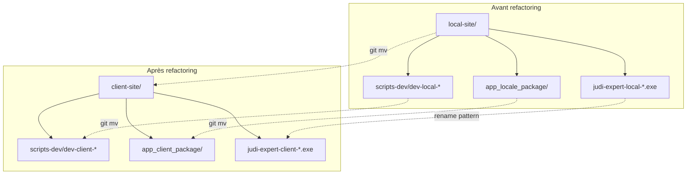

# Design Document — Terminology Refactoring

## Overview

Ce refactoring élimine l'ambiguïté du terme « local » dans le projet Judi-Expert. Le mot « local » sera réservé exclusivement au **mode de déploiement dev** (exécution en localhost), tandis que le composant installé sur le PC de l'expert sera systématiquement désigné par « client » / « Site Client ».

Le changement touche :
- L'arborescence du dépôt (répertoire racine + packaging)
- Les scripts de développement (noms de fichiers + contenu)
- La configuration Docker (services, commentaires, .env)
- La documentation (docs/, steering files)
- L'interface utilisateur (frontend client + frontend central)
- La convention de nommage des packages et chemins S3

### Principes directeurs

1. **Préservation de l'historique Git** : utiliser `git mv` pour tous les renommages de fichiers/répertoires
2. **Atomicité** : le refactoring peut être appliqué en une seule branche, avec un commit par catégorie logique de changement
3. **Non-régression fonctionnelle** : aucune modification de logique métier, seulement des renommages et mises à jour de chaînes
4. **Cohérence totale** : après refactoring, aucune occurrence de « local » ne désigne le composant client

## Architecture

Le refactoring ne modifie pas l'architecture à deux composants (Site Client + Site Central). Il modifie uniquement la **nomenclature** dans le code source, la configuration et la documentation.



### Périmètre des modifications

| Catégorie | Fichiers concernés | Type de modification |
|-----------|-------------------|---------------------|
| Arborescence | `local-site/` → `client-site/` | `git mv` répertoire |
| Scripts dev | `scripts-dev/dev-local-*.sh` | `git mv` + contenu |
| Script commun | `scripts-dev/_common.sh` | Contenu (messages) |
| Packaging | `central-site/app_locale_package/` → `app_client_package/` | `git mv` + contenu |
| Docker Compose | `client-site/docker-compose.yml` | Commentaires |
| .env | `client-site/.env` | Commentaires |
| Docker Compose central | `central-site/docker-compose.dev.yml` | Commentaires/références |
| Documentation | `docs/*.md` (27 fichiers) | Texte |
| Steering | `.kiro/steering/*.md` (3 fichiers) | Texte + arborescence |
| UI Client | `client-site/web/frontend/src/` | Chaînes i18n/texte |
| UI Central | `central-site/web/frontend/src/` | Chaînes i18n/texte |
| Build/Deploy | `scripts-dev/build-and-deploy-local.sh` | `git mv` + contenu |
| Terraform | `central-site/terraform/` | Variables S3 paths |
| NSIS | `central-site/app_client_package/nsis/` | Noms de fichiers output |

## Components and Interfaces

### 1. Renommage de répertoires (git mv)

Les opérations `git mv` constituent le cœur du refactoring :

```bash
# Répertoire principal du Site Client
git mv local-site/ client-site/

# Répertoire de packaging
git mv central-site/app_locale_package/ central-site/app_client_package/

# Scripts de développement
git mv scripts-dev/dev-local-start.sh scripts-dev/dev-client-start.sh
git mv scripts-dev/dev-local-stop.sh scripts-dev/dev-client-stop.sh
git mv scripts-dev/dev-local-restart.sh scripts-dev/dev-client-restart.sh
git mv scripts-dev/dev-local-status.sh scripts-dev/dev-client-status.sh
git mv scripts-dev/build-and-deploy-local.sh scripts-dev/build-and-deploy-client.sh
```

### 2. Mise à jour du contenu des scripts

**`scripts-dev/dev-client-start.sh`** (anciennement `dev-local-start.sh`) :
- Chemin compose : `$ROOT_DIR/local-site/docker-compose.yml` → `$ROOT_DIR/client-site/docker-compose.yml`
- GPU compose : `$ROOT_DIR/local-site/docker-compose.gpu.yml` → `$ROOT_DIR/client-site/docker-compose.gpu.yml`
- Messages : « Application Locale » → « Site Client », « Judi-Expert Local » → « Judi-Expert Client »
- Parse args : `"dev-local-start.sh"` → `"dev-client-start.sh"` (pour l'aide)

**`scripts-dev/_common.sh`** :
- Référence dans `show_help` : `scripts-dev/dev-local-start.sh` → `scripts-dev/dev-client-start.sh`
- Le terme « local » dans les messages d'aide concernant le composant → « client »

**`scripts-dev/dev-client-stop.sh`, `dev-client-restart.sh`, `dev-client-status.sh`** :
- Mêmes patterns de remplacement (chemins + messages)

**`scripts-dev/build-and-deploy-client.sh`** :
- Chemins vers `local-site/` → `client-site/`
- Noms d'images générées : `judi-expert-local-*` → `judi-expert-client-*`

### 3. Mise à jour du packaging

**`central-site/app_client_package/package.sh`** :
- Variable `LOCAL_DIR` → `CLIENT_DIR` avec chemin `$PROJECT_ROOT/client-site`
- Variable `VERSION_FILE` : `local-site/VERSION` → `client-site/VERSION`
- Noms de fichiers output : `judi-expert-installer-` pattern inchangé (pas de "local" dans le nom actuel)
- Messages : « Application Locale » → « Site Client » si présents
- Référence `$LOCAL_DIR/docker-compose.yml` → `$CLIENT_DIR/docker-compose.yml`
- Toutes les références `$LOCAL_DIR` → `$CLIENT_DIR`

**`central-site/app_client_package/nsis/judi-expert-installer.nsi`** :
- Noms de fichiers de sortie si pattern `local` est présent
- Chaînes d'affichage « Application Locale » → « Site Client »

### 4. Mise à jour Docker Compose et .env

**`client-site/docker-compose.yml`** :
- Commentaire en-tête : « Application Locale Docker Compose » → « Site Client Docker Compose »
- Commentaire « Orchestre les conteneurs de l'Application Locale » → « Orchestre les conteneurs du Site Client »
- Les noms de services (`judi-llm`, `judi-ocr`, `judi-web-backend`, `judi-web-frontend`) **ne changent pas** car ils ne contiennent pas « local »
- Les noms de conteneurs (`container_name: judi-*`) **ne changent pas** (pas de "local" dans les noms)

**`client-site/.env`** :
- Commentaire en-tête : « Application Locale (.env) » → « Site Client (.env) »

**`central-site/docker-compose.dev.yml`** :
- Commentaires référençant « Application Locale » → « Site Client »

### 5. Convention de nommage des packages

| Avant | Après |
|-------|-------|
| `judi-expert-local-{version}.exe` | `judi-expert-client-{version}.exe` |
| `judi-expert-local-{version}.tar.gz` | `judi-expert-client-{version}.tar.gz` |
| `packages/local/` | `packages/client/` |
| `judi-expert-local-backend-{version}.tar.gz` | `judi-expert-client-backend-{version}.tar.gz` |
| `judi-expert-local-ocr-{version}.tar.gz` | `judi-expert-client-ocr-{version}.tar.gz` |
| `judi-expert-local-frontend-{version}.tar.gz` | `judi-expert-client-frontend-{version}.tar.gz` |

### 6. Mise à jour des fichiers steering

Les trois fichiers `.kiro/steering/*.md` doivent être mis à jour :

- **`structure.md`** : arborescence `local-site/` → `client-site/`, convention packages `local` → `client`, chemins S3
- **`tech.md`** : commandes dev `dev-local-*` → `dev-client-*`, commentaires, chemins
- **`product.md`** : « Application Locale » → « Site Client »

### 7. Mise à jour de la documentation

Les ~27 fichiers dans `docs/` subissent un search-and-replace :
- « Application Locale » → « Site Client »
- « application locale » → « Site Client »
- `local-site/` → `client-site/`
- `dev-local-` → `dev-client-`
- `app_locale_package` → `app_client_package`
- `judi-expert-local-` → `judi-expert-client-`
- `packages/local/` → `packages/client/`

Le terme « local » utilisé pour le **mode de déploiement** (ex: « mode local », « déploiement local », « communication en localhost ») reste inchangé.

### 8. Mise à jour de l'UI

**Frontend Client** (`client-site/web/frontend/src/`) :
- Recherche de chaînes « Application Locale », « application locale » → « Site Client »
- Titre de page, labels de navigation, textes descriptifs

**Frontend Central** (`central-site/web/frontend/src/`) :
- Chaînes faisant référence au composant client → « Site Client »
- Pages de téléchargement, tableau de bord admin

## Data Models

Ce refactoring **ne modifie aucun modèle de données**. Il n'y a :
- Aucune migration Alembic nécessaire
- Aucune modification de schéma SQLAlchemy
- Aucune modification de schéma Pydantic
- Aucune modification de structure de l'API

Les noms de services Docker (`judi-llm`, `judi-ocr`, `judi-web-backend`, `judi-web-frontend`) et les variables d'environnement fonctionnelles (`DATABASE_URL`, `LLM_HOST`, `QDRANT_HOST`, `OCR_HOST`, `JWT_SECRET`, `SITE_CENTRAL_URL`) ne contiennent pas « local » au sens du composant et ne sont donc **pas modifiés**.

### Fichiers qui ne changent PAS

Pour éviter des effets de bord :
- `client-site/.env` : seuls les commentaires changent, pas les variables
- Container names : `judi-llm`, `judi-rag`, `judi-ocr`, `judi-web-backend`, `judi-web-frontend` — inchangés
- Network names : `internal`, `external` — inchangés
- Volume names : `ollama_data`, `qdrant_data`, `ocr_tmp` — inchangés
- Ports : tous inchangés (3000, 8000, 8001, 11434, 6333)

## Correctness Properties

Ce refactoring est une opération de renommage et de remplacement de texte. Il n'implique aucune fonction pure, aucune transformation algorithmique, et aucun espace d'entrée variable. **Property-based testing ne s'applique pas** à ce type de changement.

Les propriétés de correction sont ici des **invariants statiques vérifiables** après l'exécution du refactoring :

### Property 1: Absence de références « local » au sens composant

*For any* file in the repository (excluding `.git/`, `node_modules/`, `.hypothesis/`), the file SHALL NOT contain the patterns `local-site`, `dev-local-`, `app_locale_package`, or `judi-expert-local-` referring to the client component.

**Validates: Requirements 1.1, 1.2, 1.3, 1.4**

**Vérifié par** : grep exhaustif sur le dépôt avec exclusion des faux positifs (mode de déploiement « local »).

### Property 2: Préservation du contenu par git mv

*For any* file moved via `git mv`, the file content SHALL be identical before and after the move — only the path changes. Git history must show a rename, not a delete + create.

**Validates: Requirements 2.1**

**Vérifié par** : `git log --diff-filter=R --summary` confirme les renames ; `git diff --stat` ne montre aucune modification de contenu pour les fichiers uniquement déplacés.

### Property 3: Build Docker réussi après renommage

*For any* docker-compose configuration in `client-site/` and `central-site/`, `docker compose build` SHALL complete without error, confirming all relative paths in Dockerfiles and docker-compose remain valid.

**Validates: Requirements 3.1**

**Vérifié par** : smoke test `bash scripts-dev/dev-client-start.sh --build` et `bash scripts-dev/dev-central-start.sh --build`.

### Property 4: Tests existants passent sans modification

*For any* test in the existing suite (`pytest tests/unit/ tests/property/ tests/smoke/`), the test SHALL pass without any modification to its logic, confirming the refactoring introduced no functional regression.

**Validates: Requirements 4.1**

**Vérifié par** : exécution de la suite de tests complète.

### Property 5: Cohérence de la nomenclature « Site Client »

*For any* documentation file in `docs/`, steering file in `.kiro/steering/`, or UI source file, all references to the client component SHALL use « Site Client » and not « Application Locale ».

**Validates: Requirements 5.1**

**Vérifié par** : `grep -r "Application Locale" docs/ .kiro/steering/ client-site/web/frontend/src/ central-site/web/frontend/src/` retourne zéro résultat.

## Error Handling

### Risques identifiés et mitigations

| Risque | Impact | Mitigation |
|--------|--------|-----------|
| Casse de chemins d'import relatifs | Build fail | Vérification : tous les chemins dans docker-compose sont relatifs (`./web/backend`, etc.) et ne contiennent pas "local-site" |
| Perte d'historique Git | Traçabilité | Utiliser `git mv` et non `rm` + `add` |
| Oubli d'occurrences "local" au sens composant | Ambiguïté persistante | Script de validation post-refactoring (grep exhaustif) |
| Confusion avec le mode "local" légitime | Faux positifs dans grep | Regex contextuelle distinguant le mode de l'ancien composant |
| Packages S3 existants sous ancien nom | Téléchargements cassés | Migration S3 + redirect ou période de transition avec les deux chemins |
| NSIS installer paths codés en dur | Build fail | Vérification script NSIS pour chemins absolus |

### Stratégie de distinction "local" (mode) vs "local" (composant)

Les occurrences légitimes du mot « local » (mode de déploiement) sont identifiables par leur contexte :
- `--mode local` (argument CLI)
- `Mode_Local` (glossaire)
- « mode local » / « déploiement local » (dans la documentation)
- `localhost`, `host.docker.internal` (adresses réseau)
- « exécution en local » (sens : sur la machine du développeur)

Les occurrences à remplacer :
- `local-site` (nom de répertoire)
- `dev-local-*` (scripts, sens : composant client en dev)
- `app_locale_package` (packaging du composant)
- `judi-expert-local-*` (artefacts)
- « Application Locale » (nom officiel du composant)
- `packages/local/` (chemin S3 du composant)

## Testing Strategy

### Pourquoi PBT ne s'applique pas

Ce refactoring est une opération de renommage et de remplacement de texte. Il n'y a :
- Aucune fonction pure avec entrée/sortie variable
- Aucune transformation de données algorithmique
- Aucun espace d'entrée large à explorer

Les vérifications appropriées sont des **validations statiques** (grep/search), des **smoke tests** (docker compose up), et des **tests d'intégration** existants.

### Stratégie de validation

#### 1. Script de validation post-refactoring (automatisé)

Un script bash qui vérifie l'absence de « local » au sens composant dans l'ensemble du dépôt :

```bash
# Vérifier qu'aucun répertoire local-site/ n'existe
! test -d local-site/

# Vérifier qu'aucun script dev-local-* n'existe
! ls scripts-dev/dev-local-* 2>/dev/null

# Vérifier que app_locale_package n'existe plus
! test -d central-site/app_locale_package/

# Grep exhaustif (exclure .git, node_modules, .hypothesis)
# Recherche de "local-site" ou "dev-local-" ou "app_locale" dans les fichiers source
grep -r --include="*.sh" --include="*.md" --include="*.yml" --include="*.yaml" \
     --include="*.ts" --include="*.tsx" --include="*.py" --include="*.json" \
     --include="*.nsi" --include="*.env" \
     -l "local-site\|dev-local-\|app_locale_package\|judi-expert-local-" . \
     --exclude-dir=.git --exclude-dir=node_modules --exclude-dir=.hypothesis
```

#### 2. Smoke tests (manuels)

- `bash scripts-dev/dev-client-start.sh --build` → tous les conteneurs démarrent
- `bash scripts-dev/dev-client-status.sh` → tous les services healthy
- `bash scripts-dev/dev-client-stop.sh` → arrêt propre
- `bash scripts-dev/dev-central-start.sh --build` → Site Central démarre (vérifier les références au Site Client)

#### 3. Tests existants

- `pytest tests/unit/ -v` → tous les tests unitaires passent (pas de chemins cassés dans les imports)
- `pytest tests/property/ -v` → tests Hypothesis passent
- `pytest tests/smoke/ -v` → smoke tests passent

#### 4. Validation du packaging

- `bash central-site/app_client_package/package.sh --skip-build --mode local windows` → génère un .exe sans erreur
- Vérifier que le fichier output est nommé correctement

#### 5. Validation de la documentation

- Vérifier visuellement que les documents `.md` utilisent « Site Client » de manière cohérente
- Grep pour confirmer absence de « Application Locale » dans `docs/`

### Ordre d'exécution recommandé

1. **Phase 1** : `git mv` des répertoires et fichiers (structure)
2. **Phase 2** : Mise à jour du contenu des scripts (`scripts-dev/`)
3. **Phase 3** : Mise à jour du packaging (`app_client_package/`)
4. **Phase 4** : Mise à jour Docker Compose et .env (commentaires)
5. **Phase 5** : Mise à jour de la documentation (`docs/`)
6. **Phase 6** : Mise à jour des fichiers steering (`.kiro/steering/`)
7. **Phase 7** : Mise à jour de l'UI (frontend client + central)
8. **Phase 8** : Mise à jour Terraform (chemins S3)
9. **Phase 9** : Exécution du script de validation
10. **Phase 10** : Smoke tests (docker compose up)
