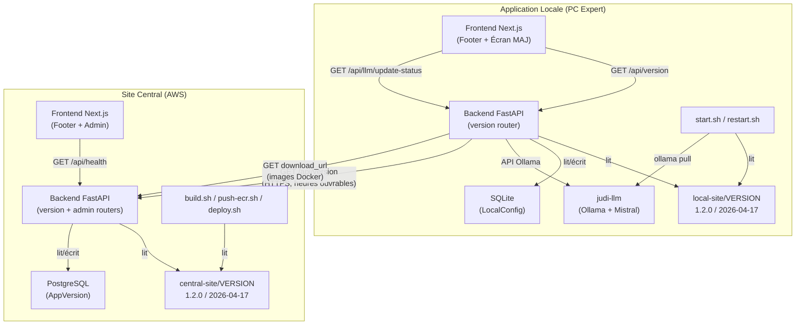
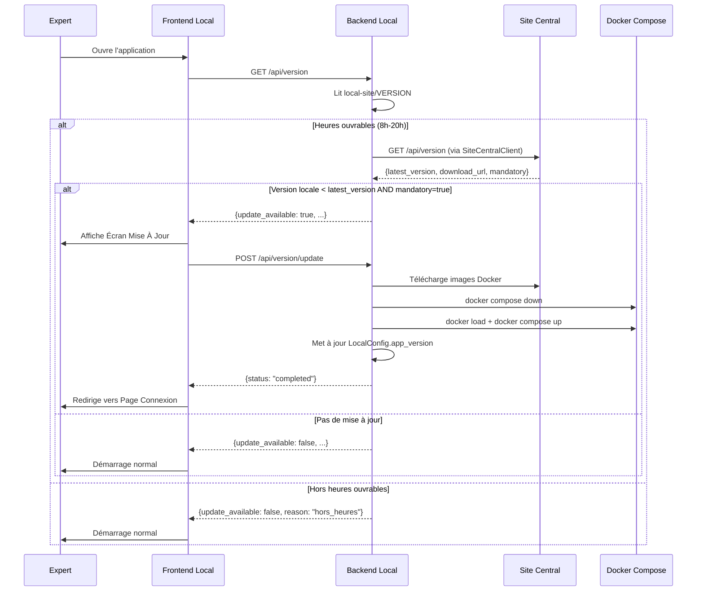
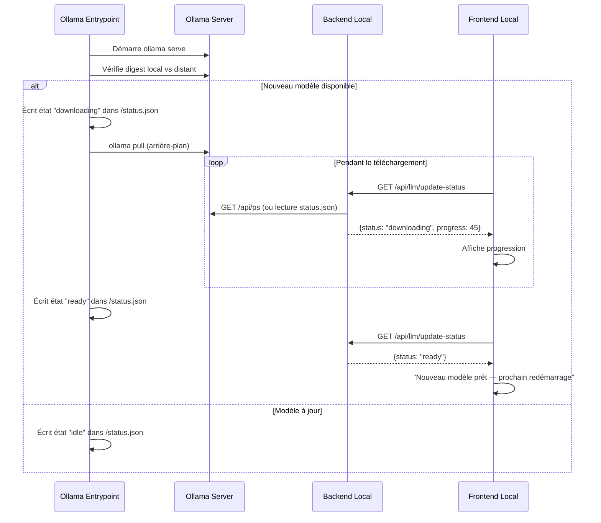

# Document de Conception — Gestion des Versions

## Vue d'ensemble

Ce document décrit l'architecture et la conception du système de gestion des versions pour Judi-Expert. Le système couvre quatre axes principaux :

1. **Versionnage centralisé** : Un fichier `VERSION` unique par composant (Application Locale et Site Central) servant de source de vérité pour le numéro de version semver et la date de publication.
2. **Mise à jour forcée de l'Application Locale** : Au démarrage, l'Application Locale interroge le Site Central via `GET /api/version` pour détecter une mise à jour obligatoire. Si une mise à jour est disponible et marquée `mandatory`, un écran bloquant guide l'expert à travers le téléchargement des images Docker, le redémarrage des conteneurs et la mise à jour de la configuration locale.
3. **Mise à jour en arrière-plan du modèle LLM** : Le conteneur Ollama vérifie au démarrage si un nouveau digest du modèle Mistral est disponible et lance un téléchargement non-bloquant. L'expert continue à travailler avec le modèle courant ; le nouveau modèle sera activé au prochain redémarrage.
4. **Affichage de la version** : Chaque site affiche sa version dans le footer de toutes les pages au format normalisé.

### Décisions de conception clés

- **Fichier VERSION comme source unique** : Plutôt qu'une variable d'environnement ou une constante dans le code, un fichier texte à 2 lignes (semver + date ISO) est lu au démarrage par le backend et les scripts. Cela simplifie le CI/CD et évite les incohérences.
- **Modèle AppVersion en base de données (Site Central)** : Les versions publiées sont stockées en PostgreSQL pour permettre l'historique, les notes de version et le contrôle admin. L'endpoint `GET /api/version` retourne toujours la dernière version publiée.
- **Réutilisation du SiteCentralClient existant** : La vérification de version utilise le client HTTP existant avec retry et vérification des heures ouvrables, garantissant la cohérence avec les autres appels au Site Central.
- **Isolation des données** : Les requêtes de version ne transmettent que la version courante en paramètre de requête — aucune donnée de dossier ni identifiant d'expert.
- **Mise à jour LLM découplée** : Le suivi de l'état de mise à jour du modèle passe par un fichier d'état JSON dans le volume Ollama, interrogé par le backend via l'API Ollama. Cela évite un couplage direct entre le conteneur LLM et la base de données.

## Architecture



### Flux de mise à jour applicative au démarrage



### Flux de mise à jour du modèle LLM



## Composants et Interfaces

### 1. Module de lecture du fichier VERSION

**Fichier** : `local-site/web/backend/services/version_reader.py` (et équivalent côté central)

Fonction utilitaire pure qui lit et parse le fichier VERSION.

```python
@dataclass(frozen=True)
class VersionInfo:
    version: str       # ex: "1.2.0"
    date: str          # ex: "2026-04-17"

def read_version_file(path: Path) -> VersionInfo:
    """Lit le fichier VERSION (2 lignes : semver, date ISO).
    
    Raises FileNotFoundError si absent, ValueError si format invalide.
    """
```

### 2. Router de version — Application Locale

**Fichier** : `local-site/web/backend/routers/version.py`

| Endpoint | Méthode | Description |
|----------|---------|-------------|
| `/api/version` | GET | Retourne la version locale + vérifie la disponibilité d'une MAJ |
| `/api/version/update` | POST | Déclenche la mise à jour forcée |
| `/api/llm/update-status` | GET | Retourne l'état de la MAJ du modèle LLM |

### 3. Router de version — Site Central

**Fichier** : `central-site/web/backend/routers/version.py`

| Endpoint | Méthode | Description |
|----------|---------|-------------|
| `/api/version` | GET | Retourne la dernière version publiée de l'Application Locale |
| `/api/admin/versions` | POST | Publie une nouvelle version (admin uniquement) |
| `/api/admin/versions` | GET | Liste les versions publiées (admin uniquement) |

### 4. Service de mise à jour — Application Locale

**Fichier** : `local-site/web/backend/services/update_service.py`

Orchestre le processus de mise à jour forcée :
- Téléchargement des images Docker depuis l'URL fournie
- Arrêt des conteneurs via Docker Compose
- Chargement des nouvelles images (`docker load`)
- Redémarrage des conteneurs
- Mise à jour de `LocalConfig.app_version`
- Rollback en cas d'échec

### 5. Service de suivi LLM — Application Locale

**Fichier** : `local-site/web/backend/services/llm_update_service.py`

Interroge l'API Ollama et le fichier d'état pour déterminer le statut de la mise à jour du modèle.

### 6. Composant Footer — Frontend (les deux sites)

**Fichier** : `local-site/web/frontend/src/components/Footer.tsx` (modifié)
**Fichier** : `central-site/web/frontend/src/components/Footer.tsx` (modifié)

Le footer existant est enrichi d'une ligne affichant la version au format normalisé :
- App Locale : `App Locale V1.2.0 - 17 avril 2026`
- Site Central : `Site Central V1.2.0 - 17 avril 2026`

Le frontend récupère la version via `GET /api/version` (local) ou `GET /api/health` (central).

### 7. Composant Écran de Mise à Jour — Frontend Local

**Fichier** : `local-site/web/frontend/src/components/UpdateScreen.tsx`

Écran modal bloquant affiché pendant une mise à jour forcée, avec barre de progression et étapes (téléchargement → installation → redémarrage).

### 8. Scripts de développement modifiés

**Fichiers** : `local-site/scripts/start.sh`, `local-site/scripts/restart.sh`

Ajout d'une étape `ollama pull $LLM_MODEL` avant le démarrage des conteneurs pour forcer la vérification/téléchargement du modèle.

### 9. Scripts de déploiement modifiés — Site Central

**Fichiers** : `central-site/scripts/build.sh`, `central-site/scripts/push-ecr.sh`, `central-site/scripts/deploy.sh`

Lecture de `central-site/VERSION` pour taguer les images Docker avec la version semver.

### 10. Ollama Entrypoint modifié

**Fichier** : `local-site/ollama-entrypoint.sh`

Ajout de la comparaison de digest et de l'écriture du fichier d'état JSON pour le suivi de la mise à jour en arrière-plan.


## Modèles de Données

### Application Locale — Modifications de LocalConfig

Le modèle `LocalConfig` existant (`local-site/web/backend/models/local_config.py`) est enrichi de deux champs :

```python
class LocalConfig(Base):
    __tablename__ = "local_config"
    
    # ... champs existants ...
    
    # Nouveaux champs pour la gestion des versions
    app_version: Mapped[Optional[str]] = mapped_column(String(20))
    # Version applicative courante (ex: "1.2.0"), mise à jour après MAJ forcée
    
    llm_model_version: Mapped[Optional[str]] = mapped_column(String(100))
    # Digest SHA256 du modèle LLM courant (ex: "sha256:abc123...")
```

Migration Alembic requise pour ajouter ces colonnes.

### Site Central — Nouveau modèle AppVersion

**Fichier** : `central-site/web/backend/models/app_version.py`

```python
class AppVersion(Base):
    __tablename__ = "app_version"
    
    id: Mapped[int] = mapped_column(primary_key=True)
    version: Mapped[str] = mapped_column(String(20), nullable=False)
    # Numéro de version semver (ex: "1.2.0")
    
    download_url: Mapped[str] = mapped_column(String(500), nullable=False)
    # URL de téléchargement du package d'images Docker
    
    mandatory: Mapped[bool] = mapped_column(default=True)
    # Si true, la mise à jour est obligatoire (bloquante)
    
    release_notes: Mapped[Optional[str]] = mapped_column(Text)
    # Notes de version optionnelles (Markdown)
    
    published_at: Mapped[datetime] = mapped_column(default=func.now())
    # Date de publication
```

### Site Central — Schémas Pydantic

**Fichier** : `central-site/web/backend/schemas/version.py`

```python
class VersionResponse(BaseModel):
    """Réponse de l'endpoint GET /api/version."""
    latest_version: str
    download_url: str
    mandatory: bool
    release_notes: Optional[str] = None

class VersionCreateRequest(BaseModel):
    """Requête de publication d'une nouvelle version (admin)."""
    version: str = Field(..., pattern=r"^\d+\.\d+\.\d+$")
    download_url: str = Field(..., min_length=1)
    mandatory: bool = True
    release_notes: Optional[str] = None

class VersionCreateResponse(BaseModel):
    """Réponse après publication d'une nouvelle version."""
    id: int
    version: str
    download_url: str
    mandatory: bool
    release_notes: Optional[str]
    published_at: datetime
    model_config = {"from_attributes": True}
```

### Application Locale — Schémas Pydantic

**Fichier** : `local-site/web/backend/schemas/version.py`

```python
class LocalVersionResponse(BaseModel):
    """Réponse de l'endpoint GET /api/version (Application Locale)."""
    current_version: str
    current_date: str
    update_available: bool
    latest_version: Optional[str] = None
    download_url: Optional[str] = None
    mandatory: Optional[bool] = None
    release_notes: Optional[str] = None

class UpdateStatusResponse(BaseModel):
    """Réponse de l'endpoint GET /api/version/update (progression)."""
    status: str  # "idle" | "downloading" | "installing" | "restarting" | "completed" | "error"
    progress: int  # 0-100
    step: Optional[str] = None
    error_message: Optional[str] = None

class LlmUpdateStatusResponse(BaseModel):
    """Réponse de l'endpoint GET /api/llm/update-status."""
    status: str  # "idle" | "downloading" | "ready" | "error"
    progress: int  # 0-100
    current_model: Optional[str] = None
    error_message: Optional[str] = None
```

### Fichier d'état LLM

**Fichier** : `/root/.ollama/update-status.json` (dans le volume `ollama_data`)

```json
{
  "status": "downloading",
  "progress": 45,
  "model": "mistral:7b-instruct-v0.3-q4_0",
  "started_at": "2026-04-17T10:30:00Z",
  "error": null
}
```

Ce fichier est écrit par `ollama-entrypoint.sh` et lu par le backend via un volume partagé ou l'API Ollama.

### Fichier VERSION (format commun)

```
1.2.0
2026-04-17
```

- Ligne 1 : version semver `MAJOR.MINOR.PATCH`
- Ligne 2 : date de publication ISO `YYYY-MM-DD`

Présent dans :
- `local-site/VERSION`
- `central-site/VERSION`


## Propriétés de Correction

*Une propriété est une caractéristique ou un comportement qui doit rester vrai pour toutes les exécutions valides d'un système — essentiellement, une déclaration formelle de ce que le système doit faire. Les propriétés servent de pont entre les spécifications lisibles par l'humain et les garanties de correction vérifiables par la machine.*

### Propriété 1 : Aller-retour de parsing du fichier VERSION

*Pour tout* numéro de version semver valide (MAJOR.MINOR.PATCH avec MAJOR, MINOR, PATCH ≥ 0) et toute date ISO valide (YYYY-MM-DD), écrire ces deux lignes dans un fichier puis appeler `read_version_file` doit retourner un `VersionInfo` dont les champs `version` et `date` correspondent exactement aux valeurs écrites.

**Valide : Exigences 1.1, 11.1**

### Propriété 2 : Validation du format semver

*Pour toute* chaîne de caractères, la fonction de validation semver doit accepter la chaîne si et seulement si elle correspond au format `MAJOR.MINOR.PATCH` où MAJOR, MINOR et PATCH sont des entiers non-négatifs. Les chaînes ne correspondant pas à ce format doivent être rejetées.

**Valide : Exigence 2.5**

### Propriété 3 : Ordre de comparaison des versions semver

*Pour toute* paire de versions semver valides (a, b), la fonction de comparaison doit respecter l'ordre total : si a < b alors compare(a, b) < 0, si a == b alors compare(a, b) == 0, si a > b alors compare(a, b) > 0. De plus, la relation doit être transitive : si a < b et b < c, alors a < c.

**Valide : Exigence 3.2**

### Propriété 4 : Formatage de la version pour l'affichage

*Pour tout* `VersionInfo` valide (version semver + date ISO), la fonction de formatage doit produire une chaîne contenant le préfixe du site (« App Locale » ou « Site Central »), suivi de « V », suivi de la version exacte, suivi de « - », suivi de la date formatée en français (« {jour} {mois_en_lettres} {année} »). La version et la date dans la chaîne formatée doivent correspondre aux valeurs d'entrée.

**Valide : Exigences 5.1, 12.1**

### Propriété 5 : Isolation des données dans les requêtes de version

*Pour toute* requête construite par le service de vérification de version, les paramètres transmis au Site Central ne doivent contenir que le champ `current_version` (chaîne semver). Aucun champ relatif aux dossiers (`dossier_id`, `contenu`, `expert_id`, `nom`, `prenom`, `email`, etc.) ne doit être présent dans les paramètres de la requête.

**Valide : Exigences 9.1, 9.2**

### Propriété 6 : Inclusion de la version dans le nom de l'installateur

*Pour tout* numéro de version semver valide, le nom de fichier de l'installateur généré doit contenir la chaîne de version exacte (ex : pour la version « 1.2.0 », le nom doit contenir « 1.2.0 »).

**Valide : Exigence 10.2**

## Gestion des Erreurs

### Fichier VERSION absent ou invalide

| Situation | Comportement | Composant |
|-----------|-------------|-----------|
| Fichier `VERSION` absent | Refus de démarrage avec message d'erreur clair | Backend local + central |
| Fichier `VERSION` vide ou 1 seule ligne | Refus de démarrage avec message d'erreur de format | Backend local + central |
| Version non-semver (ex: "abc") | Refus de démarrage avec message d'erreur de format | Backend local + central |
| Date non-ISO (ex: "17/04/2026") | Refus de démarrage avec message d'erreur de format | Backend local + central |

### Communication avec le Site Central

| Situation | Comportement | Composant |
|-----------|-------------|-----------|
| Site Central injoignable | 3 tentatives avec backoff exponentiel, puis démarrage normal avec log d'erreur | Backend local (SiteCentralClient) |
| Hors heures ouvrables (avant 8h ou après 20h) | Pas de vérification, démarrage normal | Backend local |
| Réponse HTTP 4xx/5xx | Log d'erreur, démarrage normal avec version courante | Backend local |
| Réponse JSON invalide | Log d'erreur, démarrage normal avec version courante | Backend local |

### Mise à jour forcée

| Situation | Comportement | Composant |
|-----------|-------------|-----------|
| Échec du téléchargement des images | Annulation, restauration des conteneurs précédents, message d'erreur + bouton réessayer | Update service |
| Échec du `docker load` | Annulation, restauration des conteneurs précédents, message d'erreur | Update service |
| Échec du redémarrage des conteneurs | Tentative de restauration des anciens conteneurs, message d'erreur | Update service |
| Espace disque insuffisant | Détection avant téléchargement si possible, message d'erreur explicite | Update service |

### Mise à jour du modèle LLM

| Situation | Comportement | Composant |
|-----------|-------------|-----------|
| Registre Ollama injoignable | Log warning, utilisation du modèle courant | Ollama entrypoint |
| Échec du `ollama pull` | Log erreur, état "error" dans status.json, modèle courant conservé | Ollama entrypoint |
| Espace disque insuffisant pour le nouveau modèle | Log erreur, modèle courant conservé | Ollama entrypoint |

### Scripts de développement

| Situation | Comportement | Composant |
|-----------|-------------|-----------|
| Échec du `ollama pull` dans start.sh/restart.sh | Message d'erreur en console, interruption du démarrage | Scripts dev |
| Docker Desktop non démarré | Tentative de lancement automatique, timeout après 120s | Scripts dev |
| Timeout du téléchargement du modèle (30 min) | Message d'erreur, suggestion de vérifier les logs | Scripts dev |

## Stratégie de Tests

### Approche duale

La stratégie de test combine des **tests unitaires** (exemples spécifiques, cas limites) et des **tests par propriétés** (vérification universelle via Hypothesis) pour une couverture complète.

### Tests par propriétés (Hypothesis)

**Bibliothèque** : Hypothesis (Python)
**Répertoire** : `tests/property/test_prop_version.py`
**Configuration** : minimum 100 itérations par propriété (`@settings(max_examples=100)`)

Chaque test par propriété est tagué avec un commentaire référençant la propriété du document de conception :

| Propriété | Tag | Description |
|-----------|-----|-------------|
| 1 | `Feature: version-management, Property 1: VERSION file round-trip` | Aller-retour parsing du fichier VERSION |
| 2 | `Feature: version-management, Property 2: Semver validation` | Validation du format semver |
| 3 | `Feature: version-management, Property 3: Semver comparison ordering` | Ordre de comparaison des versions |
| 4 | `Feature: version-management, Property 4: Version display formatting` | Formatage de la version pour l'affichage |
| 5 | `Feature: version-management, Property 5: Data isolation in version requests` | Isolation des données dans les requêtes |
| 6 | `Feature: version-management, Property 6: Installer filename includes version` | Inclusion de la version dans le nom de l'installateur |

### Tests unitaires

**Répertoire** : `tests/unit/test_version.py`

| Test | Exigence | Description |
|------|----------|-------------|
| `test_read_version_file_missing` | 1.4, 11.3 | Fichier VERSION absent → FileNotFoundError |
| `test_read_version_file_invalid_format` | 1.4, 11.3 | Fichier VERSION mal formaté → ValueError |
| `test_version_endpoint_returns_fields` | 2.1 | GET /api/version retourne tous les champs requis |
| `test_admin_publish_version` | 2.4 | POST /api/admin/versions accessible uniquement aux admins |
| `test_version_check_outside_business_hours` | 3.4 | Pas de vérification hors heures ouvrables |
| `test_version_check_site_central_unreachable` | 3.5 | Démarrage normal si Site Central injoignable |
| `test_update_banner_after_update` | 5.2 | Bandeau affiché après mise à jour |
| `test_llm_update_status_endpoint` | 7.1 | GET /api/llm/update-status retourne les champs requis |
| `test_downloads_fallback_version` | 10.3 | Version par défaut "0.1.0" si aucune version publiée |
| `test_health_endpoint_includes_version` | 11.4 | GET /api/health inclut le champ version |

### Tests d'intégration

**Répertoire** : `tests/integration/test_version_integration.py`

| Test | Exigence | Description |
|------|----------|-------------|
| `test_startup_reads_version_file` | 1.2, 11.2 | Le backend lit VERSION au démarrage |
| `test_publish_then_get_version` | 2.2 | Publier une version puis vérifier GET /api/version |
| `test_forced_update_workflow` | 4.1-4.4 | Workflow complet de mise à jour forcée (avec mocks Docker) |
| `test_forced_update_rollback` | 4.5 | Rollback en cas d'échec de mise à jour |
| `test_volume_preservation` | 4.6 | Les volumes Docker sont préservés pendant la MAJ |
| `test_downloads_uses_latest_version` | 10.1 | GET /api/downloads/app utilise la dernière version publiée |

### Tests smoke

**Répertoire** : `tests/smoke/test_version_smoke.py`

| Test | Exigence | Description |
|------|----------|-------------|
| `test_version_file_exists` | 1.1, 11.1 | Les fichiers VERSION existent dans les deux sites |
| `test_https_only` | 9.3 | Les requêtes de version utilisent HTTPS |

