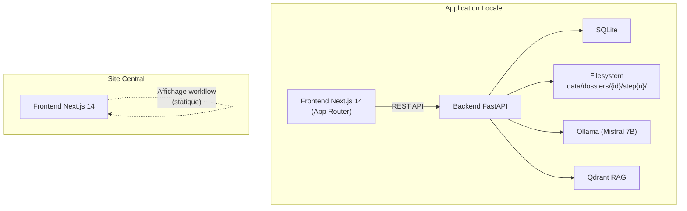
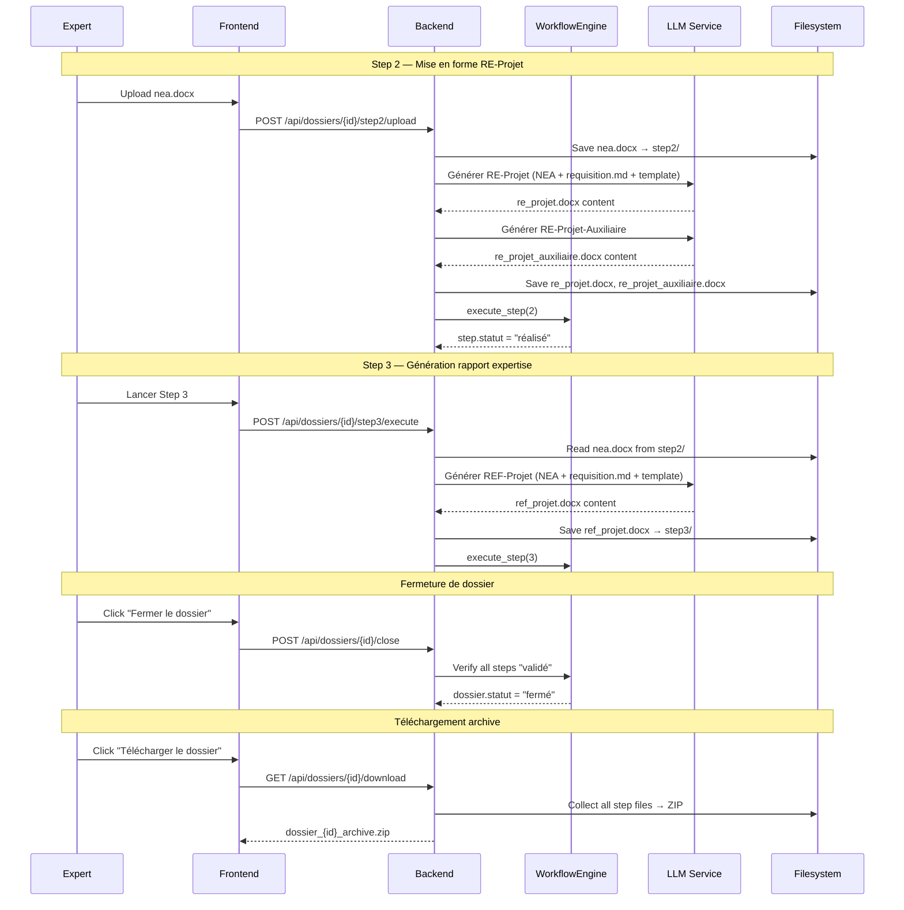

# Design Document — Workflow Dossier Refactor

## Overview

Ce refactoring transforme le workflow d'expertise Judi-Expert sur plusieurs axes :

1. **Renommage des étapes** (App Locale + Site Central) pour refléter les nouvelles responsabilités de chaque step
2. **Refonte du Step 2** : passage d'un upload NE+REB à un upload NEA unique avec génération LLM du RE-Projet et RE-Projet-Auxiliaire
3. **Refonte du Step 3** : lecture du NEA de Step 2 pour générer le REF-Projet (au lieu de lire NE+REB)
4. **Fermeture de dossier** : nouveau statut "fermé" avec verrouillage et bouton de téléchargement ZIP
5. **Affichage enrichi des fichiers** par étape sur la Dossier_Page
6. **Prévisualisation et téléchargement** de fichiers individuels via endpoints dédiés
7. **Remplacement de fichier** par l'expert sur les étapes réalisées (non validées)

Le périmètre touche le backend FastAPI (routers, services, modèles), le frontend Next.js de l'Application Locale, et la page d'accueil du Site Central.

## Architecture

### Vue d'ensemble



### Flux modifiés



## Components and Interfaces

### Backend — Nouveaux endpoints et modifications

#### Router `dossiers.py` — Nouveaux endpoints

| Endpoint | Méthode | Description |
|----------|---------|-------------|
| `/api/dossiers/{id}/close` | POST | Ferme le dossier (statut → "fermé") |
| `/api/dossiers/{id}/download` | GET | Télécharge l'archive ZIP du dossier fermé |
| `/api/dossiers/{id}/files/{file_id}/download` | GET | Télécharge un fichier individuel |
| `/api/dossiers/{id}/files/{file_id}/preview` | GET | Prévisualise un fichier (inline) |
| `/api/dossiers/{id}/files/{file_id}/replace` | PUT | Remplace un fichier existant |

#### Router `steps.py` — Modifications

| Endpoint | Modification |
|----------|-------------|
| `POST /{id}/step2/upload` | Accepte un seul fichier NEA (.docx), génère RE-Projet + RE-Projet-Auxiliaire via LLM |
| `POST /{id}/step3/execute` | Lit le NEA depuis step2/, génère REF-Projet via LLM |

#### WorkflowEngine — Nouvelles méthodes

```python
class WorkflowEngine:
    # Existant (inchangé)
    async def execute_step(self, dossier_id, step_number, db) -> Step
    async def validate_step(self, dossier_id, step_number, db) -> Step

    # Nouveau
    async def close_dossier(self, dossier_id: int, db: AsyncSession) -> Dossier:
        """Ferme le dossier si toutes les étapes sont validées.
        
        Vérifie que les 4 étapes ont statut "validé".
        Met le dossier.statut à "fermé".
        Lève HTTP 403 si pré-conditions non remplies.
        """

    def is_dossier_closed(self, dossier: Dossier) -> bool:
        """Vérifie si le dossier est fermé."""

    def is_dossier_modifiable(self, dossier: Dossier) -> bool:
        """Vérifie si le dossier accepte des modifications (statut actif)."""
```

#### LLMService — Nouvelles méthodes

```python
class LLMService:
    # Nouveau
    async def generer_re_projet(
        self, nea_content: str, requisition_md: str, template: str
    ) -> str:
        """Génère le RE-Projet à partir du NEA, de la réquisition et du template."""

    async def generer_re_projet_auxiliaire(
        self, nea_content: str, re_projet: str
    ) -> str:
        """Génère le RE-Projet-Auxiliaire en complément du RE-Projet."""

    async def generer_ref_projet(
        self, nea_content: str, requisition_md: str, template: str
    ) -> str:
        """Génère le REF-Projet (rapport final) à partir du NEA."""
```

### Frontend — Modifications

#### Constante STEP_NAMES (App Locale)

```typescript
// Avant
const STEP_NAMES: Record<number, string> = {
  0: "Extraction",
  1: "PEMEC",
  2: "Upload",
  3: "REF",
};

// Après
const STEP_NAMES: Record<number, string> = {
  0: "Extraction",
  1: "Préparation entretien",
  2: "Mise en forme RE-Projet",
  3: "Génération rapport expertise",
};
```

#### Dossier_Page — Nouvelles sections

- Affichage de la liste des `StepFile` par étape (filename, type, taille)
- Bouton "Fermer le dossier" (visible quand toutes les étapes sont "validé")
- Bouton "Télécharger le dossier" (visible quand statut = "fermé")
- Mode lecture seule quand statut = "fermé"

#### Step_Page — Modifications

- Step 2 : formulaire d'upload d'un seul fichier NEA (.docx)
- Boutons preview/download/replace par fichier
- Bouton "Upload version modifiée" quand step.statut = "réalisé" et dossier.statut = "actif"

#### Site Central — Homepage

- Mise à jour des labels et descriptions dans la section "Workflow d'expertise"

### Pydantic Schemas — Nouveaux/Modifiés

```python
class DossierCloseResponse(BaseModel):
    message: str

class FileDownloadInfo(BaseModel):
    id: int
    filename: str
    file_type: str
    file_size: int

class FileReplaceResponse(BaseModel):
    message: str
    new_size: int

class Step2UploadResponse(BaseModel):  # Modifié
    message: str
    filenames: list[str]  # ["nea.docx", "re_projet.docx", "re_projet_auxiliaire.docx"]

class Step3ExecuteResponse(BaseModel):  # Modifié
    message: str
    filenames: list[str]  # ["ref_projet.docx"]
```

## Data Models

### Modèle Dossier — Modification

Le champ `statut` accepte désormais trois valeurs : `"actif"`, `"fermé"`, `"archive"`.

```python
# Constantes ajoutées dans workflow_engine.py
DOSSIER_ACTIF = "actif"
DOSSIER_FERME = "fermé"
DOSSIER_ARCHIVE = "archive"
```

Le statut `"fermé"` est un état intermédiaire entre `"actif"` et `"archive"` :
- `"actif"` → modifications autorisées
- `"fermé"` → lecture seule, téléchargement ZIP possible, aucune modification
- `"archive"` → état final (existant, conservé pour rétrocompatibilité)

Note : la validation du Step 3 ne passe plus automatiquement le dossier en "archive". L'expert doit explicitement fermer le dossier via le bouton "Fermer le dossier".

### Modèle StepFile — Inchangé

Le modèle `StepFile` existant couvre déjà les besoins. Les nouveaux types de fichiers utilisent le champ `file_type` :

| file_type | Step | Description |
|-----------|------|-------------|
| `"pdf_scan"` | 0 | PDF de la réquisition |
| `"markdown"` | 0 | Markdown structuré |
| `"qmec"` | 1 | Plan d'entretien |
| `"nea"` | 2 | Notes d'Entretien et Analyse (input) |
| `"re_projet"` | 2 | RE-Projet (output LLM) |
| `"re_projet_auxiliaire"` | 2 | RE-Projet-Auxiliaire (output LLM) |
| `"ref_projet"` | 3 | REF-Projet — rapport final (output LLM) |

### Migration Alembic

Aucune migration de schéma nécessaire. Les changements sont :
- Nouvelle valeur `"fermé"` pour `dossiers.statut` (colonne String, pas d'enum DB)
- Nouveaux `file_type` pour `step_files.file_type` (colonne String, pas d'enum DB)
- Suppression du passage automatique en `"archive"` lors de la validation Step 3

### Structure fichiers sur disque

```
data/dossiers/{id}/
├── step0/
│   ├── requisition.pdf
│   └── requisition.md
├── step1/
│   └── qmec.md
├── step2/
│   ├── nea.docx          # Input expert
│   ├── re_projet.docx    # Output LLM
│   └── re_projet_auxiliaire.docx  # Output LLM
└── step3/
    └── ref_projet.docx   # Output LLM
```

## Correctness Properties

*A property is a characteristic or behavior that should hold true across all valid executions of a system — essentially, a formal statement about what the system should do. Properties serve as the bridge between human-readable specifications and machine-verifiable correctness guarantees.*

### Property 1: Upload file extension validation

*For any* filename string, the Step 2 upload endpoint SHALL accept the file if and only if the filename ends with `.docx` (case-insensitive). All other extensions SHALL be rejected with HTTP 400.

**Validates: Requirements 3.1, 3.2**

### Property 2: Step 2 execution post-conditions

*For any* valid Step 2 execution with a valid NEA .docx file, the system SHALL:
- Save exactly 3 files on disk at `data/dossiers/{id}/step2/`: `nea.docx`, `re_projet.docx`, `re_projet_auxiliaire.docx`
- Create exactly 3 `StepFile` database records with `file_type` values `"nea"`, `"re_projet"`, `"re_projet_auxiliaire"`
- Set the step's `statut` to `"réalisé"`

**Validates: Requirements 3.3, 3.6, 3.7, 3.8**

### Property 3: Step 3 execution post-conditions

*For any* valid Step 3 execution (where NEA exists in step2/), the system SHALL:
- Save `ref_projet.docx` on disk at `data/dossiers/{id}/step3/`
- Create exactly 1 `StepFile` database record with `file_type` `"ref_projet"`
- Set the step's `statut` to `"réalisé"`

**Validates: Requirements 4.4, 4.5, 4.6**

### Property 4: Close dossier precondition and postcondition

*For any* dossier and any combination of step statuses, the `close_dossier` operation SHALL succeed if and only if all 4 steps have `statut = "validé"`. On success, the dossier's `statut` SHALL be set to `"fermé"`. On failure, the dossier's `statut` SHALL remain unchanged and an HTTP 403 SHALL be returned.

**Validates: Requirements 5.3, 5.4, 5.5**

### Property 5: Closed dossier blocks all modifications

*For any* dossier with `statut = "fermé"` and any modification operation (execute_step, validate_step, file replace, step upload), the system SHALL reject the operation with HTTP 403.

**Validates: Requirements 5.6, 9.6**

### Property 6: ZIP archive completeness and structure

*For any* closed dossier with files in step directories, the generated ZIP archive SHALL contain every file from `step0/`, `step1/`, `step2/`, and `step3/` directories, and each entry's path SHALL match the pattern `step{n}/{filename}` preserving the directory structure.

**Validates: Requirements 6.2, 6.3**

### Property 7: ZIP download requires fermé status

*For any* dossier with `statut` not equal to `"fermé"`, the download endpoint SHALL return HTTP 403. Only dossiers with `statut = "fermé"` SHALL allow ZIP download.

**Validates: Requirements 6.4**

### Property 8: File size formatting

*For any* non-negative integer file size in bytes, the formatting function SHALL produce a human-readable string with the correct unit (octets, Ko, Mo, Go) and the numeric value SHALL be consistent with the input (i.e., converting back to bytes yields a value within rounding tolerance of the original).

**Validates: Requirements 7.2**

### Property 9: File replacement round-trip

*For any* valid replacement file content uploaded via the replace endpoint, the file on disk at the original `file_path` SHALL contain exactly the new content, and the `StepFile.file_size` in the database SHALL equal the actual size of the file on disk.

**Validates: Requirements 9.3, 9.4**

### Property 10: Validated step blocks file replacement

*For any* step with `statut = "validé"` and any file replacement attempt, the system SHALL reject the operation with HTTP 403 and the message "Étape verrouillée, modification impossible". The original file SHALL remain unchanged.

**Validates: Requirements 9.5**

## Error Handling

### Backend Error Responses

| Situation | HTTP Code | Message |
|-----------|-----------|---------|
| Upload non-.docx au Step 2 | 400 | "Seul le format .docx est accepté" |
| NEA manquant au Step 3 | 404 | "Fichier NEA non trouvé — complétez d'abord le Step 2" |
| Fermeture avec étapes non validées | 403 | "Toutes les étapes doivent être validées pour fermer le dossier" |
| Téléchargement ZIP sur dossier non fermé | 403 | "Le dossier doit être fermé pour télécharger l'archive" |
| Modification sur dossier fermé | 403 | "Le dossier est fermé, aucune modification n'est possible" |
| Remplacement sur étape validée | 403 | "Étape verrouillée, modification impossible" |
| Fichier non trouvé (download/preview/replace) | 404 | "Fichier non trouvé" |
| Service LLM indisponible | 503 | "Service LLM indisponible — essayez de redémarrer le conteneur judi-llm" |
| Service RAG indisponible | 503 | "Service RAG indisponible — vérifiez que le conteneur judi-rag est démarré" |

### Stratégie de gestion des erreurs

- **Validation en amont** : vérifier les pré-conditions (statut dossier, statut étape, existence fichier) avant toute opération coûteuse (appel LLM, écriture disque)
- **Transactions atomiques** : utiliser `db.flush()` + `db.commit()` pour garantir la cohérence entre fichiers disque et enregistrements DB. En cas d'erreur LLM, ne pas créer les StepFile ni changer le statut.
- **Nettoyage en cas d'échec** : si la génération LLM échoue après la sauvegarde du NEA, le NEA reste sur disque (l'expert peut relancer) mais le step reste en statut "initial"
- **Logging** : logger les erreurs LLM/RAG avec `logger.error()` pour le diagnostic

### Frontend Error Handling

- Afficher les messages d'erreur du backend dans un composant d'alerte
- Désactiver les boutons d'action pendant les requêtes en cours (loading state)
- Afficher un état de chargement pendant les opérations longues (génération LLM)

## Testing Strategy

### Property-Based Tests (Hypothesis)

La bibliothèque **Hypothesis** (Python) sera utilisée pour les tests property-based. Chaque test exécutera un minimum de **100 itérations**.

Chaque test sera taggé avec un commentaire référençant la propriété du design :

```python
# Feature: workflow-dossier-refactor, Property 4: Close dossier precondition and postcondition
```

Tests property-based prévus :

| Property | Fichier test | Description |
|----------|-------------|-------------|
| P1 | `tests/property/test_prop_step2_validation.py` | Validation extension .docx avec noms de fichiers aléatoires |
| P2 | `tests/property/test_prop_step2_execution.py` | Post-conditions Step 2 (fichiers + DB + statut) |
| P3 | `tests/property/test_prop_step3_execution.py` | Post-conditions Step 3 (fichiers + DB + statut) |
| P4 | `tests/property/test_prop_close_dossier.py` | Précondition/postcondition fermeture dossier |
| P5 | `tests/property/test_prop_close_dossier.py` | Dossier fermé bloque toutes les modifications |
| P6 | `tests/property/test_prop_zip_archive.py` | Complétude et structure de l'archive ZIP |
| P7 | `tests/property/test_prop_zip_archive.py` | Téléchargement ZIP requiert statut fermé |
| P8 | `tests/property/test_prop_file_formatting.py` | Formatage taille de fichier |
| P9 | `tests/property/test_prop_file_replace.py` | Round-trip remplacement de fichier |
| P10 | `tests/property/test_prop_file_replace.py` | Étape validée bloque le remplacement |

### Unit Tests (pytest)

Tests unitaires ciblés pour les cas spécifiques et les edge cases :

- Renommage STEP_NAMES (vérification des 4 labels)
- Erreur 404 quand NEA manquant au Step 3
- Erreur 400 pour fichier vide
- Réponse ZIP avec bon content-type et filename
- Message "Aucun fichier pour cette étape" quand pas de StepFile

### Integration Tests

- Workflow complet Step 0 → Step 1 → Step 2 → Step 3 → Fermeture → Téléchargement ZIP
- Remplacement de fichier puis vérification que le Step suivant utilise la version modifiée

### Mocking Strategy

- **LLM Service** : mocké dans tous les tests (sauf intégration) pour éviter les appels Ollama
- **RAG Service** : mocké pour retourner des documents de test
- **Filesystem** : utiliser `tmp_path` (pytest fixture) pour isoler les tests
- **Database** : SQLite en mémoire pour les tests unitaires et property
