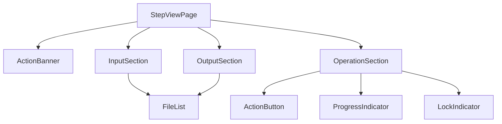

# Design Document: Workflow Steps Restructure

## Overview

This feature restructures the Step pages in the Judi-Expert Application Locale to present a clear, consistent tripartite layout: **Input Files → Operation → Output Files**, with a descriptive "Action" banner at the top of each page. The goal is to align the local app's step UI with the terminology and visual structure used on the Site Central workflow presentation.

### Current State

The existing `page.tsx` at `local-site/web/frontend/src/app/dossier/[id]/step/[n]/` renders step-specific views (Step1View through Step5View) as monolithic components mixing file uploads, action buttons, and results in an ad-hoc layout. Files are displayed in a single flat `FileList` component without distinguishing input from output.

### Target State

Each step page will follow a uniform structure:
1. **Action Banner** — A highlighted descriptive block explaining what the step does
2. **Input Section** ("Fichiers d'entrée") — Lists/uploads input files
3. **Operation Section** ("Opération") — Contains the action button with progress/lock states
4. **Output Section** ("Fichiers de sortie") — Lists output files produced by execution

This restructuring is purely a frontend concern. The backend API, data models, and file storage remain unchanged.

## Architecture

### Component Architecture



### Design Decisions

1. **Refactor into composable sections rather than step-specific views**: Instead of Step1View, Step2View, etc., the page will use a single layout with three generic section components. Step-specific logic (which files to show, which button label to use) is driven by configuration data.

2. **Configuration-driven step metadata**: A `STEP_CONFIG` constant maps each step number to its banner text, button label, expected input file types, and expected output file types. This eliminates repetitive conditional rendering.

3. **Separate FileList by direction**: The existing `FileList` component is reused but called twice — once for input files (filtered by `file_type` categories) and once for output files. A new `direction` filter prop or pre-filtering logic handles this.

4. **No backend changes required**: The `StepFile` model already has a `file_type` field that distinguishes input from output files (e.g., `ordonnance` vs `ordonnance_ocr`). The frontend filters files client-side.

## Components and Interfaces

### New Components

#### `ActionBanner`

```typescript
interface ActionBannerProps {
  stepNumber: number;
  dossierName: string;
}
```

Renders the descriptive banner for the given step. Uses `STEP_BANNER_TEXTS` config to look up the text, interpolating `dossierName` where needed (Step 1 banner references `<nom-dossier>`).

Styling: highlighted background (`var(--color-accent-light)` or similar), left border accent, "Action" label/icon.

#### `InputSection`

```typescript
interface InputSectionProps {
  stepNumber: number;
  dossierId: string;
  files: StepFileItem[];
  isLocked: boolean;
  dossierStatut: string;
  mode?: "entretien" | "analyse";
  onFileUploaded: () => Promise<void>;
}
```

Displays the "Fichiers d'entrée" heading, lists input files (filtered from `files` by input file types for the step), and provides upload controls when the step is not locked. Shows a placeholder when no input files exist.

#### `OperationSection`

```typescript
interface OperationSectionProps {
  stepNumber: number;
  dossierId: string;
  step: StepDetail;
  isLocked: boolean;
  isDossierClosed: boolean;
  onExecute: () => Promise<void>;
  onCancel: () => Promise<void>;
}
```

Displays the "Opération" heading, the step-specific action button (label from `STEP_CONFIG`), progress indicator when `statut === "en_cours"`, and lock indicator when locked or dossier closed.

#### `OutputSection`

```typescript
interface OutputSectionProps {
  stepNumber: number;
  dossierId: string;
  files: StepFileItem[];
  isLocked: boolean;
}
```

Displays the "Fichiers de sortie" heading, lists output files (filtered from `files` by output file types for the step). Shows a placeholder message when no output files exist.

### Configuration Constants

```typescript
interface StepConfig {
  name: string;
  bannerText: string | ((dossierName: string) => string);
  buttonLabel: string;
  inputFileTypes: string[];
  outputFileTypes: string[];
}

const STEP_CONFIG: Record<number, StepConfig> = {
  1: {
    name: "Création dossier",
    bannerText: (dossierName) => `Entrée de tous les fichiers du dossier. Ceux-ci sont stockés dans C:\\judi-expert\\${dossierName}\\step1\\in. Les fichiers .pdf sont transformés en texte au format .md dans \\step1\\out. On extrait de l'ordonnance la liste des questions à résoudre numérotées Q1 à Qn`,
    buttonLabel: "Extraire et structurer",
    inputFileTypes: ["ordonnance", "complementaire"],
    outputFileTypes: ["ordonnance_ocr", "questions", "docx"],
  },
  2: {
    name: "Préparation investigations",
    bannerText: "Extrait de ordonnance.md la liste des questions à résoudre dans l'expertise et les numérote : Q1, ..., Qn. Utilise le template d'entretien (TPE) ou d'analyse (TPA) pour préparer la Trame d'entretien ou d'analyse des pièces. Produit le plan d'entretien PE ou le Plan d'Analyse PA en injectant dans le TPE ou le TPA selon le cas, des questions particulières à poser en entretien ou des analyses pertinentes et diligences à initier pour l'analyse sur pièces, et dans le cas de PA des projets de courriers pour les diligences complémentaires à initier",
    buttonLabel: "Générer le plan",
    inputFileTypes: ["ordonnance_ocr", "template_tpe", "template_tpa", "complementaire_ocr"],
    outputFileTypes: ["trame_entretien", "courrier_diligence", "plan_analyse"],
  },
  3: {
    name: "Consolidation documentaire",
    bannerText: "Introduction des pièces complémentaires issues de diligences et extraction OCR en format .md pour les pièces PDF/scan de texte.",
    buttonLabel: "Extraire les documents",
    inputFileTypes: ["diligence_response"],
    outputFileTypes: ["diligence_ocr"],
  },
  4: {
    name: "Production pré-rapport",
    bannerText: "Produire un Pré-Rapport final à partir du PE ou du PA complété par les notes d'entretien, les notes d'analyses et les conclusions aux questions numérotées, le tout en style télégraphique compact. La conclusion présente les questions et construit les réponses sur la base des sections du document complété. Le DAC (Document d'Analyse Contradictoire) est un ensemble de remarques et suggestions proposées par l'outil pour renforcer et challenger les analyses et conclusions de l'expert.",
    buttonLabel: "Générer le pré-rapport",
    inputFileTypes: ["trame_annotee", "notes_expert", "template_rapport", "diligence_ocr"],
    outputFileTypes: ["pre_rapport", "dac"],
  },
};
```

### Modified Components

#### `StepViewPage` (refactored)

The main page component is simplified to:
1. Fetch step and dossier data (unchanged)
2. Render: Back link → Header → ActionBanner → InputSection → OperationSection → OutputSection
3. Step-specific upload logic moves into `InputSection`
4. Step-specific execution logic moves into `OperationSection`

#### `FileList` (unchanged)

The existing `FileList` component is reused as-is. The parent sections pre-filter the `files` array before passing it down.

### File Organization

```
local-site/web/frontend/src/
├── app/dossier/[id]/step/[n]/
│   ├── page.tsx              # Refactored main page
│   └── step.module.css       # Updated styles (new banner, section styles)
├── components/
│   ├── ActionBanner.tsx      # NEW
│   ├── ActionBanner.module.css # NEW
│   ├── InputSection.tsx      # NEW
│   ├── InputSection.module.css # NEW
│   ├── OperationSection.tsx  # NEW
│   ├── OperationSection.module.css # NEW
│   ├── OutputSection.tsx     # NEW
│   ├── OutputSection.module.css # NEW
│   ├── FileList.tsx          # Existing (unchanged)
│   └── ...
└── lib/
    ├── api.ts                # Existing (unchanged)
    └── stepConfig.ts         # NEW — STEP_CONFIG constant
```

## Data Models

### No Backend Changes

The existing data models are sufficient:

- **Step** model: `step_number`, `statut`, `executed_at`, `validated_at`, `files` relationship
- **StepFile** model: `filename`, `file_path`, `file_type`, `file_size`, `doc_type`, `doc_format`

The `file_type` field already categorizes files (e.g., `ordonnance`, `ordonnance_ocr`, `complementaire`, `trame_entretien`, `courrier_diligence`, `diligence_ocr`, `pre_rapport`). The frontend uses this field to partition files into input vs. output sections.

### File Type Classification

| Step | Input file_types | Output file_types |
|------|-----------------|-------------------|
| 1 | `ordonnance`, `complementaire` | `ordonnance_ocr`, `questions`, `docx`, `complementaire_ocr` |
| 2 | `ordonnance_ocr`, `template_tpe`, `template_tpa`, `complementaire_ocr` | `trame_entretien`, `courrier_diligence`, `plan_analyse` |
| 3 | `diligence_response` | `diligence_ocr` |
| 4 | `trame_annotee`, `notes_expert`, `template_rapport`, `diligence_ocr` | `pre_rapport`, `dac` |

### Frontend Type Additions

```typescript
// In lib/stepConfig.ts
export interface StepConfig {
  name: string;
  bannerText: string | ((dossierName: string) => string);
  buttonLabel: string;
  inputFileTypes: string[];
  outputFileTypes: string[];
  progressSteps: string[];
}
```

## Correctness Properties

*A property is a characteristic or behavior that should hold true across all valid executions of a system — essentially, a formal statement about what the system should do. Properties serve as the bridge between human-readable specifications and machine-verifiable correctness guarantees.*

### Property 1: File list rendering completeness

*For any* step number (1–4) and *for any* set of files associated with that step, every file whose `file_type` is classified as an input type for that step SHALL appear in the Input_Section, and every file whose `file_type` is classified as an output type SHALL appear in the Output_Section. No file shall be omitted or duplicated across sections.

**Validates: Requirements 1.2, 1.4, 3.4, 5.3, 6.3, 7.3, 9.3**

### Property 2: OCR input-to-output file correspondence

*For any* set of input files requiring OCR extraction (PDF/scan format) uploaded to Step 1 or Step 3, after execution completes, the Output_Section SHALL display exactly one corresponding `.md` file for each input file that was processed. The count of output `.md` files SHALL equal the count of input files that required OCR.

**Validates: Requirements 4.2, 8.1**

### Property 3: Directory tree creation invariant

*For any* valid dossier name, when a new dossier is created, the application SHALL produce a directory tree at `C:\judi-expert\<dossier-name>\` containing exactly 4 step subdirectories (`step1` through `step4`), each with `in` and `out` subdirectories. The folder name under `C:\judi-expert\` SHALL equal the dossier name.

**Validates: Requirements 12.1, 12.2, 12.3, 12.4**

### Property 4: Action button disabled state invariant

*For any* step number and *for any* combination of step status and dossier status, the action button SHALL be disabled if and only if the step's `statut` is `"en_cours"` OR `"valide"` OR the dossier's `statut` is `"fermé"`. When disabled due to `"en_cours"`, a progress indicator SHALL be shown. When disabled due to lock/close, a lock indicator SHALL be shown.

**Validates: Requirements 13.5, 13.6**

## Error Handling

### Frontend Error States

| Scenario | Behavior |
|----------|----------|
| Step data fails to load | Display error banner with retry option |
| File upload fails | Display inline error below the upload control |
| Step execution fails | Display error in Operation_Section, re-enable button |
| Network timeout during execution | Show error with suggestion to check backend status |
| Invalid step number in URL | Display "Numéro d'étape invalide" message |

### Graceful Degradation

- If `file_type` doesn't match any known input/output category for a step, the file is displayed in the Output_Section by default (safe fallback — user can still see and download it).
- If the banner text interpolation fails (missing dossier name), display the banner without the path reference.
- If the step is in an unexpected status, default to showing the action button as disabled.

## Testing Strategy

### Unit Tests (Example-based)

Focus on specific scenarios and static content verification:

- **Banner text correctness**: For each step (1–4), verify the `ActionBanner` renders the exact expected text from requirements 2.2–2.5.
- **Button labels**: For each step, verify the `OperationSection` renders the correct button label (requirements 13.1–13.4).
- **Step names**: Verify `STEP_CONFIG` maps each step to the correct French name (requirements 11.1–11.4).
- **Empty state placeholders**: Verify Input_Section and Output_Section show placeholder messages when file lists are empty (requirements 1.5, 1.6).
- **Mode-dependent display**: Verify Step 2 shows TPE in Mode_Entretien and TPA in Mode_Analyse (requirement 5.2).

### Property-Based Tests (Hypothesis)

Property-based testing is appropriate for this feature because the file filtering and directory creation logic operates over variable-length inputs (file lists, dossier names) where universal properties must hold.

**Library**: Hypothesis (Python, for backend directory logic) + fast-check (TypeScript, for frontend file filtering logic)

**Configuration**: Minimum 100 iterations per property test.

**Tag format**: `Feature: workflow-steps-restructure, Property {N}: {description}`

| Property | What to generate | What to verify |
|----------|-----------------|----------------|
| 1: File list completeness | Random lists of `StepFileItem` with various `file_type` values | All items appear in the correct section (input or output) based on `STEP_CONFIG` classification |
| 2: OCR correspondence | Random sets of input filenames with PDF/scan format | Output section contains exactly one `.md` per OCR-processed input |
| 3: Directory tree creation | Random valid dossier names (alphanumeric + hyphens) | Correct directory structure is created with all expected subdirectories |
| 4: Button disabled states | Random combinations of `(stepNumber, stepStatut, dossierStatut)` | Button disabled iff status is "en_cours" or "valide" or dossier is "fermé" |

### Integration Tests

- Upload a file via the API and verify it appears in the correct `step<N>\in` directory.
- Execute a step and verify output files appear in `step<N>\out`.
- Verify the full page renders correctly with real API data (E2E with Docker containers).

### Edge Case Tests

- Step with no input files → placeholder shown
- Step with no output files → placeholder shown
- File with unknown `file_type` → appears in output section (fallback)
- Dossier name with special characters → directory creation handles encoding
- Step in unexpected status → button defaults to disabled
