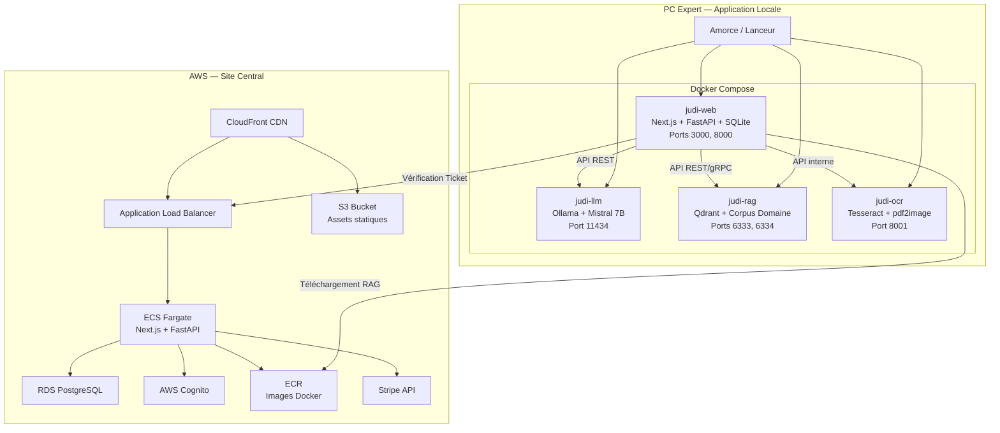
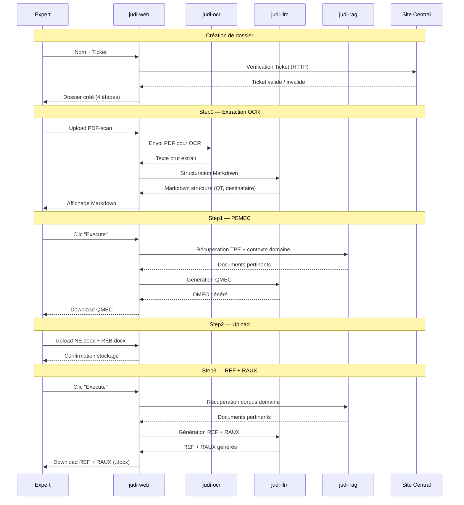
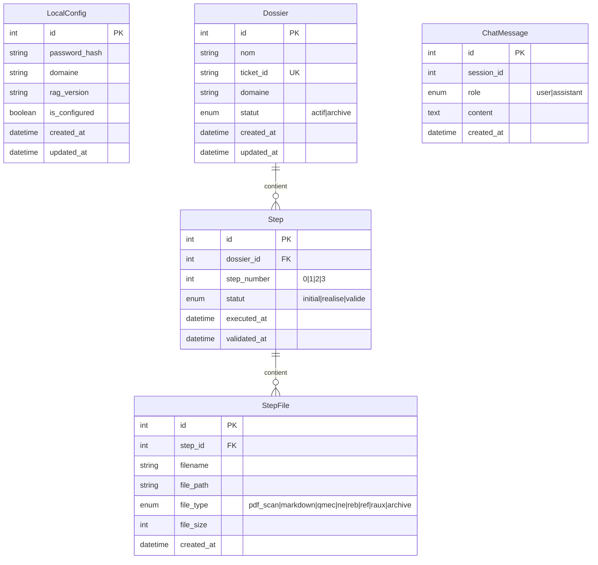
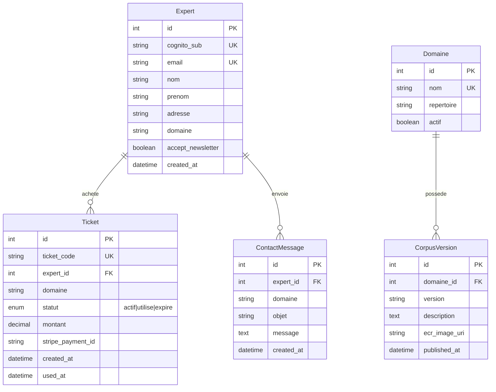

# Architecture Globale — Judi-Expert

## Introduction

Ce document décrit l'architecture technique complète du système Judi-Expert, composé de deux parties principales : l'**Application Locale** installée sur le PC de l'expert et le **Site Central** déployé sur AWS.

---

## Vue d'ensemble

Judi-Expert est un système à deux composants :

1. **Application Locale** — PWA conteneurisée (4 conteneurs Docker) installée sur le PC de l'expert, intégrant un LLM local, une base RAG, un moteur OCR et une base de données relationnelle.
2. **Site Central** — PWA déployée sur AWS, gérant l'authentification, les paiements, la distribution des modules RAG et l'administration.

Les deux composants partagent la même stack technique : Python (FastAPI) pour le backend, React/Next.js pour le frontend PWA. Toutes les données d'expertise restent exclusivement sur le PC de l'expert ; seuls les tickets transitent entre l'Application Locale et le Site Central.

---

## Architecture globale

---

## Application Locale — 4 conteneurs Docker

L'Application Locale fonctionne via Docker Compose avec 4 conteneurs isolés :

| Conteneur | Image | Rôle | Ports |
|-----------|-------|------|-------|
| `judi-web` | Next.js + FastAPI + SQLite | Frontend PWA, API backend, BD locale | 3000 (web), 8000 (api) |
| `judi-llm` | Ollama (Mistral 7B Instruct v0.3) | Inférence LLM locale | 11434 |
| `judi-rag` | Qdrant | Base vectorielle + corpus domaine | 6333 (REST), 6334 (gRPC) |
| `judi-ocr` | Python + Tesseract + pdf2image | Extraction OCR des PDF-scan | 8001 |

### Détail des conteneurs

#### judi-web (Frontend + Backend + BD)

- **Frontend** : Next.js PWA (React) — interface utilisateur professionnelle
- **Backend** : FastAPI — API REST pour le workflow d'expertise, la configuration, le ChatBot
- **Base de données** : SQLite via SQLAlchemy + Alembic — stockage des dossiers, étapes, fichiers, configuration
- **Dépendances** : passlib (bcrypt), python-jose (JWT), docxtpl (génération .docx), httpx (appels HTTP)

#### judi-llm (LLM local)

- **Runtime** : Ollama — serveur d'inférence LLM gratuit
- **Modèle** : Mistral 7B Instruct v0.3 (Apache 2.0, optimisé français, 7.25B paramètres)
- **API** : Compatible OpenAI (`/api/chat`, `/api/generate`)
- **Téléchargement automatique** du modèle au premier démarrage via script d'entrypoint

#### judi-rag (Base vectorielle)

- **Moteur** : Qdrant — base de données vectorielle open-source
- **Embedding** : `sentence-transformers/all-MiniLM-L6-v2` via FastEmbed
- **Collections** : `corpus_{domaine}`, `config_{domaine}`, `system_docs`
- **Persistance** : Volume Docker pour le stockage des vecteurs

#### judi-ocr (Extraction OCR)

- **Moteur OCR** : Tesseract OCR via pytesseract (langue `fra`)
- **Conversion PDF** : pdf2image (Poppler) pour les PDF-scan, PyMuPDF pour les PDF texte
- **API** : `POST /api/ocr/extract` — retourne `{ text, pages, confidence }`

### Ordre de démarrage

Le Docker Compose orchestre le démarrage dans l'ordre suivant :

1. `judi-llm` — démarrage d'Ollama + téléchargement du modèle (healthcheck sur `/api/tags`)
2. `judi-rag` — démarrage de Qdrant (healthcheck sur `/healthz`)
3. `judi-ocr` — démarrage du service OCR (healthcheck sur `/health`)
4. `judi-web` (backend) — dépend de la disponibilité des 3 services précédents
5. `judi-web` (frontend) — dépend du backend

---

## Site Central — Infrastructure AWS

Le Site Central est déployé sur AWS via Terraform (IaC déclaratif).

### Services AWS utilisés

| Service | Rôle |
|---------|------|
| **ECS Fargate** | Hébergement du backend FastAPI + frontend Next.js |
| **RDS PostgreSQL** | Base de données relationnelle (experts, tickets, domaines) |
| **AWS Cognito** | Authentification des experts (User Pools) |
| **S3** | Stockage des assets statiques et packages |
| **ECR** | Registre d'images Docker (modules RAG, app locale) |
| **CloudFront** | CDN pour la distribution des assets |
| **ALB** | Load balancer avec page de maintenance hors heures |
| **EventBridge + Lambda** | Scheduler heures ouvrables 8h-20h |
| **SES** | Envoi d'emails (tickets, notifications) |
| **CloudWatch** | Monitoring et logs |
| **Route 53** | DNS |
| **Secrets Manager** | Stockage des clés API (Stripe, Cognito, DB) |

### Mode heures ouvrables (8h-20h)

Le Site Central supporte un mode de fonctionnement limité aux heures ouvrables pour optimiser les coûts :

- **EventBridge** : règles cron pour démarrage (8h) et arrêt (20h), timezone Europe/Paris
- **Lambda** : met à jour le `desiredCount` ECS et start/stop RDS
- **ALB** : sert une page HTML de maintenance (HTTP 503) hors heures ouvrables
- L'Application Locale continue de fonctionner 24/7 (tout est local)

---

## Flux de données principal

---

## Modèles de données

### Base de données Application Locale (SQLite)

**ORM** : SQLAlchemy (Mapped types) + Alembic pour les migrations versionnées.

### Base de données Site Central (PostgreSQL)

**ORM** : SQLAlchemy (Mapped types) + Alembic pour les migrations versionnées.

---

## Communication entre composants

### Application Locale → Site Central

| Flux | Protocole | Description |
|------|-----------|-------------|
| Vérification ticket | HTTPS (POST) | L'App Locale envoie le ticket au Site Central via l'ALB |
| Téléchargement RAG | HTTPS (GET) | L'App Locale télécharge les images Docker depuis ECR |

### Communication interne (Docker Compose)

| Source | Destination | Protocole | Description |
|--------|-------------|-----------|-------------|
| judi-web | judi-llm | HTTP REST (port 11434) | Appels d'inférence LLM |
| judi-web | judi-rag | HTTP REST (port 6333) / gRPC (port 6334) | Recherche et indexation vectorielle |
| judi-web | judi-ocr | HTTP REST (port 8001) | Extraction OCR des PDF |

### Isolation des données

- Toutes les données d'expertise restent sur le PC de l'expert (SQLite + fichiers locaux)
- Seuls les tickets transitent entre l'Application Locale et le Site Central
- Le Site Central ne stocke que les données d'inscription, les tickets et les métadonnées des corpus

---

## Décisions techniques

| Décision | Choix | Justification |
|----------|-------|---------------|
| ORM | SQLAlchemy + Alembic | Standard Python, migrations versionnées |
| Base vectorielle | Qdrant | Open-source, API REST/gRPC, conteneur Docker officiel |
| OCR | Tesseract OCR (pytesseract) | Open-source (Apache 2.0), support français natif |
| LLM | Mistral 7B Instruct v0.3 | Apache 2.0, optimisé français, 7.25B paramètres |
| Runtime LLM | Ollama | Gratuit, API REST compatible OpenAI, gestion GPU/CPU |
| Template .docx | docxtpl (Jinja2) | Remplacement de placeholders avec préservation du style |
| Paiement | Stripe Checkout + Webhooks | Standard SaaS, SDK Python officiel |
| Auth | AWS Cognito + Amplify JS | Intégration native AWS, User Pools |
| Infra | Terraform | IaC déclaratif, état versionné |
| Conteneurs | Docker Compose (local), ECS/ECR (AWS) | Orchestration simple locale, scalable en production |
