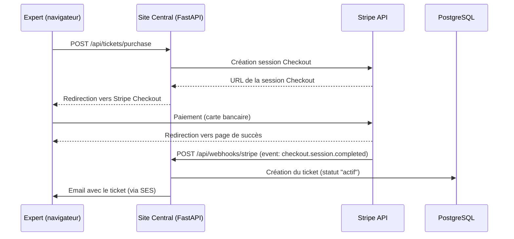

# Intégration Stripe — Judi-Expert

## Introduction

Ce document décrit l'intégration de la solution de paiement Stripe dans le Site Central Judi-Expert. Stripe est utilisé pour l'achat de tickets d'expertise par les experts judiciaires inscrits.

---

## Vue d'ensemble du flux de paiement



---

## Configuration des clés API

### Variables d'environnement

Trois clés Stripe sont nécessaires dans le fichier `.env` du Site Central :

```env
# Clé secrète (backend uniquement — JAMAIS exposée côté client)
STRIPE_SECRET_KEY=sk_test_...

# Clé publique (utilisée côté frontend pour Stripe.js)
STRIPE_PUBLISHABLE_KEY=pk_test_...

# Secret du webhook (pour vérifier la signature des événements)
STRIPE_WEBHOOK_SECRET=whsec_...
```

### Obtention des clés

1. Créer un compte sur [dashboard.stripe.com](https://dashboard.stripe.com)
2. Accéder à **Developers → API keys**
3. Copier la **Publishable key** (`pk_test_...`) et la **Secret key** (`sk_test_...`)
4. Pour le webhook secret : voir la section "Gestion des webhooks" ci-dessous

### Stockage sécurisé (production)

En production, les clés sont stockées dans **AWS Secrets Manager** et injectées dans les variables d'environnement du conteneur ECS Fargate via la Task Definition Terraform.

---

## Flux de paiement détaillé

### 1. Initiation du paiement

L'expert connecté clique sur "Acheter un ticket" depuis la page `/monespace/tickets`.

**Requête backend :**

```
POST /api/tickets/purchase
Headers: Authorization: Bearer <cognito_token>
Body: { "domaine": "psychologie" }
```

**Traitement backend :**

```python
import stripe

stripe.api_key = settings.STRIPE_SECRET_KEY

session = stripe.checkout.Session.create(
    payment_method_types=["card"],
    line_items=[{
        "price_data": {
            "currency": "eur",
            "product_data": {
                "name": f"Ticket d'expertise - {domaine}",
                "description": "Ticket à usage unique pour créer un dossier d'expertise"
            },
            "unit_amount": 1500,  # 15.00 EUR en centimes
        },
        "quantity": 1,
    }],
    mode="payment",
    success_url=f"{settings.FRONTEND_URL}/monespace/tickets?success=true",
    cancel_url=f"{settings.FRONTEND_URL}/monespace/tickets?canceled=true",
    metadata={
        "expert_id": str(expert.id),
        "domaine": domaine,
    },
)
```

**Réponse :**

```json
{
  "checkout_url": "https://checkout.stripe.com/c/pay/cs_test_..."
}
```

### 2. Paiement sur Stripe Checkout

L'expert est redirigé vers la page Stripe Checkout hébergée par Stripe. Il saisit ses informations de carte bancaire et confirme le paiement.

### 3. Confirmation via webhook

Après le paiement, Stripe envoie un événement `checkout.session.completed` au webhook du Site Central.

---

## Gestion des webhooks

### Configuration du webhook

**En développement (Stripe CLI) :**

```bash
# Installer Stripe CLI
# https://stripe.com/docs/stripe-cli

# Écouter les événements et les transférer au backend local
stripe listen --forward-to localhost:8000/api/webhooks/stripe
```

La commande affiche le webhook secret (`whsec_...`) à copier dans `.env`.

**En production (Dashboard Stripe) :**

1. Accéder à **Developers → Webhooks** dans le dashboard Stripe
2. Cliquer sur **Add endpoint**
3. URL : `https://judi-expert.fr/api/webhooks/stripe`
4. Événements à écouter : `checkout.session.completed`
5. Copier le **Signing secret** (`whsec_...`)

### Endpoint webhook

```
POST /api/webhooks/stripe
Content-Type: application/json
Headers: Stripe-Signature: t=...,v1=...
```

**Traitement du webhook :**

```python
import stripe

@router.post("/api/webhooks/stripe")
async def stripe_webhook(request: Request):
    payload = await request.body()
    sig_header = request.headers.get("Stripe-Signature")

    # Vérification de la signature
    try:
        event = stripe.Webhook.construct_event(
            payload, sig_header, settings.STRIPE_WEBHOOK_SECRET
        )
    except stripe.error.SignatureVerificationError:
        raise HTTPException(status_code=400, detail="Signature invalide")

    # Traitement de l'événement
    if event["type"] == "checkout.session.completed":
        session = event["data"]["object"]
        expert_id = int(session["metadata"]["expert_id"])
        domaine = session["metadata"]["domaine"]
        payment_id = session["payment_intent"]
        montant = session["amount_total"] / 100  # Centimes → EUR

        # Génération du ticket unique
        ticket_code = generate_unique_ticket_code()

        # Enregistrement en base
        ticket = Ticket(
            ticket_code=ticket_code,
            expert_id=expert_id,
            domaine=domaine,
            statut="actif",
            montant=montant,
            stripe_payment_id=payment_id,
        )
        db.add(ticket)
        await db.commit()

        # Envoi du ticket par email
        await send_ticket_email(expert_id, ticket_code, domaine)

    return {"status": "ok"}
```

### Sécurité du webhook

- La signature Stripe (`Stripe-Signature`) est vérifiée à chaque requête
- Le `STRIPE_WEBHOOK_SECRET` garantit que seul Stripe peut envoyer des événements valides
- En cas d'échec de traitement, Stripe effectue des retries automatiques (jusqu'à 3 jours)

---

## Vérification des tickets

Lorsque l'Application Locale crée un dossier, elle envoie le ticket au Site Central pour vérification :

```
POST /api/tickets/verify
Body: { "ticket_code": "JUDI-XXXX-XXXX-XXXX" }
```

**Réponses possibles :**

| Cas | Code HTTP | Réponse |
|-----|-----------|---------|
| Ticket valide | 200 | `{ "valid": true, "domaine": "psychologie" }` |
| Ticket déjà utilisé | 400 | `{ "valid": false, "error": "Ticket déjà utilisé" }` |
| Ticket invalide | 404 | `{ "valid": false, "error": "Ticket invalide" }` |

Lors de la vérification réussie, le ticket est marqué comme "utilisé" dans la base de données (`statut = "utilise"`, `used_at = now()`).

---

## Procédures de test

### Mode test Stripe

Stripe fournit un environnement de test complet avec des clés dédiées (`sk_test_...`, `pk_test_...`).

**Cartes de test :**

| Numéro | Comportement |
|--------|-------------|
| `4242 4242 4242 4242` | Paiement réussi |
| `4000 0000 0000 0002` | Carte refusée |
| `4000 0000 0000 3220` | Authentification 3D Secure requise |

- Date d'expiration : toute date future (ex: 12/34)
- CVC : tout nombre à 3 chiffres (ex: 123)

### Test du webhook en local

```bash
# Terminal 1 : démarrer le backend
cd site-central/aws/web/backend
uvicorn main:app --reload --port 8000

# Terminal 2 : écouter les événements Stripe
stripe listen --forward-to localhost:8000/api/webhooks/stripe

# Terminal 3 : déclencher un événement de test
stripe trigger checkout.session.completed
```

### Tests automatisés

Les tests unitaires et par propriétés utilisent le mode test Stripe :

```python
# tests/unit/test_ticket_service.py
import stripe

stripe.api_key = "sk_test_..."

def test_ticket_generation_after_payment():
    """Vérifie qu'un paiement confirmé génère un ticket unique."""
    # Simulation d'un événement webhook
    event_data = {
        "type": "checkout.session.completed",
        "data": {
            "object": {
                "metadata": {"expert_id": "1", "domaine": "psychologie"},
                "payment_intent": "pi_test_123",
                "amount_total": 1500,
            }
        }
    }
    # ... traitement et assertions
```

### Vérification dans le dashboard Stripe

Après un test de paiement :
1. Accéder au [dashboard Stripe](https://dashboard.stripe.com/test/payments)
2. Vérifier que le paiement apparaît dans la liste
3. Vérifier les événements webhook dans **Developers → Webhooks → Recent events**
4. Vérifier les logs d'événements pour diagnostiquer les erreurs

---

## Tarification

- **Commission Stripe (Europe)** : 1.5% + 0.25 € par transaction
- **Prix du ticket** : configurable (par défaut 15 €)
- **Exemple** : pour un ticket à 15 €, la commission Stripe est de 0.475 € (net reçu : 14.525 €)

---

## Checklist de mise en production

- [ ] Remplacer les clés de test (`sk_test_...`) par les clés de production (`sk_live_...`)
- [ ] Configurer le webhook de production dans le dashboard Stripe
- [ ] Stocker les clés dans AWS Secrets Manager
- [ ] Vérifier que le webhook endpoint est accessible en HTTPS
- [ ] Tester un paiement réel avec un petit montant
- [ ] Activer les notifications email Stripe pour les paiements échoués
